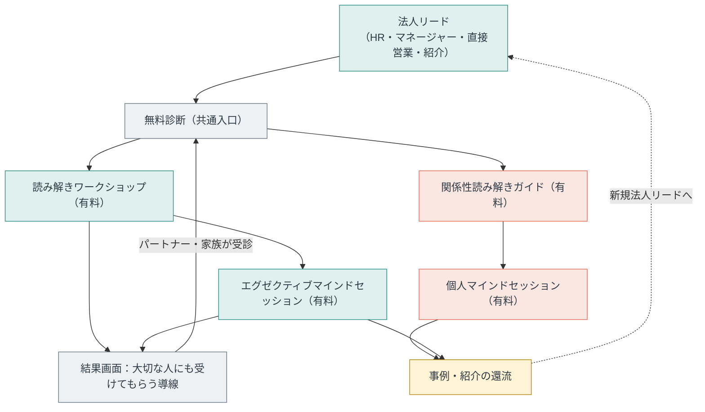
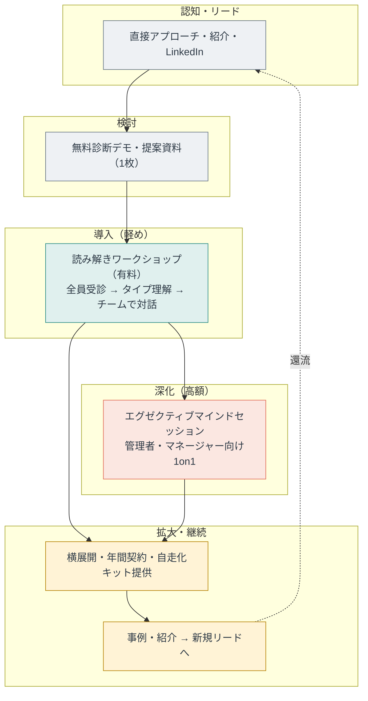
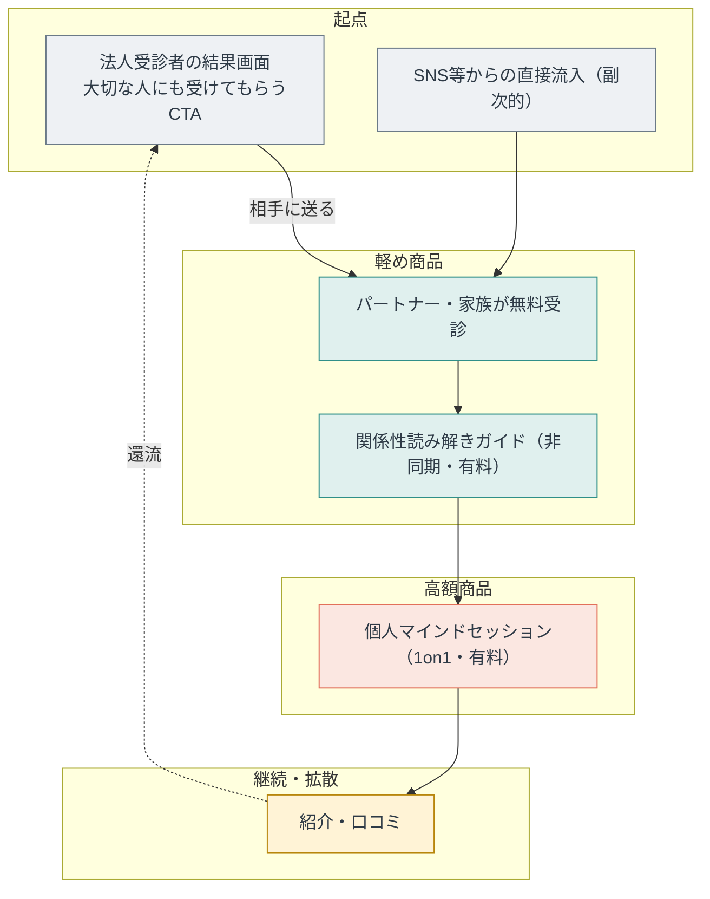
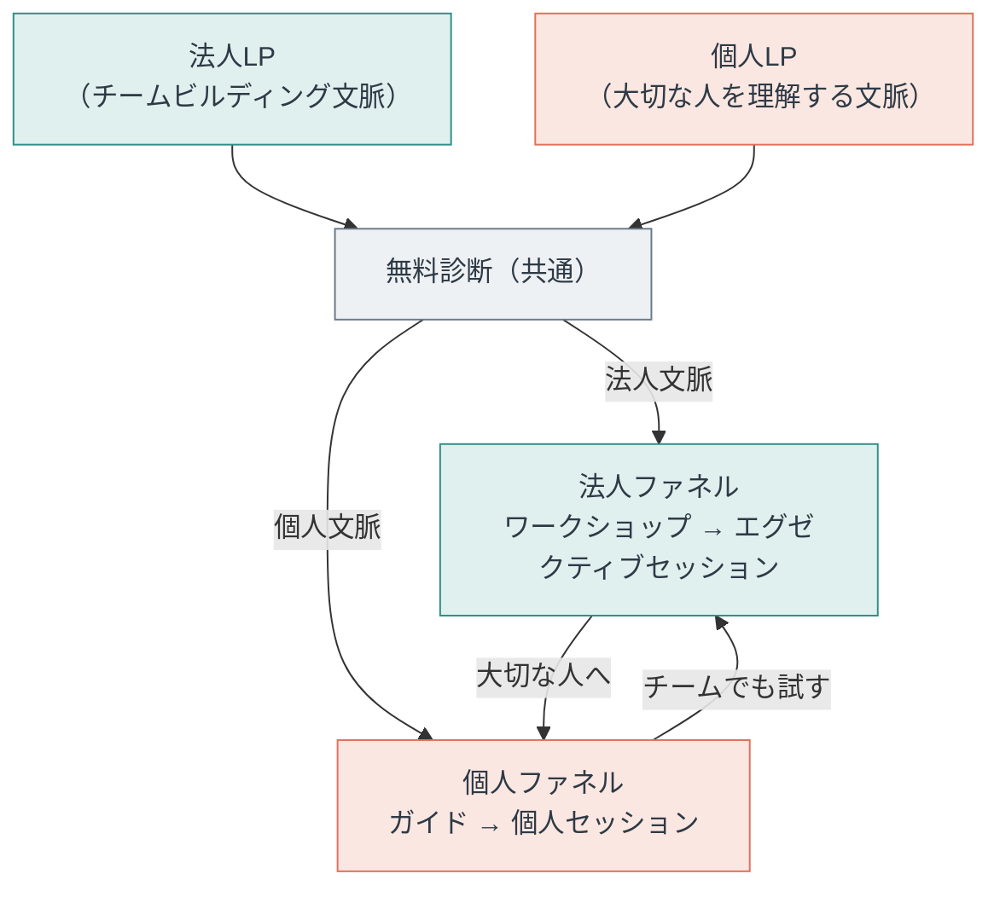

# マーケティングファネル（Funnel 1：法人起点・個人波及型）

現フェーズの戦略は**Funnel 1（法人起点・個人波及型）**。最終目標は**Funnel 3（ツインエンジン型）**への移行。

法人（toB）を主軸の獲得エンジンに置き、受診した社員が「大切なプライベートの相手にも受けさせたい」と感じることでtoC拡散が自然に起きる設計。無料診断が唯一の共通入口。

> 本文に長音ダッシュは使わない（プロジェクトの表記ルール）。
> 関連：[ロードマップ（Googleスプレッドシート・90日／12ヶ月計画）](https://docs.google.com/spreadsheets/d/1eb-P739JJs7qi1c9Uzy_WpZhy0gsCag382YzohFOBEY/edit)／`guide-3day-spec.md`。

---

## 中心価値と商品体系

| 対象 | 中心価値 | 軽め商品 | 高額商品 |
|:--|:--|:--|:--|
| 個人（toC） | あなたにとって重要な存在（プライベート）を深く理解してあげられるようになる | 関係性読み解きガイド（非同期） | 個人マインドセッション（1on1） |
| 法人（toB） | 自律的に尊重し合えるチームワークを構築する | 読み解きワークショップ（初回ファシリ、以降自走） | エグゼクティブマインドセッション（管理者・マネージャー向け1on1） |

---

## Funnel 1 全体像（現戦略）

---

## 法人（toB）ファネル詳細

買い手はマネージャー・HR・経営者。チームの自律的な尊重とチームワーク構築が訴求軸。初回はファシリが入り、2回目以降は社内で自走できるキットとして提供する（これがスケール設計の肝）。

---

## 個人（toC）波及ファネル詳細

法人受診者が主な起点。プライベートの重要な相手（パートナー・家族）を深く理解したいという欲求を起点に拡散が起きる。診断は相手にURLを送るだけで完結する設計。

---

## 最終目標：Funnel 3（ツインエンジン型）

B2BとB2Cが並走し、結果画面で互いに流入を補完し合う。どちらから来ても相手側へ送客する導線が設計に組み込まれた状態。

---

## 設計原則

- **診断は唯一の共通入口**。法人・個人どちらから来ても同じ診断を受ける。
- **法人受診者がB2C入口になる**。結果画面に「大切な人にも」導線を置くことで、法人の受診数がそのままB2C獲得の種になる。
- **ワークショップは自走可能に設計する**。初回ファシリ後、社内で回せるキットとして提供する。これがFunnel 1のスケール設計の肝。
- **職場改善はトップダウンで届ける**。個人がボトムアップで職場を変えようとする動機は弱い。法人向けは意思決定者（マネージャー・HR・経営者）へ直接アプローチする。
- **プライベートの拡散は好奇心が起点**。「相手を理解したい」という欲求が拡散のモチベーション。問題解決訴求ではなく、深く知りたいという感情に乗せる。
- **セッションは高単価・少数に絞る**。ガイドとワークショップが先に稼ぐ構造を作り、セッションはキャパの上限を高単価で使う。
