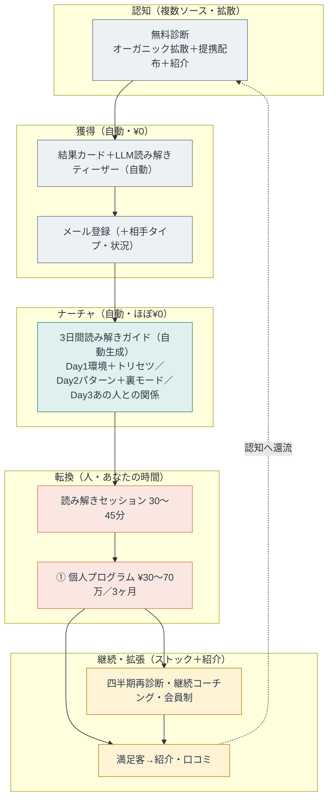
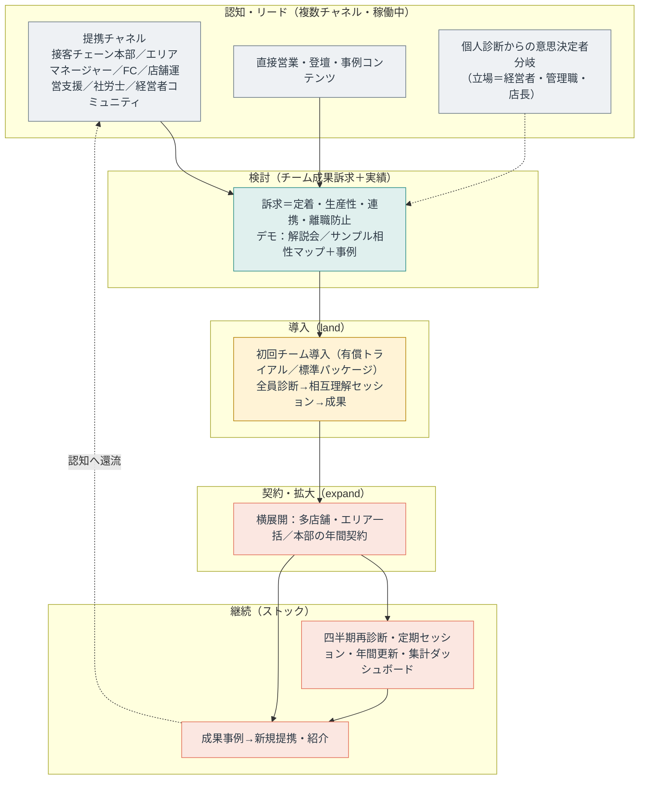
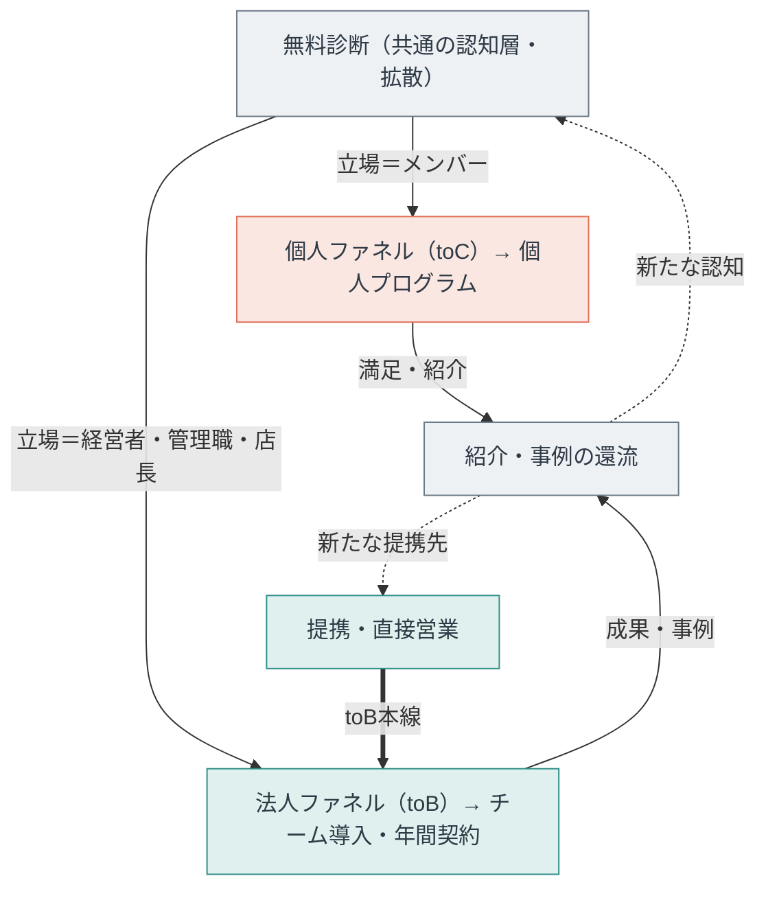

# マーケティングファネル（個人・法人の定常版）

職場の人間関係タイプ診断の、M3以降も使える汎用ファネル。個人（toC）と法人（toB）の2本立て。
無料診断を共通の認知層に置き、立場で個人／法人に分岐させ、満足client→紹介・事例で認知に還流させる（フライホイール）。

> 本文に長音ダッシュは使わない（プロジェクトの表記ルール）。
> 関連：`ROADMAP.md`（12ヶ月計画）／`guide-3day-spec.md`（MOFUの3日間ガイド）／`競合ティアダウン_ABテスト案.md`。

---

## 何が一時的（〜M3・検証）で、何が定常（M3〜・汎用）か

検証期に使った戦術のいくつかは一時的なもの。定常版では下表の右側に「卒業」する。

| 要素 | 早期（〜M3・検証） | 定常（M3〜・汎用） |
| :-- | :-- | :-- |
| 読み解き生成 | 手動（Claudeで生成） | プロダクト内で自動生成（結果画面ティーザー＋3日間ガイド） |
| 個人のセッション | 全員に1回プレゼント（実績集め） | 予約者に実施。無料の発見セッション＋有償プログラム（価格調整可） |
| 法人の初回導入 | 無料〜試験価格パイロット（最初の事例づくり） | 有償トライアル／標準パッケージ（事例があるので無料に頼らない） |
| リード源 | 温かい8名・手動の提携打診 | 稼働中の複数提携チャネル＋紹介・事例ループ |
| 継続・ストック | ほぼ無し | 四半期再診断・会員制・年間契約（リカーリング） |
| IP・属人 | あなたが全部やる（属人） | 名称付きモデル・手順書・他ファシリへライセンス |

定常版の肝は3つ。**自動化**（人の時間は転換＝セッションだけ）、**ループ化**（紹介・事例が認知/提携に還流）、**ストック**（獲得だけに依存しない継続収益）。

---

## 個人（toC）定常ファネル

---

## 法人（toB）定常ファネル

買い手＝意思決定者（店長・経営者・本部）。現場メンバーの社内上申には頼らない（CVが落ちるため）。
訴求はチーム成果（定着・生産性・連携・離職防止）。本線は提携・直接営業で、診断は認知とデモに使う。

---

## 全体（共通認知→分岐→フライホイール）

---

## つなぎ目の原則

- **アンケート＝共通の認知層**。そこから立場で分岐：メンバーは個人ファネル、意思決定者（経営者・管理職・店長）は法人ファネルへ。
- **メンバーは法人に流さない**：個人が社内で導入を上申する導線は弱く、CVが落ちる。メンバーは個人ファネルで完結させる。
- **法人の本線は提携・直接営業**。診断は「広い認知」と商談での「体験デモ」に使う。個人ファネルのDay1トリセツは、法人商談で「全員ぶん集めるとこうなる」というデモ素材に転用できる。
- **両ファネルともループ**：満足したclient（個人・法人）からの紹介・事例が、認知と提携に還流する。
