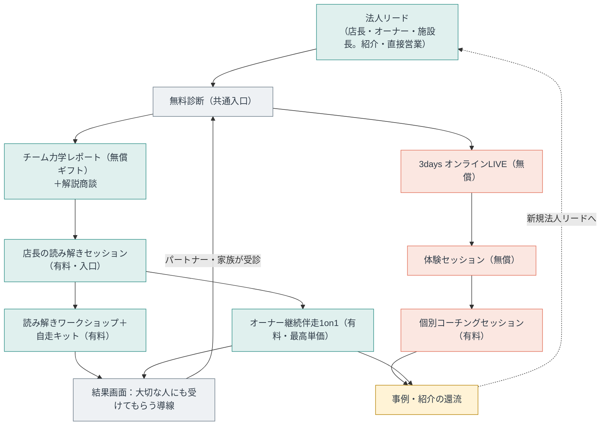
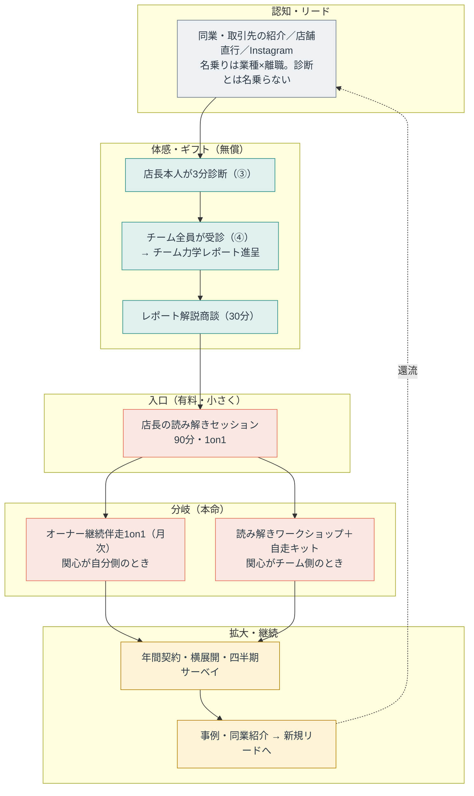
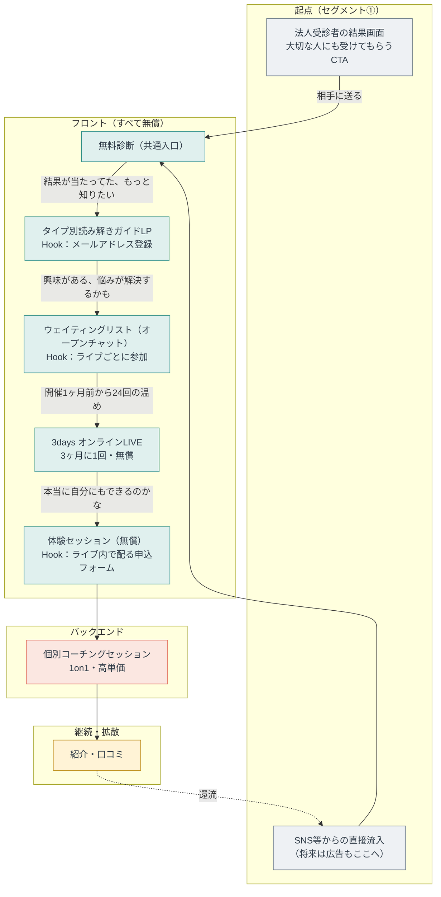
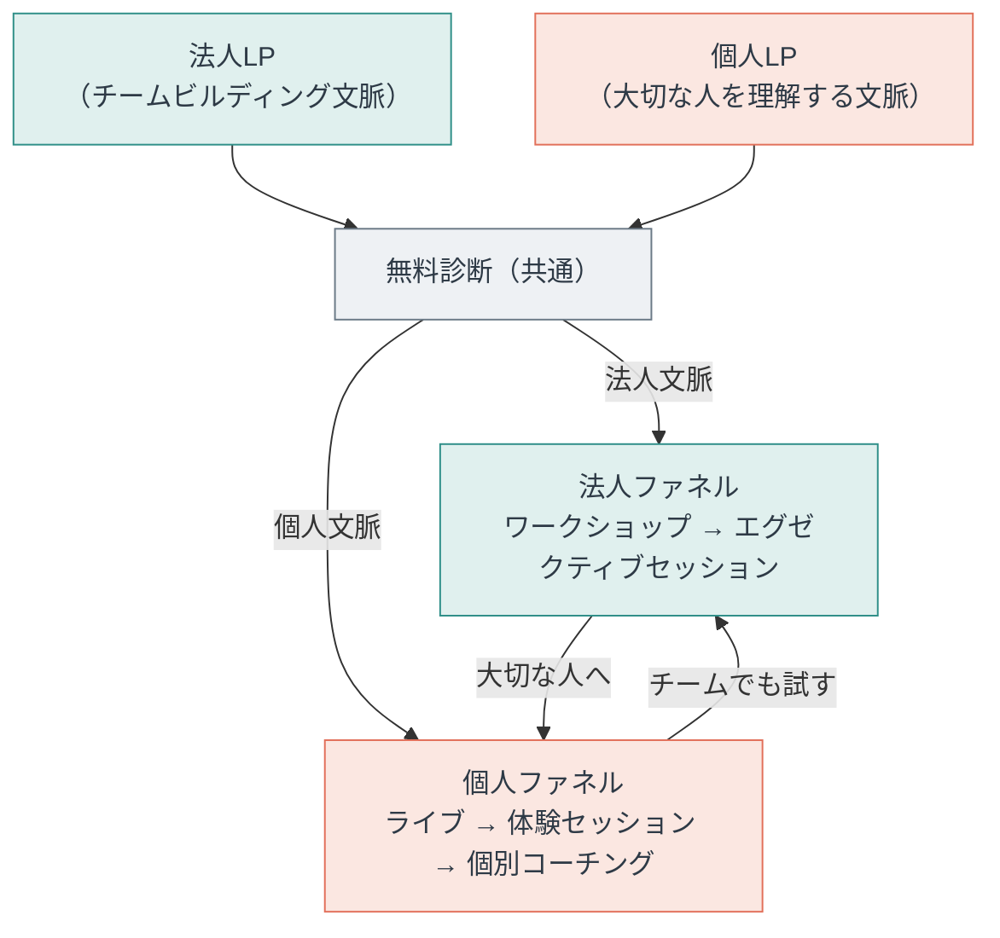

# マーケティングファネル（Funnel 1：法人起点・個人波及型）

現フェーズの戦略は**Funnel 1（法人起点・個人波及型）**。最終目標は**Funnel 3（ツインエンジン型）**への移行。

法人（toB）を主軸の獲得エンジンに置き、受診した社員が「大切なプライベートの相手にも受けさせたい」と感じることでtoC拡散が自然に起きる設計。無料診断が唯一の共通入口。

> 本文に長音ダッシュは使わない（プロジェクトの表記ルール）。
> 関連：[ロードマップ（Googleスプレッドシート・90日／12ヶ月計画）](https://docs.google.com/spreadsheets/d/1eb-P739JJs7qi1c9Uzy_WpZhy0gsCag382YzohFOBEY/edit)／`guide-3day-spec.md`。

---

## 中心価値と商品体系

| 対象 | 中心価値 | フロント商品 | バックエンド商品 |
|:--|:--|:--|:--|
| 個人（toC） | あなたにとって重要な存在（プライベート）を深く理解してあげられるようになる | **すべて無償**：3days オンラインLIVE（3ヶ月に1回）→ 体験セッション | 個別コーチングセッション（1on1・高単価） |
| 法人（toB） | **辞めない店をつくる（定着）**。動かすレバーは**店長の関わり方**で、そこに最高単価を置く | 店長の読み解きセッション（90分・1on1） | オーナー継続伴走1on1（月次）／読み解きワークショップ＋自走キット |

> 個人（toC）の商品体系は2026-07-26に変更。有償のフロント商品（関係性読み解きガイド）は置かず、**無償フロントで信頼をつくり、バックエンドの個別コーチングで回収する**構造にした。詳細と変更理由は下の「個人（toC）ファネル詳細」を参照。
>
> 法人（toB）の中心価値と商品順序は2026-08-05に確定。中心価値（＝約束）は**定着**のまま据え、それを動かす**レバーを「店長の関わり方」と特定**したうえで、フロントを全員ワークショップから**店長個人の読み解き**に、最高単価をオーナーへの**継続伴走**に置き換えた。約束（何を売るか）と最高単価（どこに金が乗るか）が別なのは、後者が前者を動かす唯一の操作点だから。判断根拠・約束の粒度・価格ラダー・ペルソナは `法人中心価値とファネル.md`。

---

## Funnel 1 全体像（現戦略）


```mermaid
flowchart TD
  B2B_IN["法人リード<br/>（店長・オーナー・施設長。紹介・直接営業）"]
  QUIZ["無料診断（共通入口）"]
  REPORT["チーム力学レポート（無償ギフト）<br/>＋解説商談"]
  LEAD1["店長の読み解きセッション（有料・入口）"]
  EXEC["オーナー継続伴走1on1（有料・最高単価）"]
  WS["読み解きワークショップ＋自走キット（有料）"]
  CTA["結果画面：大切な人にも受けてもらう導線"]
  LIVE["3days オンラインLIVE（無償）"]
  TRIAL["体験セッション（無償）"]
  COACH["個別コーチングセッション（有料）"]
  FLY["事例・紹介の還流"]

  B2B_IN --> QUIZ
  QUIZ --> REPORT --> LEAD1
  LEAD1 --> EXEC
  LEAD1 --> WS
  WS --> CTA
  EXEC --> CTA
  CTA -->|"パートナー・家族が受診"| QUIZ
  QUIZ --> LIVE
  LIVE --> TRIAL
  TRIAL --> COACH
  COACH --> FLY
  EXEC --> FLY
  FLY -.->|"新規法人リードへ"| B2B_IN

  classDef b2b fill:#E0F0EE,stroke:#2F8F88,color:#2E3A46;
  classDef shared fill:#EEF1F4,stroke:#6B7A87,color:#2E3A46;
  classDef b2c fill:#FBE7E1,stroke:#E2705A,color:#2E3A46;
  classDef fly fill:#FFF3D6,stroke:#B8860B,color:#2E3A46;
  class B2B_IN,REPORT,LEAD1,WS,EXEC b2b;
  class QUIZ,CTA shared;
  class LIVE,TRIAL,COACH b2c;
  class FLY fly;
```

---

## 法人（toB）ファネル詳細

買い手は店長・オーナー・施設長（現場の最終決裁者）。名乗りと訴求軸は**辞めない店をつくること（定着）**で、売る中身は**それを動かすレバー＝店長の関わり方**。順序は「店長本人の体感 → チーム全員の受診（無償レポート） → 商談 → 店長個人の読み解き（入口の有料商品） → 関心の向きで分岐」。全員を新たに集める有料ワークショップは時給が障壁になるため入口には置かず、チーム対話は既存ミーティングへ埋め込む（`法人ポジショニング.md`「営業上の構え3」）。**セグメント③④としての詳細（中心価値の判定・価格ラダー・ペルソナ・ステージ定義）は `法人中心価値とファネル.md`。**


```mermaid
flowchart TD
  subgraph BACQ["認知・リード"]
    B1["同業・取引先の紹介／店舗直行／Instagram<br/>名乗りは業種×離職。診断とは名乗らない"]
  end
  subgraph BCON["体感・ギフト（無償）"]
    B2["店長本人が3分診断（③）"]
    B3["チーム全員が受診（④）<br/>→ チーム力学レポート進呈"]
    B4["レポート解説商談（30分）"]
  end
  subgraph BLAND["入口（有料・小さく）"]
    B5["店長の読み解きセッション<br/>90分・1on1"]
  end
  subgraph BPREM["分岐（本命）"]
    B6["オーナー継続伴走1on1（月次）<br/>関心が自分側のとき"]
    B7["読み解きワークショップ＋自走キット<br/>関心がチーム側のとき"]
  end
  subgraph BEXP["拡大・継続"]
    B8["年間契約・横展開・四半期サーベイ"]
    B9["事例・同業紹介 → 新規リードへ"]
  end

  B1 --> B2 --> B3 --> B4 --> B5
  B5 --> B6
  B5 --> B7
  B6 --> B8
  B7 --> B8
  B8 --> B9
  B9 -.->|"還流"| B1

  classDef acq fill:#EEF1F4,stroke:#6B7A87,color:#2E3A46;
  classDef con fill:#E0F0EE,stroke:#2F8F88,color:#2E3A46;
  classDef prem fill:#FBE7E1,stroke:#E2705A,color:#2E3A46;
  classDef exp fill:#FFF3D6,stroke:#B8860B,color:#2E3A46;
  class B1 acq; class B2,B3,B4 con; class B5,B6,B7 prem; class B8,B9 exp;
```

---

## 個人（toC）ファネル詳細（セグメント①一般・2026-07-26確定）

**適用範囲：セグメント①一般（`ref` なしの受診者。認知・拡散から入る層）専用。** ②紹介・③店長リーダー（法人LP体験版）・④メンバーは別ルートで、本ルートには乗せない。将来の広告もこのルートに流す（広告 → 診断 → ガイドLPの順。現時点では出稿しない）。

起点は法人受診者の波及とSNS等からの直接流入。プライベートの重要な相手を深く理解したいという欲求で拡散が起き、診断は相手にURLを送るだけで完結する。


```mermaid
flowchart TD
  subgraph CSRC["起点（セグメント①）"]
    C1["法人受診者の結果画面<br/>大切な人にも受けてもらうCTA"]
    C2["SNS等からの直接流入<br/>（将来は広告もここへ）"]
  end
  subgraph CFREE["フロント（すべて無償）"]
    C3["無料診断（共通入口）"]
    C4["タイプ別読み解きガイドLP<br/>Hook：メールアドレス登録"]
    C5["ウェイティングリスト（オープンチャット）<br/>Hook：ライブごとに参加"]
    C6["3days オンラインLIVE<br/>3ヶ月に1回・無償"]
    C7["体験セッション（無償）<br/>Hook：ライブ内で配る申込フォーム"]
  end
  subgraph CBACK["バックエンド"]
    C8["個別コーチングセッション<br/>1on1・高単価"]
  end
  subgraph CRET["継続・拡散"]
    C9["紹介・口コミ"]
  end

  C1 -->|"相手に送る"| C3
  C2 --> C3
  C3 -->|"結果が当たってた、もっと知りたい"| C4
  C4 -->|"興味がある、悩みが解決するかも"| C5
  C5 -->|"開催1ヶ月前から24回の温め"| C6
  C6 -->|"本当に自分にもできるのかな"| C7
  C7 --> C8 --> C9
  C9 -.->|"還流"| C2

  classDef src fill:#EEF1F4,stroke:#6B7A87,color:#2E3A46;
  classDef free fill:#E0F0EE,stroke:#2F8F88,color:#2E3A46;
  classDef back fill:#FBE7E1,stroke:#E2705A,color:#2E3A46;
  classDef ret fill:#FFF3D6,stroke:#B8860B,color:#2E3A46;
  class C1,C2 src; class C3,C4,C5,C6,C7 free; class C8 back; class C9 ret;
```

### 運用ルール

- **主リストはメールアドレス**。登録が続く限り、以降のライブ招待を送り続けられる。オープンチャット参加者は必ずメール登録者に内包されるので、永続資産はメールリスト側に貯まる。
- **オープンチャットはライブごとに用意する**（都度作成の使い捨て）。開催1ヶ月前に開設し、そこから **8タイプ×3回＝24回**の温めコンテンツを投下して参加動機を高める。
- **ガイドLPには次回ライブの開催日を明示する**。待ち時間の見通しが立つことで登録率が変わる。
- **既存の3daysメール（固定文24本・`Guide.gs` の自動配信）は本ルートで使わない**。ライトな一般層にステップメール配信は重いため。仕様・実装は変更せず温存する（`guide-3day-spec.md`）。その文面は2026-07-27に②紹介のアプリ内ガイド（全4章）へ移した。

### なぜ有償フロントを置かないか

- 無償フロントでも申込のフィルタは効く。**3日間のライブに出席すること自体が本気度を示す**ので、金額によるフィルタよりむしろ強い。
- 教育の論法と商品が噛み合う。3daysメール時代に有償の読み物を挟むと、「読むだけでは変われない」と教育した直後に読み物を売ることになり論理が反転していた。着地をライブと体験セッションにしたことで、この矛盾が消えた。
- 将来の広告運用と相性がよい。無償で完結するフロントは、広告からの流入をそのまま受けられる。

### セグメント②紹介のルート（2026-07-26確定）

紹介・知人経由（`ref` が紹介者コード）は4セグメントで最も温度が高く、かつ数が限られる。よって**人の時間を使う価値が最も高い**。①（自動でスケールさせるライブ）とは逆に、高タッチで設計する。

**アプリ内で完結させる（2026-07-27変更）。** 受け皿は「3daysメール」から「**アプリ内の読み解きガイド（全4章）**」へ移した。結果画面 →「読み解きガイドを開く」→ 序章・第一章・第二章・終章と読み進め、終章で**体験セッション申込フォーム（外部リンク）**に着地する。

```
診断（?ref=紹介者コード） → 結果画面 → 読み解きガイド 全4章
  → 終章：商談前ヒアリング2項目（すべて任意） → 体験セッション申込（外部フォーム）
  → 体験セッション → 個別コーチング
```

- **メール登録を廃止した理由**：登録という関門を挟まずに、クリックだけで読み進められる方が、温度の高い②を止めずに済む。配信の待ち時間（1日1通で3日）もなくなり、その場で読み切って申込まで到達できる。
- **章に分ける理由**：3通分の文量を1画面に流すと重いので、本の「章」の体裁（章扉・柱・ノンブル・明朝）で1章＝1画面に分割する。文面は `ガイド文面24本.md` と `guide-3day-spec.md` §8のまま（メール前提の語だけ本の語に読み替え）。
- **ヒアリングは任意のまま、申込の直前に置く**。書くという行為そのものが本気度のフィルタになり（①の「ライブに出席すること自体がフィルタ」と同じ思想）、そのまま体験セッションの下準備になる。
- **消えた分岐**：メールアドレスを取らなくなったので、「悩みを書いた人には個別の深掘り読み解きメールを返す」旧分岐（`深掘り読み解きメール.md`）は成立しない。個別の読み解きは体験セッションの場で行う。読み解きメールの素材自体は、セッションの下準備として引き続き使える。
- **3daysメール（自動・固定文24本）は温存**。`apps-script/Guide.gs` と「ガイド文面」シートはそのまま残すが、現時点で配信対象のセグメントはない。

### セグメント③店長・リーダー／④メンバーのルート（2026-08-05確定）

法人LP経由の決裁者（③）と、そのチームに配られるリンクで受診する現場スタッフ（④）。**詳細は `法人中心価値とファネル.md`**。ここでは全体戦略に効く要点だけ置く。

```
認知 → 店長本人が3分診断（③） → チーム力学レポート申込 → メンバー全員が受診（④）
  → レポート解説商談（30分） → 店長の読み解きセッション（入口の有料商品）
  → 関心がチーム側ならワークショップ／自分側なら継続伴走1on1 → 継続・同業紹介へ還流
```

- **③と④は別ファネルにしない**。同じ1本の導線の中の別ロールで、④が登場するのは「チーム受診」の1ステージのみ。
- **④には売らない**。決裁権がなく、法人CTAを出すと「会社に使われている」感が回答の正直さを壊す。④に返すのは自己理解（トリセツ）と「大切な人にも」導線だけ。
- **③④が①②と共有するのは診断本体だけ**。結果画面から先は完全に分ける（③に個人向けガイドCTAを出すと、法人商談の動線が個人ファネルに漏れる）。

### 設計上の留意点（未解決）

- 診断直後から開催1ヶ月前までは**接触が空く**（最長で2ヶ月）。この期間はガイドLPと招待メールだけが接点になる。離脱が大きいようなら、開催頻度を上げるかアーカイブ視聴を用意する。
- ③④は**設計だけが確定していて実装が空**。`prototype.html` は `member` を判定するが結果を何にも使っておらず、レポート申込フックも未実装（`法人中心価値とファネル.md` §6）。

---

## 最終目標：Funnel 3（ツインエンジン型）

B2BとB2Cが並走し、結果画面で互いに流入を補完し合う。どちらから来ても相手側へ送客する導線が設計に組み込まれた状態。


```mermaid
flowchart TD
  B2B_LP["法人LP<br/>（チームビルディング文脈）"]
  B2C_LP["個人LP<br/>（大切な人を理解する文脈）"]
  QUIZ["無料診断（共通）"]
  B2B_F["法人ファネル<br/>ワークショップ → エグゼクティブセッション"]
  B2C_F["個人ファネル<br/>ライブ → 体験セッション → 個別コーチング"]

  B2B_LP --> QUIZ
  B2C_LP --> QUIZ
  QUIZ -->|"法人文脈"| B2B_F
  QUIZ -->|"個人文脈"| B2C_F
  B2B_F -->|"大切な人へ"| B2C_F
  B2C_F -->|"チームでも試す"| B2B_F

  classDef b2b fill:#E0F0EE,stroke:#2F8F88,color:#2E3A46;
  classDef b2c fill:#FBE7E1,stroke:#E2705A,color:#2E3A46;
  classDef shared fill:#EEF1F4,stroke:#6B7A87,color:#2E3A46;
  class B2B_LP,B2B_F b2b; class B2C_LP,B2C_F b2c; class QUIZ shared;
```

---

## 設計原則

- **診断は唯一の共通入口**。法人・個人どちらから来ても同じ診断を受ける。
- **法人受診者がB2C入口になる**。結果画面に「大切な人にも」導線を置くことで、法人の受診数がそのままB2C獲得の種になる。
- **ワークショップは自走可能に設計する**。初回ファシリ後、社内で回せるキットとして提供する。これがFunnel 1のスケール設計の肝。
- **時給パート構成の接客現場では、提供の順序を反転する**。店長＋時給パートが多い小規模接客チーム（宿泊・カフェ等）では、全員を新たに集める有料ワークショップは時給が障壁になる。入口は店長個人の診断・読み解き（意思決定の軸・関わり方の一手）に置き、チーム対話は別枠でなく既存の朝礼・ミーティングの5〜15分に埋め込んで新たな時給負担を出さない。集合ワークショップは効果実感後のアップセルに後置する。障壁（集合の時給）を、店長が最も欲しい価値（理解し合う時間）に反転させる（2026-07-23商談。詳細：`法人ポジショニング.md`「営業上の構え3」）。
- **職場改善はトップダウンで届ける**。個人がボトムアップで職場を変えようとする動機は弱い。法人向けは意思決定者（マネージャー・HR・経営者）へ直接アプローチする。
- **「性格診断」を売らない**。性格診断はレッドオーシャンで、商談では偏見・批判が最初から想定される。語り出しは「業界絞り×自分の強み×ニッチな提供内容」（例：5〜15名の接客チームの離職を減らす、社内で自走できる関係づくりワークショップ）。診断は入口の道具として後から出す。初期フォーカス業種は「結婚式場（＋整骨院）」と「珈琲屋・カフェ」の二本（詳細：`法人ポジショニング.md` の「営業上の構え」）。
- **説得は二層で設計する（感情で信頼、論理で稟議）**。契約の起点は、決裁者が無料診断を受けて「これが必要だ」と感じる感情的な実感（信頼獲得）。一方、稟議・社内説得には費用対効果の論理的・客観的な説明が要る。「まず本人が受けて体感、刺さったらROI資料で社内説得を支援」の順で営業を組む。
- **プライベートの拡散は好奇心が起点**。「相手を理解したい」という欲求が拡散のモチベーション。問題解決訴求ではなく、深く知りたいという感情に乗せる。
- **法人は「約束」と「レバー」を分けて設計する**（2026-08-05確定）。約束（中心価値）は**辞めない店をつくる**。ただし定着を動かせる操作点は限られており、時給・採用の質・シフトはこちらが触れない。唯一こちらが操作でき、店長が明日から動かせるのが**店長の関わり方**なので、レバーはここに定め、**最高単価もここに乗せる**。約束を直接売ると求人媒体や他社研修と相見積もりになるが、レバーには代替がない（この悩みは部下にも同業にも相談できない）。詳細と約束の粒度は `法人中心価値とファネル.md`。
- **解決する悩みを3層に1つずつ載せる**（2026-08-06確定）。約束＝「辞めそうな人ほど何も言わない」、商談で開く＝「自分の何が悪いのか、もう誰も教えてくれない」、商品で解く＝「人によって接し方を変えるべきだが、基準がない」。悩みを1つに絞ると必ず無理が出るが、この3つは弱点が互いに補完的で、この順に並べると1本の会話になる。**商品層は識学の真逆**（識学はルールで統一、当方は相手ごとに変える基準を渡す）なので、正面衝突せずに差別化できる（詳細：`法人中心価値とファネル.md` §1.6）。
- **法人のセグメントは、観測可能な構造条件で切る**（2026-08-06確定）。「単一拠点で、5〜30名を、中間管理職を挟まずにリーダー1人が直接見ている事業所」＋トリガー（求人を出し続けている、新店・増床、代替わり）。**業種フォーカス（珈琲屋・式場）はチャネルであってセグメントではない**。
- **価値観をセグメントの境界に置かない**。「相手ごとに関わり方を変えるべきだ」は事実でなく価値観で、外から観測できないため測定可能性・到達可能性を満たさない（有効なセグメントの5条件のうち2つで落ちる）。B2Bの定石も、観測可能な外側の変数から内側（買い手個人の価値観）へ絞り込む順序を取る。**この認識は入口の条件ではなく、商談で作る成果物**として扱う（詳細：`法人中心価値とファネル.md` §3.1.1〜3.1.2）。
- **定着は機序のレベルで約束する**。「離職率が◯%下がる」でなく「辞める理由そのものを減らす」。離職は時給相場・家庭の事情など外部要因が大きく、因果を全部引き受けると効かなかったときに全部が嘘になる。裏付けとして引くのは、自然体を引き出す導入設計で離職率が下がった実地実験（Cable, Gino & Staats 2013）と、自然体と燃え尽き・エンゲージメントの関係（Van den Bosch & Taris 2014）。効果の検証は四半期の匿名サーベイと離職率の実数で行う。
- **セッションは高単価・少数に絞る**。個人は無償フロントで信頼をつくり、バックエンドの個別コーチングで回収する。法人は**オーナーへの継続伴走1on1を最高単価**に置き、ワークショップはレバーをチーム全体へ広げる商品として中段に回す（単発売り切りのワークショップだけでは件数依存が重く、`料金形態分析_年間vs月額.md` の試算が成立しないため）。
- **個人（セグメント①）の無償フロントはライブ形式にする**。ライトな層にステップメール配信は重い。3日間のライブに出席するという行為そのものが本気度のフィルタになり、有償商品を挟まなくても体験セッションの申込者を絞れる（詳細：「個人（toC）ファネル詳細」）。
- **セグメントごとにルートを分ける**。①一般はライブ経由、②紹介はアプリ内ガイド（全4章）経由というように、温度と立場に応じて通す道を変える。診断は共通入口のまま、その先で必要な分だけ渡す。
