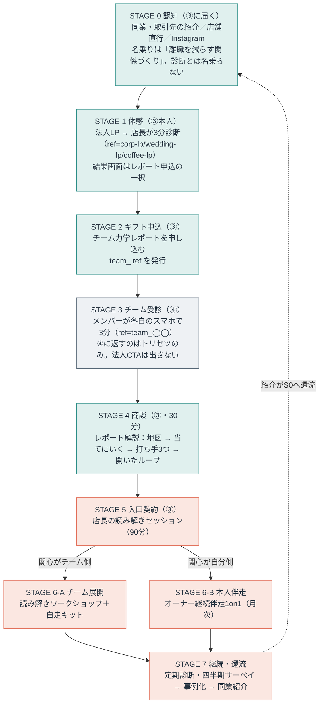

# 法人の中心価値とファネル（③店長・リーダー／④メンバー）

セグメント③店長・リーダー（`ref=corp-lp`／`wedding-lp`／`coffee-lp`）と④メンバー（`ref=team_` 始まり）の、
**提供価値の中心・ペルソナ・ファネル**を確定させる文書。①一般・②紹介は `ファネル図.md` で確定済みで、
③④だけが「別ルート」と書かれたまま中身が空だった。その空白を埋めるのが本書。

> 位置づけ：**確定**（金額のみ `（要確定）` 表記で仮置き）。判断根拠を各節に明記してあるので、前提が変われば該当節だけ差し替える。
> 参照：`ファネル図.md`（全体戦略・①②の確定ルート）／`法人ポジショニング.md`（7観点・営業上の構え）／`提案資料1枚.md`（営業資料）／`読み解きワークショップ設計.xlsx`（WS進行・接続設計）／`文脈出し分け仕様.md`（コピー素材）。
> 本文に長音ダッシュは使わない（プロジェクトの表記ルール）。

---

## 0. 決めたこと（結論）

| # | 論点 | 決定 |
| :-: | :-- | :-- |
| 1 | 法人の中心価値（**約束**） | **辞めない店をつくる（定着）**。ただし約束する粒度は「離職率が◯%下がる」でなく**「辞める理由そのものを減らす」**（§1.5） |
| 2 | 中心の**レバー** | **店長の関わり方**。定着に効く変数のうち、こちらが操作でき、店長が明日から動かせる唯一のもの |
| 3 | 一番高いお金を払う価値 | レバーの側。**店長本人が「読めて、扱える」ようになること**に最高単価を置く（§1.3） |
| 4 | 最高単価の商品 | **オーナー・店長への継続伴走1on1**（現エグゼクティブマインドセッションを月次の継続契約として再定義） |
| 5 | 入口の有料商品 | **置く。店長の読み解きセッション（90分）**。パート時給がゼロのまま最初の課金ができる |
| 6 | チームワークショップの位置 | 主商品から**降ろす**。レバーをチーム全体へ広げる商品として中段に置く |
| 6.5 | 解決する悩み | 3層それぞれに1つずつ載せる。**約束＝静かに辞める／商談＝自分の何が人を遠ざけるか／商品＝相手ごとの基準がない**（§1.6） |
| 6.6 | セグメントの切り方 | **業種と従業員規模から、関わり方の構造へ**。「全員の顔と名前が一致し、リーダーが全員と直接関わり、相手ごとに変える必要がある立場」。業種フォーカスはチャネルであってセグメントではない（§3.1） |
| 6.7 | 規模の扱い | 訴求軸から外し、**適合条件（支払い能力の代理指標）に降ろす**（§3.1.2） |
| 7 | ③のペルソナ | **現場に立ちながら一人で決めているリーダー**。約束は組織の言葉、商談の入りは本人の言葉 |
| 8 | ④のペルソナ | 時給パート中心の現場スタッフ。**買わない。売らない** |
| 9 | ④の設計原則 | **④に法人CTAを出さない**。正直な回答をもらい、自己理解（トリセツ）だけを返す |
| 10 | ③④のファネル | 認知 → 体感 → ギフト → 商談 → 入口契約 → 分岐（チーム／本人） → 継続・還流の7段（§4） |
| 11 | チーム識別子 | **`team_<店名slug>`** に統一（main の実装 `prototype.html` の判定に合わせる） |

> 中心価値（何を約束するか）と最高単価（どこに金が集まるか）が別なのは矛盾ではない。**約束は定着、操作するのは店長の関わり方**という関係で、後者が前者を動かす唯一のレバーだから最高単価が乗る（§1.3）。

---

## 1. 中心価値：何を約束し、どこに最高単価を置くか

### 1.1 「中心価値」と「一番高いお金を払う価値」は別のものとして扱う

法人が払いうる価値は、性質の違う3種類が混在している。既存資料はこれを並列に語っていて、優先順位がついていなかった。

| 候補 | 中身 | 既存資料での扱い |
| :-- | :-- | :-- |
| **A 結果** | 辞めない・回る店になる（定着・接客品質） | `提案資料1枚.md` の主線。放置コスト＝採用1名80〜100万円と対置 |
| **B 能力** | 店長が、チームを読めて扱えるようになる | `法人ポジショニング.md`「営業上の構え3・実態B」で顕在化 |
| **C 仕組み** | 共通言語と自走キットが社内に残る | `ファネル図.md` の設計原則「自走可能に設計する」 |

3つを1つに絞ろうとすると必ず無理が出る。**A は約束（何を売っているか）としては最強だが、単体では操作できない**。B は操作できるが、それ自体は買い手の目的ではない。そこで役割を分けて3点で定義する。

| 役割 | 中身 | 使う場面 |
| :-- | :-- | :-- |
| **約束（中心価値）** | **A 辞めない店をつくる** | 名乗り・LP・資料の見出し・稟議 |
| **レバー** | **B 店長の関わり方** | 商品設計・価格の重心・提供の中身 |
| **入口** | 店長本人の実感（当たる・話せる） | 商談の入り・無料診断・レポート |

### 1.2 なぜ約束をAに置けるのか（研究の裏付け）

Aを中心に据える判断は、既存資料が集めた研究がそのまま支える。ここが「定着を約束する」ことの誠実さの担保になる。

- **自然体を引き出す導入設計は、離職率を下げる**。Cable, Gino & Staats（2013, Administrative Science Quarterly）。入社時の導入を「会社に染める」でなく「その人らしさを引き出す」設計にした群は、離職率が低く顧客満足が高かった。コールセンターでの現場実験。
- **職場で自然体でいられるほど、燃え尽きが少なくエンゲージメントが高い**。Van den Bosch & Taris（2014, Journal of Happiness Studies）。自分を偽る「自己疎外」が最も悪影響の大きい因子だった。

つまり本製品が測るもの（自然体）と、約束するもの（定着）の間には、直接の実証がある。「相互理解で摩擦を減らす」という機序も、この2本で説明が付く。

### 1.3 なぜレバーはBで、そこに最高単価が乗るのか

定着に効く変数は多いが、**こちらが操作でき、店長が明日から動かせる変数**はほぼ1つしかない。

| 定着に効く変数 | 操作できるか |
| :-- | :-- |
| 時給・待遇 | 店の原資次第。こちらは触れない |
| 採用の質（ミスマッチ防止） | 適性検査の領域。入った人には効かない |
| シフト・労働時間 | 人手不足そのものが原因なので循環する |
| **上司（店長）との関係の質** | **操作できる。しかも明日から動かせる** |

最後の1つが効くことにも裏付けがある。上司と部下の関係の質（LMX）は満足・コミットメント・離職意図と一貫して相関し（Gerstner & Day 1997）、部下が声を上げるかは管理者の開放性の知覚に規定される（Detert & Burris 2007。レストランチェーン3,149名の研究で、Tier1業種に直接近い）。詳細は `チームレポート学術的裏付け.md` §5。

したがって、**定着という約束を動かす操作点は店長の関わり方**であり、そこに最も高い金が乗る。さらにこのレバーは商品として売りやすい条件を3つ持つ。

- **代替不能性が高い**。店長の「この判断でいいのか」「あの子が最近静かだが、どう声をかけるべきか」は、利害関係者にしか相談できないので相談先がない。無料の代替がなく、値付けの上限が高い。約束の側（定着）を直接売ろうとすると、求人媒体・時給アップ・他社研修と同じ棚に並べられて必ず相見積もりになる。
- **原資に適合する**。`法人ポジショニング.md`「実態A」のとおり Tier1 は店長＋時給パート構成で、全員を集める形式そのものが障壁になる。レバーは店長1人が対象なので、人数×時給が発生しない。
- **検証が速い**。効いたかどうかを本人が翌週に体感する。定着そのものは1年後にしか分からない。

### 1.4 3つの層と商品の対応

`法人ポジショニング.md`「営業上の構え2（感情で信頼、論理で稟議）」を、商品まで降ろすとこうなる。

| 層 | 何を渡すか | 誰の言葉か | 商品 | 支払い意欲 |
| :-- | :-- | :-- | :-- | :-- |
| **入口層** | 自分の店の地図が見えた | オーナー本人の驚き | 無料診断 ＋ チーム力学レポート | ¥0（ギフト） |
| **レバー層** | 店長が読めて、扱えるようになる（B） | オーナー本人の切実さ | 店長の読み解き → 継続伴走1on1 | **最高** |
| **約束の層** | 辞めない店になる（A）／共通言語が残る（C） | 名乗り・稟議・社内説明・家族への説明 | 名乗りと資料の全体／チームWS ＋ 自走キット | 中。ただし**継続と更新の理由**はここにある |

読み方は3点。

- **語る順序は 約束 → 入口 → レバー**。名乗りは約束（「スタッフがすぐ辞める、を減らす関係づくり」）から入る。次に本人が診断とレポートで体感する。買うのはレバー。
- **A（約束）を単体で売らない**。定着は結果指標なので、それだけを売ると効果の立証責任をこちらが全部背負う。売るのは「定着に効くレバーを、あなたが握れるようにする」こと。
- **C（仕組み）は継続の理由**。単発で終わらせないための言葉なので、初回の購買動機ではなく更新・年間契約の場面で使う。

### 1.5 約束の粒度（言っていいこと、言ってはいけないこと）

定着を中心に置く以上、**約束の言い方を固定しておかないと過剰約束になる**。離職は時給相場・家庭の事情・景気など外部要因が大きく、こちらの介入だけで因果を引き受けることはできない。

| 言う | 言わない |
| :-- | :-- |
| 「辞める理由そのものを減らします」 | 「離職率が◯%下がります」 |
| 「素を出せないストレスは、辞める理由の中でも扱えるものです」 | 「これで人は辞めなくなります」 |
| 「自然体を引き出す導入設計で離職率が下がった研究があります」（出典を添える） | 「効果が実証されています」（主語をぼかした断定） |
| 「効果は四半期の匿名サーベイと、御社の離職率の実数で一緒に見ます」 | 自社実績がない段階での成功事例の示唆 |

この線は `チームレポート仕様.md` §8 のガードレール（効果の主張は自社実測で／断定調の禁止）と同一。約束を強くした分、**言い方の規律で誠実さを担保する**。

### 1.6 3層に、それぞれどの悩みを載せるか（2026-08-06確定）

3層は器で、そこに載せる**具体的な悩み**を確定させたのがこの節。悩みを1つに絞ろうとすると必ず無理が出る。候補はそれぞれ弱点を持ち、しかもその弱点が互いに補完的だったので、**3つを役割分担させる**。

| 層 | 載せる悩み（相手の言葉） | 使う場面 |
| :-- | :-- | :-- |
| **約束（名乗り）** | **「辞めそうな人ほど、何も言わない。気づいたときには『お話があります』になっている」** | LP・名乗り・資料の見出し・稟議 |
| **商談で開く** | **「自分の何が悪いのか、もう誰も教えてくれない」** | レポート解説の「当てにいく」。ここで店長個人の話に落ちる |
| **商品の中身** | **「人によって接し方を変えるべきなのは分かっている。でも何を基準に、どう変えればいいのか分からない」** | 読み解きセッションと月次レビューで実際に渡すもの |

この順で1本の会話になる。「静かに辞めるのを止めたい」で入り、「その一因はあなたの関わり方にある」で自分ごとになり、「では相手ごとの基準を持ちましょう」で商品になる。

### 1.6.1 それぞれを選んだ理由と弱点

| 悩み | 強み | 弱点（だから単独では使えない） |
| :-- | :-- | :-- |
| **静かに辞める**（約束） | 緊急性が最も高く、痛みが採用コストという金額に直結するので法人予算がつく。サーベイは事後検知、適性検査は採用時にしか効かないので、素を出せないストレスの手前に入れるのは当方だけ | 予防の価値は証明しにくい（起きなかったことは見えない）。個人セッション商材と直結しない |
| **自分の何が人を遠ざけるか**（商談） | 代替不能性が全候補中で最も高い。立場が上がると誰も本音を言わなくなるので、相談先が本当に存在しない。タイプの消耗ポイントを**欠陥でなく強みの裏面**として返せるのが核 | 本人が痛みを認めていないと売れない。入口には置けない |
| **相手ごとの基準がない**（商品） | 診断資産との接続が完璧。8タイプ×相性がそのまま「基準」になり、基準を作るのでなく渡せる | 緊急性が中程度。「困ってはいるが今日でなくてもいい」に流れる |

### 1.6.2 識学との差別化はここで決まる

識学の前提は「**マネジメントには正解がある**」で、全員に同じルールを適用して組織を動かす思想。当方の商品の中身（相手ごとの基準）は、**その真逆**にあたる。

> 識学：ルールで統一する。
> 当方：相手ごとに変える。その基準を渡す。

同じ市場（中小の経営者・現場責任者のマネジメントの悩み）に、構造的に別の解を出せる位置にいる。「人によって接し方を変えるべきだが基準がない」は、識学が思想上答えない問いなので、正面からぶつからずに差別化できる。

### 1.6.3 採らなかった候補

| 候補 | 採らない理由 |
| :-- | :-- |
| 「決めるのが怖い」 | 悩み自体は本物（2026-07-23商談で実際に出た言葉）だが、**8タイプは対人スタイルであって意思決定スタイルではない**。無理に接続すると根拠のない約束になる。商談で「自分の何が」を開くときの一部として扱う |
| 「話しかけたいのに話す中身がない」 | 困り度が低く、単価が上がらない。商品の中身（相手ごとの基準）に自然に含まれる |
| 「空気が悪いが原因が分からない」 | 曖昧で緊急性が低い。「そのうち何とかしたい」で止まる |
| 「新人が馴染めず辞める」 | 研究の裏付けは最も直接的（Cable et al. 2013）だが、対象が新人なので人数課金に寄り、**リーダー個人への高単価セッションと繋がらない**。オンボーディング用途として後から足す |

---

## 2. 価格ラダー

> **金額は全て凍結中（2026-08-06）**。`調査_類似サービスの売上実例.md` で、実証済みの同型サービスが軒並み一桁上の単価だったこと（識学 月20万円、EOS 1社年340万〜500万円、飲食店コンサル相場 月5万〜15万円）が判明したため、下表の金額は**再設計待ち**として扱う。順序と役割分担は生きている。再設計はセグメントと悩みの確定（§1.6・§3.1）を踏まえてから行う。

商品の並びは次のとおり。金額は上の理由で仮置きのまま。

| # | 商品 | 対象 | 形式 | 価格（仮） | 役割 |
| :-: | :-- | :-- | :-- | :-- | :-- |
| 0 | 無料診断 | ③④全員 | 9問・3分 | ¥0 | 共通入口・体感 |
| 1 | チーム力学レポート | ③ | PDF・無償進呈 | ¥0 | ギフト。商談の題材（`チームレポート仕様.md`） |
| 2 | **店長の読み解きセッション** | ③本人 | 90分・1on1 | **¥30,000〜50,000** `（要確定）` | **入口の有料商品**。中心価値を最小単位で渡す |
| 3 | チーム読み解きワークショップ | ③＋④ | 90分・初回ファシリ＋年間一式 | ¥120,000〜150,000 `（要確定）` | レバーをチーム全体へ広げる。約束（定着）の言葉で買う |
| 4 | **オーナー継続伴走** | ③本人 | 月次1on1・6ヶ月〜 | **月¥30,000〜50,000** `（要確定）` | **最高単価・最高LTV**。中心価値の本体 |
| 5 | 自走キット＋定期診断＋四半期サーベイ | ③④ | 年間 | 3に同梱／更新時は年額 | 継続・更新の理由 |

### 2.1 なぜ2（入口の有料商品）を置くのか

`法人ポジショニング.md`「営業上の構え3」で「要確定」のまま残っていた論点をここで確定させる。**置く**。理由は3つ。

1. **時給ゼロで最初の課金ができる**。無料レポートの次がいきなり12〜15万円＋パート時給（5〜15名×90分）だと、決断のサイズが跳ね上がる。3〜5万円・店長1人なら、その場で決まる。
2. **レバーを最初に握らせる**。定着（約束）を動かす操作点は店長の関わり方なので、最初に買うものがレバーそのものだと「体感したものを買う」という筋が通る。チームWSを入口にすると、体感したもの（自分の読み解き）と買うもの（全員の集合）がずれる。
3. **4への自然な接続**。2は単発、4は継続。2の場で「これを毎月やりましょう」が最も自然に出る。3（チームWS）から4への接続は `読み解きワークショップ設計.xlsx` の M6 決裁者デブリーフに依存するが、2からなら初回の90分がそのままデモになる。

### 2.2 なぜ4（継続伴走）を最高単価に置くのか

- **レバーの性質が継続向き**。「読めるようになる」は一度で完成せず、メンバーが入れ替わるたびに地図が変わる（接客業は入替が多い）。単発では完結しないものを単発で売る方が不自然。
- **約束（定着）の時間軸と揃う**。定着は結果が出るまで数ヶ月から1年かかる。単発商品では「効いたかどうか」を一緒に確認する場がないまま関係が切れるが、月次の伴走なら**約束の検証そのものが商品の中に入る**（四半期サーベイと離職率の実数を一緒に見る場になる）。過剰約束を避けつつ定着を掲げるには、この場が要る。
- **提供工数が積み上がらない**。月次1on1・60分×10名で月10時間。一方チームWSは1件90分＋移動＋準備で実質半日、しかも売り切り。`料金形態分析_年間vs月額.md` は「利益100万円には単価15万円で月16〜17件の成約と実施が必要＝物理的に不可能」と結論しているが、**ストック型の4を混ぜると件数依存が下がる**。
- **`ファネル図.md` の設計原則と一致**：「セッションは高単価・少数に絞る」。

### 2.3 商品の出し方（1本道でなく、2の場で分岐する）

2（店長の読み解き）の終わりで、店長の関心がどちらを向いているかで分岐させる。メニューを並べない。

- 関心が**チーム側**（「これをみんなでやりたい」）→ 3 チームWS
- 関心が**自分側**（「自分の関わり方をもっと知りたい」「決められない」）→ 4 継続伴走

`読み解きワークショップ設計.xlsx`「接続設計」の予測マップ#3（「自分の関わり方は合っているのか。部下には聞けない」）が、4への最短の入り口。

---

## 3. セグメントとペルソナ

### 3.1 セグメントの定義（業種でなく、関わり方の構造で切る・2026-08-06確定）

従来は「Tier1業種（接客・飲食・宿・美容・介護・保育・式場）の5〜15名」と、**業種と従業員規模**でセグメントを定義していた。これを改める。理由は2つ。

- **悩みは規模で決まらない**。5名の店長も200名の部長も「決められない」「どう関わればいいか分からない」は同質。規模を訴求に掲げても相手は自分ごとにならない。
- **商材が個人単位のセッションになった**ので、チーム人数が価格にも提供工数にも直結しなくなった。

代わりに、**§1.6 の3つの悩みを実際に持つ人の条件**でセグメントを定義する。

> **全員の顔と名前が一致する規模で、リーダー自身が全員と直接関わっており、しかも相手ごとに関わり方を変える必要がある立場。**

この条件は業種をまたぐ。店長・施設長のほか、クリニックの院長、士業事務所の所長、制作チームのリーダーが同じ条件に入る。逆に、間に管理職が挟まって直接関わっていない立場は外れる（悩みの形が変わるため）。

### 3.1.1 業種フォーカスは「セグメント」でなく「チャネル」に位置づけ直す

初期フォーカス業種（珈琲屋・カフェ／結婚式場）は、**悩みの定義ではなく参入経路**として扱う。創業者が元珈琲屋オーナーであること、同業・取引先の人脈があること、店舗商売なので会いに行けることが理由であって、「珈琲屋だから悩みが特殊」なのではない。

含意は2つ。

- **訴求の言葉は業種に縛らなくてよい**。名乗りで業種を出すのは相手に「自分のためのサービスだ」と思わせるための技法（`法人ポジショニング.md`「営業上の構え1」）であって、セグメントの境界ではない。
- **珈琲屋で型ができたら、業種でなく「同じ関わり方の構造を持つ立場」へ横展開する**。従来は「Tier1の他業種へ」だったが、これからは業種を問わず上の条件で探す。

### 3.1.2 適合条件（規模は訴求から外し、ここに残す）

規模は差別化の軸から外すが、**買える相手かどうかの判定**には残す。ただし従業員数より精度の高い代理指標を使う。

| 見る指標 | 適合 | 不適合 |
| :-- | :-- | :-- |
| **決裁の独立性** | 自分の一存で決められる | 稟議が要る（悪くはないが商談が長期化する。Tier2扱い） |
| **原資** | 自分の給料以外に使える金がある。年商・店舗数がその代理指標 | 店の利益＝自分の生活費で、投資枠がない |
| **店舗数・チーム数** | 複数あると単価が積める | 単店のみ（入口としては良いが、単価の上限が低い） |
| **雇用の前提** | 長期雇用・育成志向（`法人ポジショニング.md` の適合サイン） | スポットワーク依存（相互理解が積み上がらない） |
| **関わりの直接性** | リーダーが全員と直接関わっている | 間に管理職が挟まっている |

> 従業員数そのものは条件から外した。`調査_類似サービスの売上実例.md` §7 のとおり、実証済みの高単価モデル（識学・EOS）の顧客下限は従業員10名前後・年商2.8億円以上で、5〜15名の個人経営店はその下限かそれ以下にある。ただし効くのは**従業員数でなく支払い能力**なので、見る指標を上の表に置き換えた。

### 3.2 ③店長・リーダー（買い手）

`法人ポジショニング.md` の買い手ペルソナを、**言葉の使い分け**まで含めて書き直したもの。約束（定着）は組織の言葉で語り、商談の入りは本人の言葉で入る。同じ人の中に両方あるので、順番だけ間違えなければよい。

| 属性 | 内容 |
| :-- | :-- |
| 誰 | §3.1 の条件を満たす立場。**全員の顔と名前が一致し、自分が全員と直接関わっているリーダー**（店長・施設長・院長・所長など）。初期の接点は珈琲屋・カフェ／結婚式場だが、それはチャネルであって条件ではない |
| 立場 | 現場に立つプレイングマネージャー。接客業なら社員は2〜3割、残りは時給パート・アルバイト |
| 決裁 | 自分の一存で決められる。原資は§3.1.2で判定する |
| 一日で一番きつい瞬間 | 「辞めます」と言われた瞬間ではなく、その前の**「最近あの子、静かだな」に気づきながら何も言えない時間** |
| 約束が刺さる悩み | **「辞めそうな人ほど何も言わない。気づいたときには『お話があります』になっている」**（§1.6 の約束層） |
| 商談で開く悩み | **「自分の何が悪いのか、もう誰も教えてくれない」**（§1.6 の商談層。2026-07-23商談の「決めるのが怖い」もここに含めて扱う） |
| 商品で解く悩み | **「人によって接し方を変えるべきなのは分かる。でも何を基準にどう変えればいいか分からない」**（§1.6 の商品層） |
| 構造的な孤独 | 部下には聞けない（利害関係者）。同業には見栄がある。家族には話が通じない。**相談先がない** |
| 買わない理由（反論） | 「また性格診断か」／「全員集めると時給が」／「一過性では」（返しは `法人ポジショニング.md` 観点7） |
| 名乗り（約束の言葉） | 「スタッフが**静かに辞めていく**のを減らす、関係づくりのサービスをやっています」 |
| 商談の入り（本人の言葉） | 「あの子が静かな理由、たぶん分かります」 |

> 悩みは3つとも同じ人の中にある。**順番だけ間違えなければよい**（約束で入り、商談で本人の話に落とし、商品で基準を渡す）。組織の悩み（人がすぐ辞める・ギスギス・新人が馴染めない・任せられない）は消えたわけではなく、支払いを正当化する言葉として後段で使う。

### 3.3 ④メンバー（利用者・買わない）

| 属性 | 内容 |
| :-- | :-- |
| 誰 | 時給パート・アルバイト中心の現場スタッフ。20代が多い |
| 受診の動機 | 好奇心のみ。会社のためではない。店長に言われたからでもない（言われて渋々受けると回答が歪む） |
| 決裁権 | **なし** |
| 最大の警戒 | 「これ、会社に見られるやつだ」。そう思った瞬間に建前で答える |
| 得る価値 | 自分のトリセツ（自己理解）。加えて「この店は自分を人として見ようとしている」というシグナル |
| ④が壊れると何が壊れるか | 建前回答 → レポートが実態とずれる → 商談で「当てにいく」が外れる → ③への提供価値が消える |

### 3.4 ③と④の非対称性（④の設計原則）

④は顧客ではないが、③への提供価値の**原材料**であり、同時に**受益者**でもある。この非対称性から原則が2つ出る。

> **原則1：④に売らない。法人CTAを④に出さない。**
> 決裁権がないので出しても転換しない。それどころか「会社に使われている」感が出て、回答の正直さ（＝レポート品質）を壊す。

> **原則2：④への約束を、受診の前に明示する。**
> 「個人の結果はご本人のもの。お店に共有されるのはタイプの分布だけ。人事評価には使えない」を受診案内とチーム受診の入口の両方に置く。これは倫理であると同時に、**データ品質の防衛策**（`チームレポート仕様.md` §2.2 と同じ）。

---

## 4. ファネル（③④の一本道）

③と④は同じ職場にいる別ロールなので、別々のファネルにせず**1本の導線の中の別ステージ**として描く。④が登場するのは STAGE 3 のみ。

### 4.1 ステージ定義

| STAGE | 主役 | ゴール（次へ進んだと見なすイベント） | 記録される場所 |
| :-- | :-: | :-- | :-- |
| 0 認知 | ③ | 法人LP閲覧、またはその場でQR診断開始 | 声かけ台帳 |
| 1 体感 | ③ | 店長本人の診断完了（`ref` が法人LP系） | 回答ログ |
| 2 ギフト申込 | ③ | レポート申込フォーム送信 | 法人リード（`mode=team-report`） |
| 3 チーム受診 | **④** | **受診率80%以上**（`ref=team_◯◯`） | 回答ログ |
| 4 商談 | ③ | 解説商談の実施（30分） | 法人リードの対応状況列 |
| 5 入口契約 | ③ | 店長の読み解きセッションの日程確定 | 同上 |
| 6 分岐 | ③（＋④） | チームWSの日程確定／継続伴走の初月開始 | 同上 |
| 7 継続・還流 | ③ | 更新、または同業紹介1件 | 同上 |

### 4.2 ボトルネックの読み方

週次で同じ順に実数を見る。転換率の目標値は置かず、まず4週間の実数を取ってから基準を決める。

| 止まっている場所 | 疑うべきもの | 打ち手の方向 |
| :-- | :-- | :-- |
| 0→1（診断に届かない） | 名乗り。業種の言い当てが弱い | LPと声かけの一言（`法人LP情報設計.json`） |
| 1→2（申込が出ない） | 結果画面のCTA。体感が「面白かった」で止まっている | 結果画面のレポート申込フック（**main 未実装**。§5.2） |
| 2→3（受診が集まらない） | 店長からメンバーへの伝え方 | 受診案内の雛形。朝礼で一声を依頼 |
| 3→4（商談にならない） | レポートの先渡し。先に渡すと商談化率が落ちる | レポートは商談の場で渡す |
| 4→5（決まらない） | 「当てにいく」の精度、または価格の出し方 | 最頻パターン（抱え込み＝静かに辞める）から入る |
| 5→6（続かない） | 分岐の出し方。メニューを並べている | 関心の向きを見て1つだけ処方する（§2.3） |

### 4.3 ①②③④の関係（4セグメントの全体整合）

| セグメント | 判定 | ルート | 稼働 |
| :-: | :-- | :-- | :-- |
| ①一般 | `ref` なし | ライブ経由（`ファネル図.md`） | 設計済み・未実装 |
| ②紹介 | 紹介者コード | アプリ内ガイド全4章 → 体験セッション | **稼働中** |
| ③店長・リーダー | 法人LP系 `ref` | 本書 STAGE 0〜7 | 本書で設計確定 |
| ④メンバー | `team_` 始まり | 本書 STAGE 3 のみ。自己理解を返して終わる | 本書で設計確定 |

③④が①②と共有するのは**診断本体だけ**。結果画面から先は完全に分ける。特に③に個人向けガイドCTAを出すと、法人商談の動線が個人ファネルに漏れる。

---

## 5. ④メンバーの実装仕様（現状の空白を埋める）

### 5.1 現状

main の `prototype.html` は `team_` 始まりの `ref` を `member` と判定するが、**判定した結果で何も変えていない**。
`GUIDE_ON = SEG === 'referral'` なので④にはガイドCTAも出ず、法人CTAも存在しないため、④は結果画面で行き止まりになっている。

### 5.2 あるべき仕様

| 対象 | ④に出すもの | ④に出さないもの |
| :-- | :-- | :-- |
| 結果画面 | タイプ結果・あるある・強み・ワンポイント・相性（＝トリセツ） | 法人CTA（レポート申込）。②紹介のアプリ内ガイドCTA |
| 受診の入口 | 「個人の結果はご本人のもの。お店に共有されるのはタイプの分布だけ。人事評価には使えない」 | 立場の必須設問（歪みの原因になる。任意のまま） |
| 結果画面の末尾 | 「大切な人にも」導線（B2C波及の種。`ファネル図.md` の設計原則） | 体験セッション・ライブ等の個人向け有償導線 |

### 5.3 識別子の確定

- チーム専用 `ref` は **`team_<店名slug>`**（例 `team_hinata`）。main の `prototype.html:961` の判定に合わせる。
- 未merge の `チームレポート仕様.md`・`珈琲屋導線.md` は `team-◯◯`（ハイフン）で書かれている。**取り込む際にアンダースコアへ直す**。

---

## 6. 未着手・要確定

| # | 項目 | 状態 |
| :-: | :-- | :-- |
| 1 | **価格ラダー全体の再設計** | **凍結中（最優先）**。`調査_類似サービスの売上実例.md` のとおり実例は軒並み一桁上の単価。セグメントと悩みが確定した（§1.6・§3.1）ので、次はここ。`料金形態分析_年間vs月額.md` の試算もストック型込みで引き直す |
| 1.5 | 単価を上げた場合の「増殖の階段」 | 未着手。識学は経営者→幹部（浸透パック・最大5名）→部門（実践パック）→評価制度と1年かけて降ろすことで1社あたりを積んでいる。**当方は店長1人で階段が1段で終わる**（`調査_類似サービスの売上実例.md`）。複数店舗・複数チームか、別の積み方が要る |
| 2 | ④の実装（結果画面の出し分け・受診前の約束文） | `prototype.html` 未実装。§5.2が仕様 |
| 3 | 結果画面のレポート申込フック（③のみ表示） | 未merge ブランチに実装あり。現行 `prototype.html` へ移植が必要 |
| 4 | チーム力学レポート資産の取り込み | `チームレポート仕様.md`／`サンプル`／`学術的裏付け`／`珈琲屋導線.md` が未merge。§5.3の識別子と、main の現状（検証アンケートは廃止されていない）に合わせて修正してから取り込む |
| 5 | 店長の読み解きセッション（90分）の進行設計 | 未着手。`読み解きワークショップ設計.xlsx` の M1・M4・M6 を1on1用に再構成する |
| 6 | 継続伴走の契約形態（最低期間・解約条件） | 未着手 |

---

## 7. 既存資料との関係

| 資料 | 本書との関係 |
| :-- | :-- |
| `ファネル図.md` | 上位。③④のルートは本書が定義し、ファネル図側には要約と参照を置く |
| `法人ポジショニング.md` | 7観点はそのまま生きる。中心価値が定着（観点2・観点3の主線）なので整合済み。本書が上書きするのは3点、「営業上の構え3」の `要確定`（入口商品の定義）、商談の入りで使う言葉の順序、**観点1のセグメント定義（業種×従業員規模 → 関わり方の構造。Tier表は適合条件と初期チャネルの表として読み替える）** |
| `調査_類似サービスの売上実例.md` | 本書の価格ラダーを凍結させた根拠。値付けと「増殖の階段」を再設計するときの外部基準 |
| `提案資料1枚.md` | **主線が本書と一致しているのでそのまま使える**（定着課題を解くプロダクト、放置コスト＝採用コスト）。加える改訂は2点、価格ラダーへの商品2・4の追加と、スライド7の提供内容を「レバー＝店長の関わり方」として言い直すこと |
| `読み解きワークショップ設計.xlsx` | 商品3の中身として生きる。M6デブリーフは商品4への接続として引き続き重要 |
| `文脈出し分け仕様.md` | 法人コピーの素材として生きる。`?ctx=` 実装時に本書の中心価値を反映する |
| `料金形態分析_年間vs月額.md`（未merge） | 前提が「チーム単価×件数」のみなので、商品4のストック収入を加えて引き直す |
