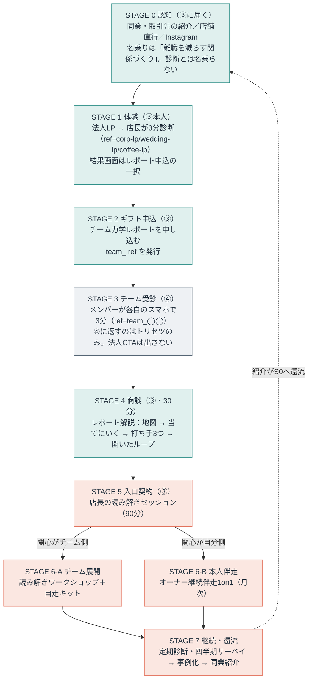

# 法人の中心価値とファネル（③店長・リーダー／④メンバー）

セグメント③店長・リーダー（`ref=corp-lp`／`wedding-lp`／`coffee-lp`）と④メンバー（`ref=team_` 始まり）の、
**提供価値の中心・ペルソナ・ファネル**を確定させる文書。①一般・②紹介は `ファネル図.md` で確定済みで、
③④だけが「別ルート」と書かれたまま中身が空だった。その空白を埋めるのが本書。

> 位置づけ：**確定**（金額のみ `（要確定）` 表記で仮置き）。判断根拠を各節に明記してあるので、前提が変われば該当節だけ差し替える。
> 参照：`ファネル図.md`（全体戦略・①②の確定ルート）／`法人ポジショニング.md`（7観点・営業上の構え）／`提案資料1枚.md`（営業資料）／`読み解きワークショップ設計.xlsx`（WS進行・接続設計）／`文脈出し分け仕様.md`（コピー素材）。
> 本文に長音ダッシュは使わない（プロジェクトの表記ルール）。

---

## 0. 決めたこと（結論）

| # | 論点 | 決定 |
| :-: | :-- | :-- |
| 1 | 法人の中心価値（**約束**） | **辞めない店をつくる（定着）**。ただし約束する粒度は「離職率が◯%下がる」でなく**「辞める理由そのものを減らす」**（§1.5） |
| 2 | 中心の**レバー** | **店長の関わり方**。定着に効く変数のうち、こちらが操作でき、店長が明日から動かせる唯一のもの |
| 3 | 一番高いお金を払う価値 | レバーの側。**店長本人が「読めて、扱える」ようになること**に最高単価を置く（§1.3） |
| 4 | 最高単価の商品 | **オーナー・店長への継続伴走1on1**（現エグゼクティブマインドセッションを月次の継続契約として再定義） |
| 5 | 入口の有料商品 | **置く。店長の読み解きセッション（90分）**。パート時給がゼロのまま最初の課金ができる |
| 6 | チームワークショップの位置 | 主商品から**降ろす**。レバーをチーム全体へ広げる商品として中段に置く |
| 6.5 | 解決する悩み | 3層それぞれに1つずつ載せる。**約束＝静かに辞める／商談＝自分の何が人を遠ざけるか／商品＝相手ごとの基準がない**（§1.6） |
| 6.6 | セグメントの切り方 | **業種と従業員規模から、観測可能な構造条件へ**。「単一拠点で、5〜30名を、中間管理職を挟まずにリーダー1人が直接見ている事業所」＋トリガー（求人を出し続けているなど）。業種フォーカスはチャネルであってセグメントではない（§3.1） |
| 6.7 | 価値観の扱い | **セグメントの境界に置かない**。「相手ごとに変えるべき」は観測できないので境界にできず、適合条件にすると市場が狭くなりすぎる。**商談で作る認識**として扱う（§3.1.1〜3.1.2） |
| 6.8 | 規模の扱い | 訴求軸から外す。人数は境界の構造条件（5〜30名）へ、支払い能力は適合条件へ分けて置く（§3.1.3・§3.1.7） |
| 7 | ③のペルソナ | **現場に立ちながら一人で決めているリーダー**。約束は組織の言葉、商談の入りは本人の言葉 |
| 8 | ④のペルソナ | 時給パート中心の現場スタッフ。**買わない。売らない** |
| 9 | ④の設計原則 | **④に法人CTAを出さない**。正直な回答をもらい、自己理解（トリセツ）だけを返す |
| 10 | ③④のファネル | 認知 → 体感 → ギフト → 商談 → 入口契約 → 分岐（チーム／本人） → 継続・還流の7段（§4） |
| 11 | チーム識別子 | **`team_<店名slug>`** に統一（main の実装 `prototype.html` の判定に合わせる） |
| 12 | 価格と商品の順序 | **価格が先**。ただし「価格を決める」でなく「その価格で成立する商品を逆算する」。商品設計のうち**商品定義は価格と同時、進行設計は価格の後**（§2.4） |
| 13 | 増殖の階段 | **年5,000万円の必要条件ではない**。1人で月10万〜12万円×40社で届く。**本当の制約は継続率**で、単価を上げるより継続を伸ばす方が効く（§2.5） |
| 14 | 3ヶ月の成果 | **3点セット**。主成果＝メンバーから上がってくる情報が変わる／具体の証拠＝指名した1人との関係／蓄積の証拠＝全員分の基準が残る。エンゲージメントスコアとパフォーマンスは成果に置かない（§2.6） |
| 15 | 価格 | **凍結解除・確定**。入口セッション5万円、継続伴走は規模帯別で月6万／9万／12万円、チームWSは年30万円。**価値からの逆算は相場より低く出る**ので、論理層の論法を「1名の離職回避」から「離職コスト全体を継続的に減らす」へ組み替える（§2.7） |
| 16 | 年5,000万円への距離 | この価格で**1人なら年約4,300万円**。到達には規模帯を上に寄せるか、2人目が要る（§2.7.3） |

> 中心価値（何を約束するか）と最高単価（どこに金が集まるか）が別なのは矛盾ではない。**約束は定着、操作するのは店長の関わり方**という関係で、後者が前者を動かす唯一のレバーだから最高単価が乗る（§1.3）。

---

## 1. 中心価値：何を約束し、どこに最高単価を置くか

### 1.1 「中心価値」と「一番高いお金を払う価値」は別のものとして扱う

法人が払いうる価値は、性質の違う3種類が混在している。既存資料はこれを並列に語っていて、優先順位がついていなかった。

| 候補 | 中身 | 既存資料での扱い |
| :-- | :-- | :-- |
| **A 結果** | 辞めない・回る店になる（定着・接客品質） | `提案資料1枚.md` の主線。放置コスト＝採用1名80〜100万円と対置 |
| **B 能力** | 店長が、チームを読めて扱えるようになる | `法人ポジショニング.md`「営業上の構え3・実態B」で顕在化 |
| **C 仕組み** | 共通言語と自走キットが社内に残る | `ファネル図.md` の設計原則「自走可能に設計する」 |

3つを1つに絞ろうとすると必ず無理が出る。**A は約束（何を売っているか）としては最強だが、単体では操作できない**。B は操作できるが、それ自体は買い手の目的ではない。そこで役割を分けて3点で定義する。

| 役割 | 中身 | 使う場面 |
| :-- | :-- | :-- |
| **約束（中心価値）** | **A 辞めない店をつくる** | 名乗り・LP・資料の見出し・稟議 |
| **レバー** | **B 店長の関わり方** | 商品設計・価格の重心・提供の中身 |
| **入口** | 店長本人の実感（当たる・話せる） | 商談の入り・無料診断・レポート |

### 1.2 なぜ約束をAに置けるのか（研究の裏付け）

Aを中心に据える判断は、既存資料が集めた研究がそのまま支える。ここが「定着を約束する」ことの誠実さの担保になる。

- **自然体を引き出す導入設計は、離職率を下げる**。Cable, Gino & Staats（2013, Administrative Science Quarterly）。入社時の導入を「会社に染める」でなく「その人らしさを引き出す」設計にした群は、離職率が低く顧客満足が高かった。コールセンターでの現場実験。
- **職場で自然体でいられるほど、燃え尽きが少なくエンゲージメントが高い**。Van den Bosch & Taris（2014, Journal of Happiness Studies）。自分を偽る「自己疎外」が最も悪影響の大きい因子だった。

つまり本製品が測るもの（自然体）と、約束するもの（定着）の間には、直接の実証がある。「相互理解で摩擦を減らす」という機序も、この2本で説明が付く。

### 1.3 なぜレバーはBで、そこに最高単価が乗るのか

定着に効く変数は多いが、**こちらが操作でき、店長が明日から動かせる変数**はほぼ1つしかない。

| 定着に効く変数 | 操作できるか |
| :-- | :-- |
| 時給・待遇 | 店の原資次第。こちらは触れない |
| 採用の質（ミスマッチ防止） | 適性検査の領域。入った人には効かない |
| シフト・労働時間 | 人手不足そのものが原因なので循環する |
| **上司（店長）との関係の質** | **操作できる。しかも明日から動かせる** |

最後の1つが効くことにも裏付けがある。上司と部下の関係の質（LMX）は満足・コミットメント・離職意図と一貫して相関し（Gerstner & Day 1997）、部下が声を上げるかは管理者の開放性の知覚に規定される（Detert & Burris 2007。レストランチェーン3,149名の研究で、Tier1業種に直接近い）。詳細は `チームレポート学術的裏付け.md` §5。

したがって、**定着という約束を動かす操作点は店長の関わり方**であり、そこに最も高い金が乗る。さらにこのレバーは商品として売りやすい条件を3つ持つ。

- **代替不能性が高い**。店長の「この判断でいいのか」「あの子が最近静かだが、どう声をかけるべきか」は、利害関係者にしか相談できないので相談先がない。無料の代替がなく、値付けの上限が高い。約束の側（定着）を直接売ろうとすると、求人媒体・時給アップ・他社研修と同じ棚に並べられて必ず相見積もりになる。
- **原資に適合する**。`法人ポジショニング.md`「実態A」のとおり Tier1 は店長＋時給パート構成で、全員を集める形式そのものが障壁になる。レバーは店長1人が対象なので、人数×時給が発生しない。
- **検証が速い**。効いたかどうかを本人が翌週に体感する。定着そのものは1年後にしか分からない。

### 1.4 3つの層と商品の対応

`法人ポジショニング.md`「営業上の構え2（感情で信頼、論理で稟議）」を、商品まで降ろすとこうなる。

| 層 | 何を渡すか | 誰の言葉か | 商品 | 支払い意欲 |
| :-- | :-- | :-- | :-- | :-- |
| **入口層** | 自分の店の地図が見えた | オーナー本人の驚き | 無料診断 ＋ チーム力学レポート | ¥0（ギフト） |
| **レバー層** | 店長が読めて、扱えるようになる（B） | オーナー本人の切実さ | 店長の読み解き → 継続伴走1on1 | **最高** |
| **約束の層** | 辞めない店になる（A）／共通言語が残る（C） | 名乗り・稟議・社内説明・家族への説明 | 名乗りと資料の全体／チームWS ＋ 自走キット | 中。ただし**継続と更新の理由**はここにある |

読み方は3点。

- **語る順序は 約束 → 入口 → レバー**。名乗りは約束（「スタッフがすぐ辞める、を減らす関係づくり」）から入る。次に本人が診断とレポートで体感する。買うのはレバー。
- **A（約束）を単体で売らない**。定着は結果指標なので、それだけを売ると効果の立証責任をこちらが全部背負う。売るのは「定着に効くレバーを、あなたが握れるようにする」こと。
- **C（仕組み）は継続の理由**。単発で終わらせないための言葉なので、初回の購買動機ではなく更新・年間契約の場面で使う。

### 1.5 約束の粒度（言っていいこと、言ってはいけないこと）

定着を中心に置く以上、**約束の言い方を固定しておかないと過剰約束になる**。離職は時給相場・家庭の事情・景気など外部要因が大きく、こちらの介入だけで因果を引き受けることはできない。

| 言う | 言わない |
| :-- | :-- |
| 「辞める理由そのものを減らします」 | 「離職率が◯%下がります」 |
| 「素を出せないストレスは、辞める理由の中でも扱えるものです」 | 「これで人は辞めなくなります」 |
| 「自然体を引き出す導入設計で離職率が下がった研究があります」（出典を添える） | 「効果が実証されています」（主語をぼかした断定） |
| 「効果は四半期の匿名サーベイと、御社の離職率の実数で一緒に見ます」 | 自社実績がない段階での成功事例の示唆 |

この線は `チームレポート仕様.md` §8 のガードレール（効果の主張は自社実測で／断定調の禁止）と同一。約束を強くした分、**言い方の規律で誠実さを担保する**。

### 1.6 3層に、それぞれどの悩みを載せるか（2026-08-06確定）

3層は器で、そこに載せる**具体的な悩み**を確定させたのがこの節。悩みを1つに絞ろうとすると必ず無理が出る。候補はそれぞれ弱点を持ち、しかもその弱点が互いに補完的だったので、**3つを役割分担させる**。

| 層 | 載せる悩み（相手の言葉） | 使う場面 |
| :-- | :-- | :-- |
| **約束（名乗り）** | **「辞めそうな人ほど、何も言わない。気づいたときには『お話があります』になっている」** | LP・名乗り・資料の見出し・稟議 |
| **商談で開く** | **「自分の何が悪いのか、もう誰も教えてくれない」** | レポート解説の「当てにいく」。ここで店長個人の話に落ちる |
| **商品の中身** | **「人によって接し方を変えるべきなのは分かっている。でも何を基準に、どう変えればいいのか分からない」** | 読み解きセッションと月次レビューで実際に渡すもの |

この順で1本の会話になる。「静かに辞めるのを止めたい」で入り、「その一因はあなたの関わり方にある」で自分ごとになり、「では相手ごとの基準を持ちましょう」で商品になる。

### 1.6.1 それぞれを選んだ理由と弱点

| 悩み | 強み | 弱点（だから単独では使えない） |
| :-- | :-- | :-- |
| **静かに辞める**（約束） | 緊急性が最も高く、痛みが採用コストという金額に直結するので法人予算がつく。サーベイは事後検知、適性検査は採用時にしか効かないので、素を出せないストレスの手前に入れるのは当方だけ | 予防の価値は証明しにくい（起きなかったことは見えない）。個人セッション商材と直結しない |
| **自分の何が人を遠ざけるか**（商談） | 代替不能性が全候補中で最も高い。立場が上がると誰も本音を言わなくなるので、相談先が本当に存在しない。タイプの消耗ポイントを**欠陥でなく強みの裏面**として返せるのが核 | 本人が痛みを認めていないと売れない。入口には置けない |
| **相手ごとの基準がない**（商品） | 診断資産との接続が完璧。8タイプ×相性がそのまま「基準」になり、基準を作るのでなく渡せる | 緊急性が中程度。「困ってはいるが今日でなくてもいい」に流れる |

### 1.6.2 識学との差別化はここで決まる

識学の前提は「**マネジメントには正解がある**」で、全員に同じルールを適用して組織を動かす思想。当方の商品の中身（相手ごとの基準）は、**その真逆**にあたる。

> 識学：ルールで統一する。
> 当方：相手ごとに変える。その基準を渡す。

同じ市場（中小の経営者・現場責任者のマネジメントの悩み）に、構造的に別の解を出せる位置にいる。「人によって接し方を変えるべきだが基準がない」は、識学が思想上答えない問いなので、正面からぶつからずに差別化できる。

### 1.6.3 採らなかった候補

| 候補 | 採らない理由 |
| :-- | :-- |
| 「決めるのが怖い」 | 悩み自体は本物（2026-07-23商談で実際に出た言葉）だが、**8タイプは対人スタイルであって意思決定スタイルではない**。無理に接続すると根拠のない約束になる。商談で「自分の何が」を開くときの一部として扱う |
| 「話しかけたいのに話す中身がない」 | 困り度が低く、単価が上がらない。商品の中身（相手ごとの基準）に自然に含まれる |
| 「空気が悪いが原因が分からない」 | 曖昧で緊急性が低い。「そのうち何とかしたい」で止まる |
| 「新人が馴染めず辞める」 | 研究の裏付けは最も直接的（Cable et al. 2013）だが、対象が新人なので人数課金に寄り、**リーダー個人への高単価セッションと繋がらない**。オンボーディング用途として後から足す |

---

## 2. 価格ラダー

> **金額は2026-08-06に再設計した。確定値は §2.7.2 の表**（下表は改定後の金額を反映済み）。凍結の経緯は `調査_類似サービスの売上実例.md`（実証済みの同型サービスが軒並み一桁上の単価だった）。再設計はセグメント（§3.1）・悩み（§1.6）・成果（§2.6）の確定を踏まえて行った。

| # | 商品 | 対象 | 形式 | 価格（仮） | 役割 |
| :-: | :-- | :-- | :-- | :-- | :-- |
| 0 | 無料診断 | ③④全員 | 9問・3分 | ¥0 | 共通入口・体感 |
| 1 | チーム力学レポート | ③ | PDF・無償進呈 | ¥0 | ギフト。商談の題材（`チームレポート仕様.md`） |
| 2 | **店長の読み解きセッション** | ③本人 | 90分・1on1・単発 | **¥50,000** | **入口の有料商品**。稼ぐ商品でなく移行させる商品。継続に入れば初月分に充当 |
| 3 | チーム読み解きワークショップ | ③＋④ | 90分・初回ファシリ＋年間一式 | **¥300,000（年）** | レバーをチーム全体へ広げる。約束（定着）の言葉で買う |
| 4 | **継続伴走（月次レビュー）** | ③本人 | 月1回90分＋週次の記録 | **5〜9名 月¥60,000／10〜19名 月¥90,000／20〜30名 月¥120,000** | **最高単価・最高LTV**。規模帯別（工数でなく価値で値付け） |
| 5 | 自走キット＋定期診断＋四半期サーベイ | ③④ | 年間 | 3に同梱／更新時は年額 | 継続・更新の理由 |

### 2.1 なぜ2（入口の有料商品）を置くのか

`法人ポジショニング.md`「営業上の構え3」で「要確定」のまま残っていた論点をここで確定させる。**置く**。理由は3つ。

1. **時給ゼロで最初の課金ができる**。無料レポートの次がいきなり12〜15万円＋パート時給（5〜15名×90分）だと、決断のサイズが跳ね上がる。3〜5万円・店長1人なら、その場で決まる。
2. **レバーを最初に握らせる**。定着（約束）を動かす操作点は店長の関わり方なので、最初に買うものがレバーそのものだと「体感したものを買う」という筋が通る。チームWSを入口にすると、体感したもの（自分の読み解き）と買うもの（全員の集合）がずれる。
3. **4への自然な接続**。2は単発、4は継続。2の場で「これを毎月やりましょう」が最も自然に出る。3（チームWS）から4への接続は `読み解きワークショップ設計.xlsx` の M6 決裁者デブリーフに依存するが、2からなら初回の90分がそのままデモになる。

### 2.2 なぜ4（継続伴走）を最高単価に置くのか

- **レバーの性質が継続向き**。「読めるようになる」は一度で完成せず、メンバーが入れ替わるたびに地図が変わる（接客業は入替が多い）。単発では完結しないものを単発で売る方が不自然。
- **約束（定着）の時間軸と揃う**。定着は結果が出るまで数ヶ月から1年かかる。単発商品では「効いたかどうか」を一緒に確認する場がないまま関係が切れるが、月次の伴走なら**約束の検証そのものが商品の中に入る**（四半期サーベイと離職率の実数を一緒に見る場になる）。過剰約束を避けつつ定着を掲げるには、この場が要る。
- **提供工数が積み上がらない**。月次1on1・60分×10名で月10時間。一方チームWSは1件90分＋移動＋準備で実質半日、しかも売り切り。`料金形態分析_年間vs月額.md` は「利益100万円には単価15万円で月16〜17件の成約と実施が必要＝物理的に不可能」と結論しているが、**ストック型の4を混ぜると件数依存が下がる**。
- **`ファネル図.md` の設計原則と一致**：「セッションは高単価・少数に絞る」。

### 2.3 商品の出し方（1本道でなく、2の場で分岐する）

2（店長の読み解き）の終わりで、店長の関心がどちらを向いているかで分岐させる。メニューを並べない。

- 関心が**チーム側**（「これをみんなでやりたい」）→ 3 チームWS
- 関心が**自分側**（「自分の関わり方をもっと知りたい」「決められない」）→ 4 継続伴走

`読み解きワークショップ設計.xlsx`「接続設計」の予測マップ#3（「自分の関わり方は合っているのか。部下には聞けない」）が、4への最短の入り口。

### 2.4 価格と商品、どちらを先に設計するか（2026-08-06確定）

**価格が先**。ただし「価格を決める」でなく「**その価格で成立する商品を逆算する**」という意味。

**根拠1：新商品の失敗の主因が価格の後回しにある。** Simon-Kucher の Ramanujam & Tacke『Monetizing Innovation: How Smart Companies Design the Product Around the Price』は、イノベーションの**72%が財務目標に届かないか完全に失敗する**とし、その原因を価格が後付けの検討事項になっていることに帰す。処方は「作る前に支払い意欲を確かめ、価格の周りに商品を設計する」。

**根拠2：サービス業にはより直接的な定石がある。** Alan Weiss『Value-Based Fees』の原則は「**望ましい成果について概念的合意を得よ。方法論と提供物を先に語るな**」。順序は 成果 → 測定指標 → 価値 → 提案 → 方法論で、方法論（＝商品設計）は最後。コンサルの価値は費やした時間や方法論でなく達成された成果にあるため、方法論を先に固めると価格がそれに引きずられる。

**根拠3：当方固有の事情。** `調査_類似サービスの売上実例.md` で現行案が実例より一桁低いと分かっている。この状態で商品を作り込むと**安い価格に合わせた薄い商品**ができる。90分3〜5万円の単発商品と、月10万円×12ヶ月の伴走商品では設計そのものが別物（前者は進行台本1本、後者は12回分の議題の流れ・間の接触・蓄積される記録が要る）。順序を逆にすると作り直しになる。サービス業なので在庫も開発費もなく、価格先行のリスクは小さい。

**ただし但し書きが2つ。**

- **「商品設計」は2つに分けて扱う**。**商品定義**（何を約束し、何を渡し、どの頻度でやるか）は価格と不可分なので同時に決める。**進行設計**（90分の中で何をどの順でやるか、月次の議題フォーマット）は価格の後でよい。§6の「読み解きセッション90分の進行設計」は後者なので、後回しで正しい。
- **支払い意欲は聞かない**。人は自分の将来行動の予測が下手なので、「いくらなら払いますか」は当てにならない。価格を仮に置いて**実際に提示し、反応を観察する**（商談がそのまま検証の場になる）。

**したがって作業順序は：増殖の階段（§2.5）→ 成果の定義 → 価格レンジ → 商品定義 → 進行設計。**

> 出典：[Monetizing Innovation（Wiley）](https://www.wiley.com/en-be/Monetizing+Innovation:+How+Smart+Companies+Design+the+Product+Around+the+Price-p-9781119240860)／[It's Price Before Product. Period.（First Round Review）](https://review.firstround.com/its-price-before-product-period/)／[Conceptual Agreement with A Buyer（Alan Weiss）](https://alanweiss.com/conceptual-agreement-with-a-buyer/)／[Ask Teresa: How Can You Test a Customer's Willingness to Pay?](https://www.producttalk.org/willingness-to-pay/)

### 2.5 増殖の階段は必要か（2026-08-06検討）

`調査_類似サービスの売上実例.md` §6 で、識学が1社あたりを積む仕組み（経営者→幹部→部門→評価制度と1年かけて降ろす）を持つのに対し、**当方は店長1人で階段が1段で終わる**ことを課題として挙げた。価格レンジを決める前に、この上限を確かめる。

#### 2.5.1 まず計算する。階段がなくても年5,000万円に届くか

1人で提供する前提で、月次伴走の提供工数から上限を出す。

| 前提 | 値 |
| :-- | :-- |
| 1社あたりの月次工数 | 90分の1on1 ＋ 準備と記録30分 ＝ **2時間／社／月** |
| 稼働可能時間 | 週40時間 × 4.3週 ＝ 月172時間 |
| うち提供に充てられる割合 | **半分**（残りは営業・レポート作成・ワークショップ・事務） |
| 提供可能時間 | 月86時間 |
| **同時に抱えられる社数** | **約40社** |

この40社に対する年商は次のとおり。

| 月額 | 40社での年商 | 5,000万円に必要な社数 |
| :-- | :-- | :-: |
| 10万円 | 4,800万円 | 42社 |
| 12万円 | 5,760万円 | 35社 |
| 15万円 | 7,200万円 | 28社 |

**結論：階段がなくても届く。** 月10万〜12万円（飲食コンサル相場の中心）で40社を維持できれば、年5,000万円前後になる。EOS実施者が1人20社で6,700万〜9,900万円相当なのと同じ構造で、当方は単価が低い分だけ社数が要る。

#### 2.5.2 したがって「増殖の階段」は前提条件ではない

識学が階段を作ったのは、**講師を量産して組織で伸ばす道**を選んだからで、1人で5,000万円を目指すなら必須ではない。位置づけを次のように変更する。

| | 変更前 | 変更後 |
| :-- | :-- | :-- |
| 増殖の階段 | **5,000万円到達の必要条件** | **必要条件ではない**。5,000万円を超えた先、または社数が積めなくなったときの手段 |
| 5,000万円の制約 | 1社あたり単価 | **社数の維持（＝継続率と新規獲得のバランス）** |

#### 2.5.3 本当の制約は継続率だった

40社を「抱える」には、**抜けた分を埋め続ける**必要がある。ここが効く。

| 平均継続期間 | 40社の維持に必要な年間新規 | 月あたり |
| :-- | :-: | :-: |
| 12ヶ月 | 40社 | 3.3社 |
| 18ヶ月 | 27社 | 2.2社 |
| **24ヶ月** | **20社** | **1.7社** |

**平均12ヶ月で終わる設計にすると、月3.3社の新規獲得が永久に必要になる。** これは紹介中心の営業では厳しい。24ヶ月続けば月1.7社で足りる。

含意は商品定義に直結する。

- **識学型の「全12回で一区切り」は採らない**。回数で区切ると平均継続が12ヶ月に固定される。
- **終わりのない設計にする**。メンバーが入れ替わるたびに地図が変わる（接客業は入替が多い）という性質は、そのまま「終わらない理由」になる。§2.2で挙げた「レバーの性質が継続向き」を、契約形態でも表現する。
- **単価を上げるより、継続を伸ばす方が効く**。月10万円を12万円にすると年商は20%増えるが、継続が12ヶ月から24ヶ月に伸びると**必要な新規獲得が半減する**。営業が最大のボトルネックである以上、後者の方が実質的に効く。

#### 2.5.4 それでも階段が要るときの候補

社数が積めない、または単価を上げたい場合の候補。セグメント定義（単一拠点・中間管理職なし）との整合を併記する。

| 候補 | 中身 | セグメント定義との整合 |
| :-- | :-- | :-- |
| **時間で積む（縦）** | 継続そのもの。2年目以降も続ける | **整合する。最優先** |
| **社員・次期リーダーへ降ろす** | 5〜30名のうち社員層（1〜9名）に「次の店長を育てる」文脈で読み解きを渡す | 部分的に整合。ただし**中間管理職がいないのがセグメント条件**なので、識学の浸透パックのような厚みは出ない |
| **店舗数で積む（横）** | オーナーが2店舗目・3店舗目を持つと店長の数だけ積める | **セグメント定義（単一拠点）と衝突する**。「単一拠点だが増やす意志がある」オーナーに限れば整合 |
| **チーム側の商品** | ワークショップ＋自走キット＋定期診断（既存の商品3） | 整合する。ただし単発性が強く、継続には寄与しにくい |
| 採用への拡張 | 採用候補者にも診断を受けてもらい、既存チームとの相性を見る | **要注意**。診断資産は直接効き、約束（辞めない店）とも一致するが、**「人事評価・選抜に使わない」というガードレール（`チームレポート仕様.md` §8・④への約束）と衝突する**。既存メンバーが「うちは診断で人を選んでいる」と知れば、自分の結果への信頼も崩れ、回答が歪む。採るなら設計を分離する必要がある |

### 2.6 成果の定義（概念的合意・2026-08-06確定）

§2.4 の作業順序に従い、価格の前に「何が達成されたら成功か」を確定させる。Alan Weiss の概念的合意の形式（**objectives 成果 / measures 測定指標 / value 価値**）で書く。商談ではこれを買い手と合意してから提案に入る。

#### 2.6.1 3ヶ月の成果（3点セット）

成果は1つに絞らない。性質の違う3つを組み合わせると、互いの弱点が消える。

| 役割 | 成果（objective） | 測定指標（measure） | 価値（value） |
| :-- | :-- | :-- | :-- |
| **主成果** | **メンバーから上がってくる情報が変わっている**。相談・申し出・「ちょっといいですか」が出てくる。気づくのでなく、言ってもらえる | 週次で「今週メンバーから上がってきたこと」を記録し、開始月と3ヶ月目で件数と種類を比べる | 静かに辞めるが起きなくなる。採用のやり直し1名あたり約80万〜100万円の回避 |
| **具体の証拠** | **開始時に指名した「一番気になっている1人」との関係が変わっている** | 開始時に具体的な場面を1つ書き出し、3ヶ月後に同じ場面がどうなったかを比べる | その1人が残る。約100万円 |
| **蓄積の証拠** | **全員分の「この人にはこう関わる」が言語化され、記録に残っている** | 全員分のトリセツが埋まっている。新メンバーが入るたびに追加されている | 店長が替わっても引き継げる資産になる。関わり方の属人化が解ける |

配置の意図は3つ。

- **主成果に「上がってくる情報」を置いた理由**：約束（辞めそうな人ほど何も言わない）の**ちょうど裏返し**であり、しかも帰属を説明できる。部下が声を上げるかは管理者の開放性の知覚に規定される（Detert & Burris 2007。レストランチェーン3,149名の研究）ので、**店長の関わり方の直接の結果**として語れる。
- **具体の証拠を置いた理由**：商談でその場で決められ、成功が誰の目にも見える。抽象的な成果だけだと「達成したかどうか」で揉める。
- **蓄積の証拠を置いた理由**：**確実に達成できる**ので、「3ヶ月やって何も残らなかった」を構造的に防ぐ。単独では弱い（持っているだけで使えている保証がない）が、保険として効く。

#### 2.6.2 12ヶ月の層（3ヶ月の成果とは分ける）

3ヶ月では動かないが、約束の本体はこちらにある。**成果として合意するのではなく、一緒に見る数字として開始時から記録する**。

| 見る数字 | 測り方 |
| :-- | :-- |
| 離職率・退職者数の実数 | 御社の実数。開始時点を起点に記録 |
| 期間中に入った新人の定着 | 独り立ちまで残ったか |
| 店長が欠員の穴埋めでシフトに入った時間 | シフト表。**店長本人の生活が変わるので体感が強い** |
| 四半期の匿名サーベイ | 働きやすさ・チームワーク・自然体を出せているか |

#### 2.6.3 成果に置かないもの

| 置かないもの | 理由 |
| :-- | :-- |
| **エンゲージメントスコアの向上** | 3ヶ月では動かず、5〜30名では匿名性が担保できず統計も効かない（`提案資料1枚.md` スライド9で自ら競合批判として書いている論点）。加えて**スコアで約束するとサーベイ製品と同じ棚で比較される**。12ヶ月の層に、行動の言葉（言ってもらえる関係になっている／穴埋めに入らなくてよくなっている）に置き換えて置く |
| **パフォーマンス・売上の向上** | 客数・季節・立地・時給相場で動くため帰属できない |
| **「3ヶ月で誰も辞めていない」** | 帰属が低い。3ヶ月誰も辞めなくても元々そうだったかもしれず、辞めた場合は制御外の理由でも失敗になる。§1.5 の過剰約束の禁止に抵触する。**2.6.2 の「一緒に見る数字」としてのみ扱う** |
| **意思決定の速さ・迷いの減少** | 8タイプは対人スタイルであって意思決定スタイルではない（§1.6.3と同じ理由） |

#### 2.6.4 この成果定義が、次の商品定義に課す要件

成果を先に決めたので、商品が満たすべき条件が自動的に決まる。§2.4 のとおり、これが商品定義の入力になる。

| 成果 | 商品に必要な仕掛け |
| :-- | :-- |
| 主成果（上がってくる情報） | **週次で記録する仕組み**。月次レビューだけでは粒度が粗いので、店長が自分で残せる軽い器が要る |
| 具体の証拠（あの1人） | **開始時のセットアップ**。1人を指名し、場面を書き出す手順。これが入口の有料商品（店長の読み解きセッション90分）の中身を規定する |
| 蓄積の証拠（全員分の基準） | **トリセツの器と、更新の導線**。診断結果とチーム力学レポートで素材は既にあるが、更新され続ける形にする必要がある |

### 2.7 価格レンジ（2026-08-06確定。凍結解除）

§2.4 の順序に従い、商品定義の前に価格を決める。制約は3つある。

| 制約 | 中身 |
| :-- | :-- |
| **上限** | 顧客が知覚する価値（§2.6 の成果の value） |
| **下限** | 目標年商 ÷ 提供可能な社数（§2.5.1 で40社） |
| **参照** | 市場相場（`調査_類似サービスの売上実例.md` §4） |

#### 2.7.1 価値からの逆算（不都合な結果が出る）

まず正攻法で、成果の価値から価格を出す。前提は `（要・自社数値／顧客の実数で置き換える）`。

| 規模 | 年間離職者（離職率25〜30%と仮定） | 離職コスト（1名90万円） | 店長の時間コスト（1名50〜100時間×3,000円） | 当方が減らせる分（年1〜3名と仮定） |
| :-- | :-- | :-- | :-- | :-- |
| 5〜9名 | 1.5〜3名 | 135万〜270万円 | 5万〜18万円 | **約90万〜120万円** |
| 10〜19名 | 3〜6名 | 270万〜540万円 | 11万〜36万円 | **約120万〜240万円** |
| 20〜30名 | 5〜9名 | 450万〜810万円 | 18万〜54万円 | **約225万〜360万円** |

価値ベース価格の定石は創出価値の10〜25%。当てはめると次のようになる。

| 規模 | 価値 | 10〜25%を適用した年額 | 月額換算 |
| :-- | :-- | :-- | :-- |
| 5〜9名 | 90万〜120万円 | 9万〜30万円 | **月0.8万〜2.5万円** |
| 10〜19名 | 120万〜240万円 | 12万〜60万円 | **月1万〜5万円** |
| 20〜30名 | 225万〜360万円 | 22万〜90万円 | **月1.9万〜7.5万円** |

**価値からの逆算は、相場（月5万〜15万円）よりはっきり低く出る。** これは目を逸らさずに扱うべき事実で、意味は2つ。

- **定着だけを価値に数えると、単価は上がらない**。飲食コンサルが月5万〜15万円を取れているのは、売上改善（メニュー・集客・原価）という**もっと大きい価値**を扱っているから。同じ価格帯を、定着だけを根拠に主張すると論理で負ける。
- **相場との差は「感情で買う分」**。オーナー即決層は厳密なROI計算をせずに買う（§1.4で自ら前提にしている構造）。ここに乗ることは可能だが、**論理層（稟議・社内説明）で突かれると弱い**という自覚が要る。

#### 2.7.2 したがって価格は規模帯別にする

提供工数は規模によらずほぼ同じ（店長1人との月次1on1）だが、**価値は規模に比例する**。工数でなく価値で値付けするのが定石なので、規模帯で分ける。人数課金ではないので、「全員集めると時給が」という障壁（§1.3）は発生しない。

| 商品 | 形式 | 価格 |
| :-- | :-- | :-- |
| 0 無料診断 | 9問・3分 | ¥0 |
| 1 チーム力学レポート | PDF・無償進呈＋解説商談30分 | ¥0 |
| **2 店長の読み解きセッション** | 90分・1on1・単発 | **¥50,000** |
| **4 継続伴走（月次レビュー）** | 月1回90分＋週次の記録 | **5〜9名 ¥60,000／10〜19名 ¥90,000／20〜30名 ¥120,000（月額）** |
| 3 チーム読み解きワークショップ＋自走キット＋定期診断 | 初回ファシリ90分＋年間一式 | **¥300,000（年）** |

設計の意図。

- **入口（商品2）は5万円**。ペルソナの「数万円は即決、10万円超は考える」（§3.2）の即決ゾーンに収める。ここは稼ぐ商品ではなく**移行させる商品**なので、上限を攻めない。
- **入口は継続の初月に充当する**。単発で買うと5万円、続けるなら初月分に充てる。単発の方が割高に感じる構造にして、継続への移行率を上げる。
- **継続伴走は相場の中心に置く**。最も近い比較対象は「顧問契約・月1回1〜2時間で月5万〜10万円」で、提供形態がほぼ同じ。10〜19名の月9万円はここに収まる。
- **ワークショップは年30万円**。定額制研修（グローイング・アカデミー 月4万〜7万円＝年48万〜84万円）より安く、単発研修より残るものが多い位置に置く。

#### 2.7.3 検算（この価格で年5,000万円に届くか）

継続伴走の規模帯分布を、下に厚め（5〜9名が半分、10〜19名が4割、20〜30名が1割）と仮定すると平均月額は約7.8万円。丸めて**平均月8万円**とする。

| 商品 | 前提 | 年商 |
| :-- | :-- | :-- |
| 継続伴走 | 40社 × 月8万円 × 12ヶ月 | **3,840万円** |
| 入口セッション | 新規 年20社 × 5万円 | 100万円 |
| ワークショップ | 年12社 × 30万円 | 360万円 |
| **合計** | | **約4,300万円** |

**1人では年5,000万円に届かない。** 届かせるには次のいずれかが要る。

| 打ち手 | 効果 |
| :-- | :-- |
| **顧客の規模帯を上に寄せる** | 平均月10万円になれば継続伴走だけで4,800万円。合計5,260万円で到達。§3.1.3 の5〜30名のうち**上半分を狙う**ということ |
| 提供に充てる時間の割合を上げる | 紹介中心になって営業時間が減れば50社まで持てる。50社×月8万×12＝4,800万円 |
| 2人目を入れる | `料金形態分析_年間vs月額.md` の統合型（セラー・ファシリテーター）。ただし単価が変わるので試算し直しが要る |

**結論：この価格設計は「1人で年4,300万円、規模帯を上に寄せるか2人目で5,000万円超」という構造。** 年5,000万円は1人での限界のすぐ外側にある。

#### 2.7.4 論理層（稟議・社内説明）の組み方への含意

§2.7.1 のとおり、**離職1名の回避だけを根拠にすると価格を支えきれない**。論理層の説明を次のように組み直す必要がある。

| 使わない論法 | 使う論法 |
| :-- | :-- |
| 「1名の早期離職を防ぐだけで費用を上回る」 | 「**離職コスト全体（年◯百万円）の一部を、継続的に減らし続ける**」 |
| 単年のROI比較 | **複数年の累積**。継続契約なので、2年目以降は初期の学習コストがかからない |
| 採用コストだけ | **採用コスト＋店長の時間**（採用面接・教育やり直し・穴埋めシフトで離職1名あたり50〜100時間） |

> `提案資料1枚.md`（PR #16版）スライド4は「たった1名の早期離職を防ぐだけで、本サービスの初年度費用（12万〜15万円）を大きく上回る」と書いているが、**価格が上がったのでこの一文は成立しない**。上の論法に差し替える必要がある。

#### 2.7.5 検証の方法（聞かずに、提示して観察する）

§2.4 のとおり支払い意欲は質問しない。**商談で実際に提示して反応を観察する**。最初の10件は次を記録する。

- 提示した価格と規模帯
- その場の反応（即決／持ち帰り／値下げ交渉／断り）
- 断られた場合の理由（高い／必要性を感じない／時期が悪い）
- 実際に成約した価格

10件たまった時点で、規模帯ごとの成約率を見て価格を調整する。**下げるのは簡単だが上げるのは難しい**ので、最初は上の価格で出す。

---

## 3. セグメントとペルソナ

### 3.1 セグメントの定義（2026-08-06確定。同日、価値観を境界から外して再確定）

従来は「Tier1業種（接客・飲食・宿・美容・介護・保育・式場）の5〜15名」と、**業種と従業員規模**でセグメントを定義していた。これを改める。理由は2つ。

- **悩みは規模で決まらない**。5名の店長も200名の部長も「決められない」「どう関わればいいか分からない」は同質。規模を訴求に掲げても相手は自分ごとにならない。
- **商材が個人単位のセッションになった**ので、チーム人数が価格にも提供工数にも直結しなくなった。

いったん「全員の顔と名前が一致する規模で、リーダー自身が全員と直接関わっており、**しかも相手ごとに関わり方を変える必要がある立場**」と定義したが、**最後の一節は外した**。理由は §3.1.1。

### 3.1.1 なぜ「相手ごとに変える必要がある」を境界に置けないのか（調査結果）

「相手ごとに関わり方を変える必要がある」は、事実ではなく**そうすべきだという価値観**である。セグメンテーション理論では、価値観を境界に置くことは明確に否とされている。

**根拠1：有効なセグメントの5条件（Kotler）を満たさない。** 有効なセグメントの要件は Measurable（規模と購買力が測れる）／Substantial（十分な大きさがある）／Accessible（チャネルで到達できる）／Differentiable（別々に反応する）／Actionable（施策が打てる）。価値観は **Measurable と Accessible の2つで落ちる**。誰がその価値観を持っているかは外から見えないので、測れないしリストも作れない。

**根拠2：識別可能性の問題。** 測定可能な特性を持たない純粋に理論上のセグメントは、どれだけ調査しても特定できない。ニーズや感情でセグメントを切っても、実務で狙える形のセグメントが得られることは稀だ、という批判が定説としてある。

**根拠3：B2Bの定石は「外側から内側へ」（Bonoma & Shapiro のネステッドアプローチ, 1984）。** B2Bのセグメント変数は5層の入れ子構造になっている。

| 層 | 変数 | 観測しやすさ |
| :-- | :-- | :-- |
| 1 最も外側 | 業種・企業規模・立地（firmographics） | 外から見える |
| 2 | オペレーティング変数（技術・利用状況・能力） | 調べれば分かる |
| 3 | 購買アプローチ（決裁構造・購買方針・基準） | 接触すれば分かる |
| 4 | 状況要因（緊急度・用途・案件規模） | 接触すれば分かる |
| 5 最も内側 | **買い手個人の特性（価値観・態度・リスク許容度）** | **会って話さないと分からない** |

定石は**1から始めて内側へ絞り込む**こと。価値観は最も内側の第5層にあたる。**第5層から始めると、そもそも誰に会いに行けばいいかが決まらない。**

**結論：非。ただし価値観を捨てるのではなく、置き場所を変える。** 実務の定石は「観測可能な変数で境界（誰に会いに行くか）を引き、ニーズや態度は内側の修飾子として使う」。態度やニーズは調査で見つけたうえで、**観測可能な firmographic・行動の代理指標にマッピングし直して**初めて狙える形になる。

> 出典：[Criteria for Effective Market Segmentation](https://www.segmentationstudyguide.com/criteria-for-effective-market-segmentation/)（Kotlerの5条件）／[Market Segmentation and Identifying the Best Approach](https://www.burke.com/beyondmeasure/market-segmentation-and-identifying-the-best-approach-for-your-business/)（識別可能性）／[Segmenting technology markets: applying the nested approach](https://www.emerald.com/insight/content/doi/10.1108/02634501111178695/full/html)（Bonoma & Shapiro のネステッドアプローチ）／[Needs-Based Segmentation Framework](https://umbrex.com/resources/frameworks/marketing-frameworks/needs-based-segmentation-framework/)・[B2B Customer Segmentation Guide](https://pipeline.zoominfo.com/marketing/customer-segmentation)（トリガーイベントによる切り方、firmographicを境界・ニーズを修飾子として重ねる実務）。

### 3.1.2 「相手ごとに変えるべき」の正しい置き場所は、適合条件ですらない

この価値観の行き先には3つの候補がある。

| 候補 | 適否 |
| :-- | :-- |
| セグメントの境界 | **否**（§3.1.1） |
| 適合条件（買える相手かの判定） | **不適**。これを条件にすると、既にその認識を持っている人しか対象にならず、市場が過度に狭くなる |
| **商談で作る認識** | **これが正解** |

「人によって接し方を変えるべきだ」という認識は、**こちらが商談の中で作るもの**であって、事前に持っていることを期待するものではない。`提案資料1枚.md`（PR #16版）のスライド3「実は、根っこは1つ」が、まさにこの認識を作るステップになっている。3つの課題（辞める・マネジメントが大変・主体的に動かない）を「互いの自然体が見えていない」と再解釈するところで、相手の中にこの価値観が生まれる。

つまり**この価値観は、セグメントの入口条件ではなく、営業の成果物**である。持っていない相手こそ、商談で作れば顧客になる。

### 3.1.3 セグメントの定義（観測可能な条件で引き直す）

境界は、外から見える構造条件だけで引く。

> **単一拠点で、5〜30名のスタッフを、中間管理職を挟まずにリーダー1人が直接見ている事業所。**

| 条件 | なぜ必要か | どう観測するか |
| :-- | :-- | :-- |
| **単一拠点** | 拠点が分かれるとリーダーが全員を直接見られない | 店舗情報・法人サイト |
| **5〜30名** | 下限は痛みと原資、上限は**中間管理職なしで1人が直接見られる限界** | 求人票の従業員数、店舗規模 |
| **中間管理職がいない** | 挟まると悩みの形が「部下の育成」に変わり、商品が合わなくなる | 求人票の組織説明、店に行けば分かる |
| **時給・シフト雇用が中心** | 全員を集める形式が使えないという制約が生まれ、当方の提供形態が優位になる | 求人票の雇用形態 |

> 上限を従来の15名から30名へ広げた。15名は接客業の実態から来た数字だが、**構造条件としての上限は「中間管理職を置かずに1人が直接見られる限界」**であり、そちらの方が悩みの形を正しく決める。あわせて支払い能力の下限問題（`調査_類似サービスの売上実例.md` §7）も少し緩む。

この条件は業種をまたぐ。店長・施設長のほか、クリニックの院長、士業事務所の所長、制作チームのリーダーが同じ条件に入る。

### 3.1.4 トリガー（今この瞬間に痛みが出ているサイン。全て観測可能）

needs-based セグメンテーションの定石は、**顧客が市場に出てくるきっかけとなった出来事（trigger event）で切る**こと。構造条件は「誰が対象か」を決めるが、トリガーは「今誰に声をかけるか」を決める。

| トリガー | 何を意味するか | 観測方法 |
| :-- | :-- | :-- |
| **継続的に採用募集を出している** | **定着に痛みがある最強のシグナル**。しかも外から完全に見える | Indeed・求人ボックス・店頭の貼り紙。掲載の継続期間も見える |
| 求人票に「急募」「アットホームな職場」 | 欠員が出た直後、または人間関係を売りにしたい意識 | 求人票の文言 |
| 新店オープン・増床・増員 | 人が増え、関わり方の設計が要る局面 | SNS・店舗情報 |
| 代替わり・事業承継 | リーダーが替わり、関係を作り直す局面 | 業界の口コミ・SNS |

**「求人を出し続けている」が最も強い。** 誰かが辞めた、あるいは足りていないという事実が、外から観測できる形で出ている。当方の約束（辞めそうな人ほど何も言わない）が、そのまま刺さる状態にある。

### 3.1.5 3つの層の整理（どの変数をどこで使うか）

| 層 | 使う変数 | 用途 |
| :-- | :-- | :-- |
| **境界（誰に会いに行くか）** | 単一拠点／5〜30名／中間管理職なし／時給雇用中心／トリガー（求人継続など） | リスト作成・声かけ先の決定 |
| **適合条件（買える相手か）** | 決裁の独立性／原資／店舗数／雇用の前提（長期雇用・育成志向） | 商談前後の選別（§3.1.7） |
| **商談で作るもの** | 「人によって変えるべきだが、基準がない」という認識 | 提案資料スライド3「実は、根っこは1つ」 |

### 3.1.6 業種フォーカスは「セグメント」でなく「チャネル」に位置づけ直す

初期フォーカス業種（珈琲屋・カフェ／結婚式場）は、**悩みの定義ではなく参入経路**として扱う。創業者が元珈琲屋オーナーであること、同業・取引先の人脈があること、店舗商売なので会いに行けることが理由であって、「珈琲屋だから悩みが特殊」なのではない。

含意は2つ。

- **訴求の言葉は業種に縛らなくてよい**。名乗りで業種を出すのは相手に「自分のためのサービスだ」と思わせるための技法（`法人ポジショニング.md`「営業上の構え1」）であって、セグメントの境界ではない。
- **珈琲屋で型ができたら、業種でなく「同じ関わり方の構造を持つ立場」へ横展開する**。従来は「Tier1の他業種へ」だったが、これからは業種を問わず上の条件で探す。

### 3.1.7 適合条件（買える相手かどうかの判定。境界とは別の層）

境界（§3.1.3）を通った相手に対して、**買える相手かどうか**を判定する。ここは接触して初めて分かる変数なので、境界には使えない。

| 見る指標 | 適合 | 不適合 |
| :-- | :-- | :-- |
| **決裁の独立性** | 自分の一存で決められる | 稟議が要る（悪くはないが商談が長期化する。Tier2扱い） |
| **原資** | 自分の給料以外に使える金がある。年商・店舗数がその代理指標 | 店の利益＝自分の生活費で、投資枠がない |
| **店舗数・チーム数** | 複数あると単価が積める | 単店のみ（入口としては良いが、単価の上限が低い） |
| **雇用の前提** | 長期雇用・育成志向（`法人ポジショニング.md` の適合サイン） | スポットワーク依存（相互理解が積み上がらない） |

> 「雇用の前提」も価値観だが、**ここは境界でなく適合条件なので置いてよい**（接触した相手を選別する層）。境界に置けないのは、事前に観測できないからであって、価値観だから使えないのではない。
>
> 従業員数そのものは境界の側（§3.1.3の5〜30名）へ移した。ここに残していた「関わりの直接性」も、事実であって価値観ではないので境界（中間管理職の有無）へ移している。

> 従業員数そのものは条件から外した。`調査_類似サービスの売上実例.md` §7 のとおり、実証済みの高単価モデル（識学・EOS）の顧客下限は従業員10名前後・年商2.8億円以上で、5〜15名の個人経営店はその下限かそれ以下にある。ただし効くのは**従業員数でなく支払い能力**なので、見る指標を上の表に置き換えた。

### 3.2 ③店長・リーダー（買い手）

`法人ポジショニング.md` の買い手ペルソナを、**言葉の使い分け**まで含めて書き直したもの。約束（定着）は組織の言葉で語り、商談の入りは本人の言葉で入る。同じ人の中に両方あるので、順番だけ間違えなければよい。

| 属性 | 内容 |
| :-- | :-- |
| 誰 | §3.1.3 の条件を満たす立場。**単一拠点で5〜30名を、中間管理職を挟まずに直接見ているリーダー**（店長・施設長・院長・所長など）。初期の接点は珈琲屋・カフェ／結婚式場だが、それはチャネルであって条件ではない |
| 立場 | 現場に立つプレイングマネージャー。接客業なら社員は2〜3割、残りは時給パート・アルバイト |
| 決裁 | 自分の一存で決められる。原資は§3.1.7で判定する |
| 一日で一番きつい瞬間 | 「辞めます」と言われた瞬間ではなく、その前の**「最近あの子、静かだな」に気づきながら何も言えない時間** |
| 約束が刺さる悩み | **「辞めそうな人ほど何も言わない。気づいたときには『お話があります』になっている」**（§1.6 の約束層） |
| 商談で開く悩み | **「自分の何が悪いのか、もう誰も教えてくれない」**（§1.6 の商談層。2026-07-23商談の「決めるのが怖い」もここに含めて扱う） |
| 商品で解く悩み | **「人によって接し方を変えるべきなのは分かる。でも何を基準にどう変えればいいか分からない」**（§1.6 の商品層） |
| 構造的な孤独 | 部下には聞けない（利害関係者）。同業には見栄がある。家族には話が通じない。**相談先がない** |
| 買わない理由（反論） | 「また性格診断か」／「全員集めると時給が」／「一過性では」（返しは `法人ポジショニング.md` 観点7） |
| 名乗り（約束の言葉） | 「スタッフが**静かに辞めていく**のを減らす、関係づくりのサービスをやっています」 |
| 商談の入り（本人の言葉） | 「あの子が静かな理由、たぶん分かります」 |

> 悩みは3つとも同じ人の中にある。**順番だけ間違えなければよい**（約束で入り、商談で本人の話に落とし、商品で基準を渡す）。組織の悩み（人がすぐ辞める・ギスギス・新人が馴染めない・任せられない）は消えたわけではなく、支払いを正当化する言葉として後段で使う。

### 3.3 ④メンバー（利用者・買わない）

| 属性 | 内容 |
| :-- | :-- |
| 誰 | 時給パート・アルバイト中心の現場スタッフ。20代が多い |
| 受診の動機 | 好奇心のみ。会社のためではない。店長に言われたからでもない（言われて渋々受けると回答が歪む） |
| 決裁権 | **なし** |
| 最大の警戒 | 「これ、会社に見られるやつだ」。そう思った瞬間に建前で答える |
| 得る価値 | 自分のトリセツ（自己理解）。加えて「この店は自分を人として見ようとしている」というシグナル |
| ④が壊れると何が壊れるか | 建前回答 → レポートが実態とずれる → 商談で「当てにいく」が外れる → ③への提供価値が消える |

### 3.4 ③と④の非対称性（④の設計原則）

④は顧客ではないが、③への提供価値の**原材料**であり、同時に**受益者**でもある。この非対称性から原則が2つ出る。

> **原則1：④に売らない。法人CTAを④に出さない。**
> 決裁権がないので出しても転換しない。それどころか「会社に使われている」感が出て、回答の正直さ（＝レポート品質）を壊す。

> **原則2：④への約束を、受診の前に明示する。**
> 「個人の結果はご本人のもの。お店に共有されるのはタイプの分布だけ。人事評価には使えない」を受診案内とチーム受診の入口の両方に置く。これは倫理であると同時に、**データ品質の防衛策**（`チームレポート仕様.md` §2.2 と同じ）。

---

## 4. ファネル（③④の一本道）

③と④は同じ職場にいる別ロールなので、別々のファネルにせず**1本の導線の中の別ステージ**として描く。④が登場するのは STAGE 3 のみ。

### 4.1 ステージ定義

| STAGE | 主役 | ゴール（次へ進んだと見なすイベント） | 記録される場所 |
| :-- | :-: | :-- | :-- |
| 0 認知 | ③ | 法人LP閲覧、またはその場でQR診断開始 | 声かけ台帳 |
| 1 体感 | ③ | 店長本人の診断完了（`ref` が法人LP系） | 回答ログ |
| 2 ギフト申込 | ③ | レポート申込フォーム送信 | 法人リード（`mode=team-report`） |
| 3 チーム受診 | **④** | **受診率80%以上**（`ref=team_◯◯`） | 回答ログ |
| 4 商談 | ③ | 解説商談の実施（30分） | 法人リードの対応状況列 |
| 5 入口契約 | ③ | 店長の読み解きセッションの日程確定 | 同上 |
| 6 分岐 | ③（＋④） | チームWSの日程確定／継続伴走の初月開始 | 同上 |
| 7 継続・還流 | ③ | 更新、または同業紹介1件 | 同上 |

### 4.2 ボトルネックの読み方

週次で同じ順に実数を見る。転換率の目標値は置かず、まず4週間の実数を取ってから基準を決める。

| 止まっている場所 | 疑うべきもの | 打ち手の方向 |
| :-- | :-- | :-- |
| 0→1（診断に届かない） | 名乗り。業種の言い当てが弱い | LPと声かけの一言（`法人LP情報設計.json`） |
| 1→2（申込が出ない） | 結果画面のCTA。体感が「面白かった」で止まっている | 結果画面のレポート申込フック（**main 未実装**。§5.2） |
| 2→3（受診が集まらない） | 店長からメンバーへの伝え方 | 受診案内の雛形。朝礼で一声を依頼 |
| 3→4（商談にならない） | レポートの先渡し。先に渡すと商談化率が落ちる | レポートは商談の場で渡す |
| 4→5（決まらない） | 「当てにいく」の精度、または価格の出し方 | 最頻パターン（抱え込み＝静かに辞める）から入る |
| 5→6（続かない） | 分岐の出し方。メニューを並べている | 関心の向きを見て1つだけ処方する（§2.3） |

### 4.3 ①②③④の関係（4セグメントの全体整合）

| セグメント | 判定 | ルート | 稼働 |
| :-: | :-- | :-- | :-- |
| ①一般 | `ref` なし | ライブ経由（`ファネル図.md`） | 設計済み・未実装 |
| ②紹介 | 紹介者コード | アプリ内ガイド全4章 → 体験セッション | **稼働中** |
| ③店長・リーダー | 法人LP系 `ref` | 本書 STAGE 0〜7 | 本書で設計確定 |
| ④メンバー | `team_` 始まり | 本書 STAGE 3 のみ。自己理解を返して終わる | 本書で設計確定 |

③④が①②と共有するのは**診断本体だけ**。結果画面から先は完全に分ける。特に③に個人向けガイドCTAを出すと、法人商談の動線が個人ファネルに漏れる。

---

## 5. ④メンバーの実装仕様（現状の空白を埋める）

### 5.1 現状

main の `prototype.html` は `team_` 始まりの `ref` を `member` と判定するが、**判定した結果で何も変えていない**。
`GUIDE_ON = SEG === 'referral'` なので④にはガイドCTAも出ず、法人CTAも存在しないため、④は結果画面で行き止まりになっている。

### 5.2 あるべき仕様

| 対象 | ④に出すもの | ④に出さないもの |
| :-- | :-- | :-- |
| 結果画面 | タイプ結果・あるある・強み・ワンポイント・相性（＝トリセツ） | 法人CTA（レポート申込）。②紹介のアプリ内ガイドCTA |
| 受診の入口 | 「個人の結果はご本人のもの。お店に共有されるのはタイプの分布だけ。人事評価には使えない」 | 立場の必須設問（歪みの原因になる。任意のまま） |
| 結果画面の末尾 | 「大切な人にも」導線（B2C波及の種。`ファネル図.md` の設計原則） | 体験セッション・ライブ等の個人向け有償導線 |

### 5.3 識別子の確定

- チーム専用 `ref` は **`team_<店名slug>`**（例 `team_hinata`）。main の `prototype.html:961` の判定に合わせる。
- 未merge の `チームレポート仕様.md`・`珈琲屋導線.md` は `team-◯◯`（ハイフン）で書かれている。**取り込む際にアンダースコアへ直す**。

---

## 6. 未着手・要確定

| # | 項目 | 状態 |
| :-: | :-- | :-- |
| 1 | 価格ラダー | **確定（§2.7）**。残る作業は、この価格を前提に `料金形態分析_年間vs月額.md` の必要売上試算を引き直すことと、`提案資料1枚.md` スライド4・10の金額と論法の差し替え |
| 1.1 | **商品定義** | **未着手（次の作業）**。要件は §2.6.4 に出ている。特に**週次の記録の器**は現在のラダーに存在しないので新規に作る |
| 1.5 | 増殖の階段 | **検討済み（§2.5）**。年5,000万円の必要条件ではないと結論。残る論点は継続率を伸ばす契約形態と、社数が積めなくなったときの階段の選択 |
| 1.6 | 成果の定義（概念的合意） | **確定済み（§2.6）**。次は価格レンジ、その次に商品定義。商品定義の要件は §2.6.4 に出ている |
| 2 | ④の実装（結果画面の出し分け・受診前の約束文） | `prototype.html` 未実装。§5.2が仕様 |
| 3 | 結果画面のレポート申込フック（③のみ表示） | 未merge ブランチに実装あり。現行 `prototype.html` へ移植が必要 |
| 4 | チーム力学レポート資産の取り込み | `チームレポート仕様.md`／`サンプル`／`学術的裏付け`／`珈琲屋導線.md` が未merge。§5.3の識別子と、main の現状（検証アンケートは廃止されていない）に合わせて修正してから取り込む |
| 5 | 店長の読み解きセッション（90分）の進行設計 | 未着手。`読み解きワークショップ設計.xlsx` の M1・M4・M6 を1on1用に再構成する |
| 6 | 継続伴走の契約形態（最低期間・解約条件） | 未着手 |

---

## 7. 既存資料との関係

| 資料 | 本書との関係 |
| :-- | :-- |
| `ファネル図.md` | 上位。③④のルートは本書が定義し、ファネル図側には要約と参照を置く |
| `法人ポジショニング.md` | 7観点はそのまま生きる。中心価値が定着（観点2・観点3の主線）なので整合済み。本書が上書きするのは3点、「営業上の構え3」の `要確定`（入口商品の定義）、商談の入りで使う言葉の順序、**観点1のセグメント定義（業種×従業員規模 → 関わり方の構造。Tier表は適合条件と初期チャネルの表として読み替える）** |
| `調査_類似サービスの売上実例.md` | 本書の価格ラダーを凍結させた根拠。値付けと「増殖の階段」を再設計するときの外部基準 |
| `提案資料1枚.md` | **主線が本書と一致しているのでそのまま使える**（定着課題を解くプロダクト、放置コスト＝採用コスト）。加える改訂は2点、価格ラダーへの商品2・4の追加と、スライド7の提供内容を「レバー＝店長の関わり方」として言い直すこと |
| `読み解きワークショップ設計.xlsx` | 商品3の中身として生きる。M6デブリーフは商品4への接続として引き続き重要 |
| `文脈出し分け仕様.md` | 法人コピーの素材として生きる。`?ctx=` 実装時に本書の中心価値を反映する |
| `料金形態分析_年間vs月額.md`（未merge） | 前提が「チーム単価×件数」のみなので、商品4のストック収入を加えて引き直す |
