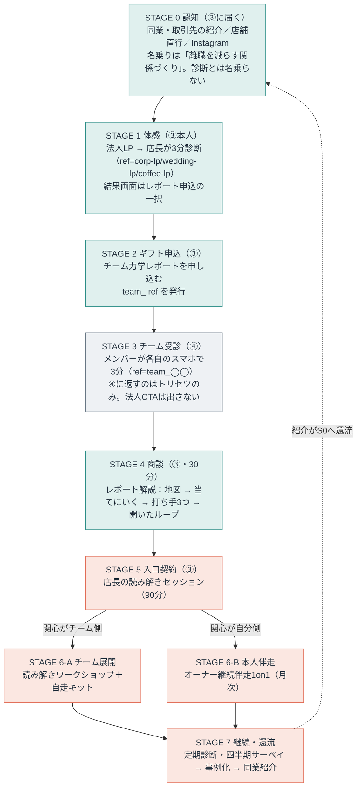

# 法人の中心価値とファネル（③店長・リーダー／④メンバー）

セグメント③店長・リーダー（`ref=corp-lp`／`wedding-lp`／`coffee-lp`）と④メンバー（`ref=team_` 始まり）の、
**提供価値の中心・ペルソナ・ファネル**を確定させる文書。①一般・②紹介は `ファネル図.md` で確定済みで、
③④だけが「別ルート」と書かれたまま中身が空だった。その空白を埋めるのが本書。

> 位置づけ：**確定**（金額のみ `（要確定）` 表記で仮置き）。判断根拠を各節に明記してあるので、前提が変われば該当節だけ差し替える。
> 参照：`ファネル図.md`（全体戦略・①②の確定ルート）／`法人ポジショニング.md`（7観点・営業上の構え）／`提案資料1枚.md`（営業資料）／`読み解きワークショップ設計.xlsx`（WS進行・接続設計）／`文脈出し分け仕様.md`（コピー素材）。
> 本文に長音ダッシュは使わない（プロジェクトの表記ルール）。

---

## 0. 決めたこと（結論）

| # | 論点 | 決定 |
| :-: | :-- | :-- |
| 1 | 法人の中心価値 | **店長が、自分の店のチームを「読める」ようになること**。勘と気合の総当たりマネジメントを、地図（誰が何タイプか）と一手（この人にはこう関わる）に変える |
| 2 | 一番高いお金を払う価値 | 上と同じ。**結果（離職が減る）でも仕組み（自走キット）でもなく、決裁者本人が獲得する能力**に最高単価を置く |
| 3 | 最高単価の商品 | **オーナー・店長への継続伴走1on1**（現エグゼクティブマインドセッションを月次の継続契約として再定義） |
| 4 | 入口の有料商品 | **置く。店長の読み解きセッション（90分）**。パート時給がゼロのまま最初の課金ができる |
| 5 | チームワークショップの位置 | 主商品から**降ろす**。中心価値を体感したあとの、稟議の言葉で買う「論理層の商品」に後置 |
| 6 | ③のペルソナ | 5〜15名の接客チームの、**現場に立ちながら一人で決めている店長・オーナー**。痛みの主語は組織でなく本人 |
| 7 | ④のペルソナ | 時給パート中心の現場スタッフ。**買わない。売らない** |
| 8 | ④の設計原則 | **④に法人CTAを出さない**。正直な回答をもらい、自己理解（トリセツ）だけを返す |
| 9 | ③④のファネル | 認知 → 体感 → ギフト → 商談 → 入口契約 → 分岐（チーム／本人） → 継続・還流の7段（§4） |
| 10 | チーム識別子 | **`team_<店名slug>`** に統一（main の実装 `prototype.html` の判定に合わせる） |

---

## 1. 中心価値：一番高いお金を払う価値はどれか

### 1.1 候補は3つある

法人が払いうる価値は、性質の違う3種類が混在している。既存資料はこの3つを並列に語っていて、優先順位がついていなかった。

| 候補 | 中身 | 既存資料での扱い |
| :-- | :-- | :-- |
| **A 結果** | 辞めない・回る店になる（定着・接客品質） | `提案資料1枚.md` の主線。放置コスト＝採用1名80〜100万円と対置 |
| **B 能力** | 店長が、チームを読めて扱えるようになる | `法人ポジショニング.md`「営業上の構え3・実態B」で顕在化。ただし後段の高額商品に置かれたまま |
| **C 仕組み** | 共通言語と自走キットが社内に残る | `ファネル図.md` の設計原則「自走可能に設計する」 |

### 1.2 判定：Bが最も高く売れる

5つの軸で並べると、B が単独で強い。

| 軸 | A 結果 | **B 能力** | C 仕組み |
| :-- | :-- | :-- | :-- |
| 緊急性（今日の問題か） | 低。離職は起きてから気づく | **高**。明日のシフトで誰にどう声をかけるかは今日の問題 | 低。整えたい時に整えればよい |
| 代替不能性 | 低。求人媒体・待遇改善・他社研修と同じ棚に並ぶ | **高**。部下には聞けず、同業には見栄があり、家族には通じない。無料の代替がない | 中。研修会社の教材と比較される |
| 帰属（誰に残るか） | 会社に残る | **本人に残る**。店を移っても持っていける | 会社に残る |
| 検証可能性 | 低。効いたか分かるのは1年後 | **高**。効いたかどうかは本人が翌週に体感する | 中 |
| 原資適合（時給の壁） | 中 | **高**。店長1人の話なので人数×時給が発生しない | 低。全員を集める形式は時給が障壁（実態A） |

決め手は**代替不能性と原資適合**の2つ。

- **代替不能性**：店長の「この判断でいいのか」「あの子が最近静かだが、どう声をかけるべきか」は、利害関係者にしか相談できないので相談相手がいない。ここには無料の代替がなく、値付けの上限が高い。一方 A（定着）は求人媒体・時給アップ・他社研修と同じ棚に並べられ、必ず相見積もりになる。
- **原資適合**：`法人ポジショニング.md`「実態A」のとおり、Tier1は店長＋時給パート構成で、全員を集める形式そのものが障壁になる。B は店長1人が対象なので、この制約を最初から回避する。人数が増えても価格が上がらない代わりに、**人数が少なくても成立する**。

### 1.3 中心価値の定義（この一文を全資料の起点にする）

> **店長が、自分の店のチームを「読める」ようになる。**
> 誰が何タイプで、どこがすれ違い、この人にはどう関わればいいのか。勘と気合の総当たりを、地図と一手に変える。

補助線となる言い換え（商談で使う順）：

1. 「メンバーを理解する時間が取れない」に、**時間を増やさずに**応える（既存の朝礼・引き継ぎに5〜15分差し込む）。
2. 「自分の意思決定に自信が持てない」に、**判断の軸**を渡す（自分の型が分かると、なぜその判断に迷うかが分かる）。
3. 「もっと雑談して関係を強めたい」に、**話す中身**を渡す（タイプが分かると、何を聞けばいいかが分かる）。

この3つはいずれも 2026-07-23 の宿泊業店長との商談で本人の口から出た悩みで、`法人ポジショニング.md`「実態B」に記録されている。中心価値はこの3つの直上に置いた。

### 1.4 3階建ての価値構造（A・Cを捨てるわけではない）

A と C は捨てず、**役割を変えて残す**。`法人ポジショニング.md`「営業上の構え2（感情で信頼、論理で稟議）」の二層を、3階建てに具体化する。

| 層 | 価値 | 誰の言葉か | 商品 | 支払い意欲 |
| :-- | :-- | :-- | :-- | :-- |
| **体感層** | 自分の店の地図が見えた | オーナー本人の驚き | 無料診断 ＋ チーム力学レポート | ¥0（ギフト） |
| **中心層** | 店長が読めて、扱えるようになる（B） | オーナー本人の切実さ | 店長の読み解き → 継続伴走1on1 | **最高** |
| **論理層** | 辞めない・回る（A）／共通言語が残る（C） | 稟議・社内説明・家族への説明 | チームWS ＋ 自走キット ＋ 定期診断 | 中。ただし**継続の理由**はここにしかない |

読み方は3点。

- **売る順序は 体感 → 中心 → 論理**。感情で契約が起き、論理はあとから支払いを正当化する。オーナー即決層（稟議なし）でも、本人の中で「なぜこれに金を使ったか」の説明は要る。それが論理層。
- **A（結果）を中心から降ろす理由**は、約束できないから。離職は景気・時給相場・家庭の事情など外部要因が大きく、こちらの介入だけで因果を引き受けられない。中心に置くと、効かなかったときに全部が嘘になる。論理層に置けば「定着に効く設計である」という説明で足り、誠実性を保てる（`チームレポート仕様.md` のガードレール「効果の主張は自社実測で」と同じ線）。
- **C（仕組み）は継続の理由**。単発で終わらせないための言葉なので、初回の購買動機ではなく更新・年間契約の場面で使う。

---

## 2. 価格ラダー

中心価値を最高単価に置いた結果、商品の並びは次のようになる。金額は仮置きで、`料金形態分析_年間vs月額.md`（未merge）の試算と `提案資料1枚.md` の現行案を接続して決める。

| # | 商品 | 対象 | 形式 | 価格（仮） | 役割 |
| :-: | :-- | :-- | :-- | :-- | :-- |
| 0 | 無料診断 | ③④全員 | 9問・3分 | ¥0 | 共通入口・体感 |
| 1 | チーム力学レポート | ③ | PDF・無償進呈 | ¥0 | ギフト。商談の題材（`チームレポート仕様.md`） |
| 2 | **店長の読み解きセッション** | ③本人 | 90分・1on1 | **¥30,000〜50,000** `（要確定）` | **入口の有料商品**。中心価値を最小単位で渡す |
| 3 | チーム読み解きワークショップ | ③＋④ | 90分・初回ファシリ＋年間一式 | ¥120,000〜150,000 `（要確定）` | 論理層。稟議・社内説明の言葉で買う |
| 4 | **オーナー継続伴走** | ③本人 | 月次1on1・6ヶ月〜 | **月¥30,000〜50,000** `（要確定）` | **最高単価・最高LTV**。中心価値の本体 |
| 5 | 自走キット＋定期診断＋四半期サーベイ | ③④ | 年間 | 3に同梱／更新時は年額 | 継続・更新の理由 |

### 2.1 なぜ2（入口の有料商品）を置くのか

`法人ポジショニング.md`「営業上の構え3」で「要確定」のまま残っていた論点をここで確定させる。**置く**。理由は3つ。

1. **時給ゼロで最初の課金ができる**。無料レポートの次がいきなり12〜15万円＋パート時給（5〜15名×90分）だと、決断のサイズが跳ね上がる。3〜5万円・店長1人なら、その場で決まる。
2. **中心価値と入口商品が一致する**。最初に買うものが中心価値そのものなので、「体感したものを買う」という筋が通る。チームWSを入口にすると、体感したもの（自分の読み解き）と買うもの（全員の集合）がずれる。
3. **4への自然な接続**。2は単発、4は継続。2の場で「これを毎月やりましょう」が最も自然に出る。3（チームWS）から4への接続は `読み解きワークショップ設計.xlsx` の M6 決裁者デブリーフに依存するが、2からなら初回の90分がそのままデモになる。

### 2.2 なぜ4（継続伴走）を最高単価に置くのか

- **中心価値の性質が継続向き**。「読めるようになる」は一度で完成せず、メンバーが入れ替わるたびに地図が変わる（接客業は入替が多い）。単発では完結しないものを単発で売る方が不自然。
- **提供工数が積み上がらない**。月次1on1・60分×10名で月10時間。一方チームWSは1件90分＋移動＋準備で実質半日、しかも売り切り。`料金形態分析_年間vs月額.md` は「利益100万円には単価15万円で月16〜17件の成約と実施が必要＝物理的に不可能」と結論しているが、**ストック型の4を混ぜると件数依存が下がる**。
- **`ファネル図.md` の設計原則と一致**：「セッションは高単価・少数に絞る」。

### 2.3 商品の出し方（1本道でなく、2の場で分岐する）

2（店長の読み解き）の終わりで、店長の関心がどちらを向いているかで分岐させる。メニューを並べない。

- 関心が**チーム側**（「これをみんなでやりたい」）→ 3 チームWS
- 関心が**自分側**（「自分の関わり方をもっと知りたい」「決められない」）→ 4 継続伴走

`読み解きワークショップ設計.xlsx`「接続設計」の予測マップ#3（「自分の関わり方は合っているのか。部下には聞けない」）が、4への最短の入り口。

---

## 3. ペルソナ

### 3.1 ③店長・リーダー（買い手）

`法人ポジショニング.md` の買い手ペルソナを、中心価値Bに合わせて**痛みの主語を組織から本人に移して**書き直したもの。

| 属性 | 内容 |
| :-- | :-- |
| 誰 | 5〜15名の接客チーム（初期フォーカス＝珈琲屋・カフェ／結婚式場）のオーナー・店長・施設長 |
| 立場 | 現場に立つプレイングマネージャー。社員は2〜3割、残りは時給パート・アルバイト |
| 決裁 | 自分で決められる。ただし原資は小さい。**数万円は即決、10万円超は考える** |
| 一日で一番きつい瞬間 | 「辞めます」と言われた瞬間ではなく、その前の**「最近あの子、静かだな」に気づきながら何も言えない時間** |
| 本人の悩み（主） | 意思決定への自信のなさ／メンバーを理解する時間がない／もっと雑談して関係を強めたい（2026-07-23商談） |
| 組織の悩み（従） | 人がすぐ辞める／ギスギスが接客に出る／新人が馴染めない／任せられない |
| 構造的な孤独 | 部下には聞けない（利害関係者）。同業には見栄がある。家族には話が通じない。**相談先がない** |
| 買わない理由（反論） | 「また性格診断か」／「全員集めると時給が」／「一過性では」（返しは `法人ポジショニング.md` 観点7） |
| 刺さる一言 | 「あの子が静かな理由、たぶん分かります」 |

> ペルソナの重心を本人の悩みに置いたが、組織の悩みを消したわけではない。**商談の入りは本人の悩み、支払いの正当化は組織の悩み**という役割分担にする（§1.4の3階建て）。

### 3.2 ④メンバー（利用者・買わない）

| 属性 | 内容 |
| :-- | :-- |
| 誰 | 時給パート・アルバイト中心の現場スタッフ。20代が多い |
| 受診の動機 | 好奇心のみ。会社のためではない。店長に言われたからでもない（言われて渋々受けると回答が歪む） |
| 決裁権 | **なし** |
| 最大の警戒 | 「これ、会社に見られるやつだ」。そう思った瞬間に建前で答える |
| 得る価値 | 自分のトリセツ（自己理解）。加えて「この店は自分を人として見ようとしている」というシグナル |
| ④が壊れると何が壊れるか | 建前回答 → レポートが実態とずれる → 商談で「当てにいく」が外れる → ③への提供価値が消える |

### 3.3 ③と④の非対称性（④の設計原則）

④は顧客ではないが、③への提供価値の**原材料**であり、同時に**受益者**でもある。この非対称性から原則が2つ出る。

> **原則1：④に売らない。法人CTAを④に出さない。**
> 決裁権がないので出しても転換しない。それどころか「会社に使われている」感が出て、回答の正直さ（＝レポート品質）を壊す。

> **原則2：④への約束を、受診の前に明示する。**
> 「個人の結果はご本人のもの。お店に共有されるのはタイプの分布だけ。人事評価には使えない」を受診案内とチーム受診の入口の両方に置く。これは倫理であると同時に、**データ品質の防衛策**（`チームレポート仕様.md` §2.2 と同じ）。

---

## 4. ファネル（③④の一本道）

③と④は同じ職場にいる別ロールなので、別々のファネルにせず**1本の導線の中の別ステージ**として描く。④が登場するのは STAGE 3 のみ。

### 4.1 ステージ定義

| STAGE | 主役 | ゴール（次へ進んだと見なすイベント） | 記録される場所 |
| :-- | :-: | :-- | :-- |
| 0 認知 | ③ | 法人LP閲覧、またはその場でQR診断開始 | 声かけ台帳 |
| 1 体感 | ③ | 店長本人の診断完了（`ref` が法人LP系） | 回答ログ |
| 2 ギフト申込 | ③ | レポート申込フォーム送信 | 法人リード（`mode=team-report`） |
| 3 チーム受診 | **④** | **受診率80%以上**（`ref=team_◯◯`） | 回答ログ |
| 4 商談 | ③ | 解説商談の実施（30分） | 法人リードの対応状況列 |
| 5 入口契約 | ③ | 店長の読み解きセッションの日程確定 | 同上 |
| 6 分岐 | ③（＋④） | チームWSの日程確定／継続伴走の初月開始 | 同上 |
| 7 継続・還流 | ③ | 更新、または同業紹介1件 | 同上 |

### 4.2 ボトルネックの読み方

週次で同じ順に実数を見る。転換率の目標値は置かず、まず4週間の実数を取ってから基準を決める。

| 止まっている場所 | 疑うべきもの | 打ち手の方向 |
| :-- | :-- | :-- |
| 0→1（診断に届かない） | 名乗り。業種の言い当てが弱い | LPと声かけの一言（`法人LP情報設計.json`） |
| 1→2（申込が出ない） | 結果画面のCTA。体感が「面白かった」で止まっている | 結果画面のレポート申込フック（**main 未実装**。§5.2） |
| 2→3（受診が集まらない） | 店長からメンバーへの伝え方 | 受診案内の雛形。朝礼で一声を依頼 |
| 3→4（商談にならない） | レポートの先渡し。先に渡すと商談化率が落ちる | レポートは商談の場で渡す |
| 4→5（決まらない） | 「当てにいく」の精度、または価格の出し方 | 最頻パターン（抱え込み＝静かに辞める）から入る |
| 5→6（続かない） | 分岐の出し方。メニューを並べている | 関心の向きを見て1つだけ処方する（§2.3） |

### 4.3 ①②③④の関係（4セグメントの全体整合）

| セグメント | 判定 | ルート | 稼働 |
| :-: | :-- | :-- | :-- |
| ①一般 | `ref` なし | ライブ経由（`ファネル図.md`） | 設計済み・未実装 |
| ②紹介 | 紹介者コード | アプリ内ガイド全4章 → 体験セッション | **稼働中** |
| ③店長・リーダー | 法人LP系 `ref` | 本書 STAGE 0〜7 | 本書で設計確定 |
| ④メンバー | `team_` 始まり | 本書 STAGE 3 のみ。自己理解を返して終わる | 本書で設計確定 |

③④が①②と共有するのは**診断本体だけ**。結果画面から先は完全に分ける。特に③に個人向けガイドCTAを出すと、法人商談の動線が個人ファネルに漏れる。

---

## 5. ④メンバーの実装仕様（現状の空白を埋める）

### 5.1 現状

main の `prototype.html` は `team_` 始まりの `ref` を `member` と判定するが、**判定した結果で何も変えていない**。
`GUIDE_ON = SEG === 'referral'` なので④にはガイドCTAも出ず、法人CTAも存在しないため、④は結果画面で行き止まりになっている。

### 5.2 あるべき仕様

| 対象 | ④に出すもの | ④に出さないもの |
| :-- | :-- | :-- |
| 結果画面 | タイプ結果・あるある・強み・ワンポイント・相性（＝トリセツ） | 法人CTA（レポート申込）。②紹介のアプリ内ガイドCTA |
| 受診の入口 | 「個人の結果はご本人のもの。お店に共有されるのはタイプの分布だけ。人事評価には使えない」 | 立場の必須設問（歪みの原因になる。任意のまま） |
| 結果画面の末尾 | 「大切な人にも」導線（B2C波及の種。`ファネル図.md` の設計原則） | 体験セッション・ライブ等の個人向け有償導線 |

### 5.3 識別子の確定

- チーム専用 `ref` は **`team_<店名slug>`**（例 `team_hinata`）。main の `prototype.html:961` の判定に合わせる。
- 未merge の `チームレポート仕様.md`・`珈琲屋導線.md` は `team-◯◯`（ハイフン）で書かれている。**取り込む際にアンダースコアへ直す**。

---

## 6. 未着手・要確定

| # | 項目 | 状態 |
| :-: | :-- | :-- |
| 1 | 2・4の単価確定（読み解きセッション、継続伴走の月額） | `（要確定）`。`料金形態分析_年間vs月額.md` の試算をストック型込みで引き直す |
| 2 | ④の実装（結果画面の出し分け・受診前の約束文） | `prototype.html` 未実装。§5.2が仕様 |
| 3 | 結果画面のレポート申込フック（③のみ表示） | 未merge ブランチに実装あり。現行 `prototype.html` へ移植が必要 |
| 4 | チーム力学レポート資産の取り込み | `チームレポート仕様.md`／`サンプル`／`学術的裏付け`／`珈琲屋導線.md` が未merge。§5.3の識別子と、main の現状（検証アンケートは廃止されていない）に合わせて修正してから取り込む |
| 5 | 店長の読み解きセッション（90分）の進行設計 | 未着手。`読み解きワークショップ設計.xlsx` の M1・M4・M6 を1on1用に再構成する |
| 6 | 継続伴走の契約形態（最低期間・解約条件） | 未着手 |

---

## 7. 既存資料との関係

| 資料 | 本書との関係 |
| :-- | :-- |
| `ファネル図.md` | 上位。③④のルートは本書が定義し、ファネル図側には要約と参照を置く |
| `法人ポジショニング.md` | 7観点は生きる。ただし**観点1のペルソナ重心**（組織→本人）と、「営業上の構え3」の `要確定`（入口商品の定義・単価）は本書が上書きする |
| `提案資料1枚.md` | 論理層の資料として生きる。ただし表紙・CTAは中心価値B（店長が読める）に寄せる改訂が要る |
| `読み解きワークショップ設計.xlsx` | 商品3の中身として生きる。M6デブリーフは商品4への接続として引き続き重要 |
| `文脈出し分け仕様.md` | 法人コピーの素材として生きる。`?ctx=` 実装時に本書の中心価値を反映する |
| `料金形態分析_年間vs月額.md`（未merge） | 前提が「チーム単価×件数」のみなので、商品4のストック収入を加えて引き直す |
