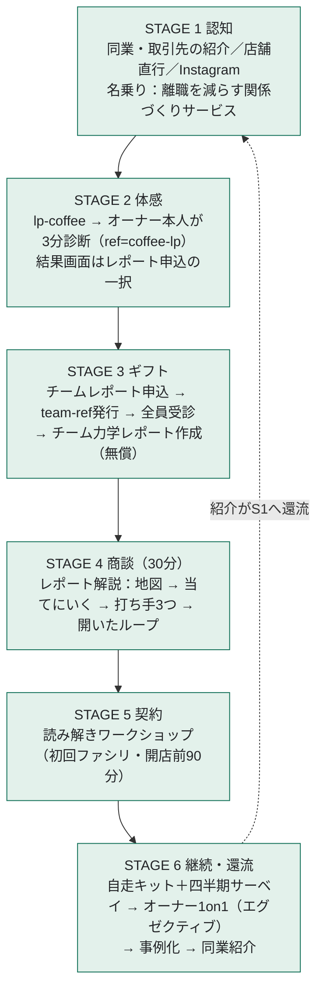

# 珈琲屋・カフェ 一本道導線（認知 → 体感 → 商談 → 契約）

現フェーズ（M2）の集客・営業は、**この一本だけを能動運用する**。以前は入口が併存し（親版LP・式場LP・結果画面の汎用CTA・紹介）、リードの出所が混在していた。本書でそれを是正し、珈琲屋・カフェに絞った一本道のスキーム（認知→体感→商談→契約→継続）と週次の回し方を定める。

- **是正の実装（済み）**：診断結果画面の法人CTA（チームレポート申込）は **coffee系ref経由でのみ表示**。一般・紹介・チームメンバーの受診には出ない（それぞれ個人ファネルへ）。珈琲屋文脈の結果画面は**CTA一択**（個人向けガイドCTA・検証アンケート非表示）。
- **待機扱い**：`lp-wedding.html`・`lp-corporate.html` は削除せずリンクも生かすが、能動集客はしない（問い合わせが来たら対応。式場は接点Aさんの進展待ちで再開）。
- 参照：`ファネル図.md`（全体戦略）／`法人ポジショニング.md`（営業上の構え）／`チームレポート仕様.md`（ギフトと商談）／`紹介トークスクリプト.md`。
- 本文に長音ダッシュは使わない（プロジェクトの表記ルール）。

---

## 0. 一本道の全体図

各ステージのゴール（転換イベント）：

| STAGE | ゴール（次へ進んだと見なすイベント） | 記録される場所 |
| :-- | :-- | :-- |
| 1 認知 | lp-coffee閲覧 or その場でQR診断開始 | （声かけ台帳。§7） |
| 2 体感 | オーナーの診断完了（ref=coffee-lp） | 回答ログ 指標v2 |
| 3 ギフト | レポート申込 → メンバー受診率80%以上 → レポート納品 | 法人リード（mode=team-report）＋回答ログ（team-ref） |
| 4 商談 | 解説商談の実施 | 法人リードの対応状況列 |
| 5 契約 | ワークショップの日程確定（＝実質契約） | 同上 |
| 6 継続 | 四半期サーベイ稼働／1on1受注／紹介1件 | 同上 |

---

## 1. なぜ珈琲屋にこの導線か（設計根拠）

1. **オーナー即決層**：稟議がなく、契約の主動線は「感情の体感」（自分の診断が当たる＋自店のレポートが刺さる）。ROI資料は補助（営業上の構え2の順序どおり）。だから導線の中心は資料でなく**体感の連鎖**（自分→チーム）。
2. **創業者が元珈琲屋オーナー**：当事者性の名乗りと同業人脈チャネルは、他業種にない資産（営業上の構え1の「自分の強み」）。認知チャネルはここから作る。
3. **店舗商売**：「店に行けば会える」。テレアポも広告も要らず、客として通う→関係→相談の順で入れる。
4. **横のつながりが濃い業界**（豆・機材・卸・イベント・間借り）：1件の成功事例が紹介で連鎖しやすい。STAGE 6の紹介還流を最初から設計に含める。
5. **Instagramが業界の主要露出面**：営業チャネルではなく、名乗りの信頼を担保する受け皿として使う。

---

## 2. STAGE 1 認知（チャネルは3つ・優先順）

**名乗り（固定）**：「5〜15名の珈琲屋・カフェの、『スタッフがすぐ辞める』を減らす関係づくりサービスをやっています。私自身、珈琲屋をやっていました」。**性格診断とは名乗らない**（営業上の構え1）。

| 優先 | チャネル | やり方 | 週の目安 |
| :-: | :-- | :-- | :-- |
| 1 | **同業・取引先の人脈** | 元同業の直接接点、焙煎所・卸・機材屋・イベント主催に紹介を依頼。1人に1店だけ頼む（下の雛形） | 声かけ `（要確定：例 5件）` |
| 2 | **店舗直行** | 商圏内のオーナー在店の店に客として2〜3回通い、顔を覚えられてから名刺＋QR。混雑時間帯は避ける | 新規訪問 `（要確定：例 3店）` |
| 3 | **Instagram** | プロフィールにlp-coffeeリンク。発信は「元珈琲屋オーナーが語る、スタッフが辞めない店の空気」系の当事者コンテンツ。DM営業はしない（受け皿に徹する） | 投稿 `（要確定：例 週2）` |

**雛形（紹介依頼・人脈向け）**：
> 「小さい珈琲屋さんで、スタッフの入れ替わりに困ってるオーナーさん、1人だけ思い当たりませんか？ 人が辞めにくくなるチームづくりのサービスを始めていて、最初は無料でチームの状態をレポートにしています。合いそうなら繋いでもらえると嬉しいです」

**雛形（店頭・名刺の一言）**：
> 「実は私も珈琲屋をやっていまして。いまは5〜15名のカフェ向けに、スタッフが辞めにくくなるチームづくりを手伝っています。3分で終わる診断があるので、よかったらお手すきの時に。（QR）」

---

## 3. STAGE 2 体感（オーナー本人の3分診断）

- 入口は `lp-coffee.html`（診断リンクに `ref=coffee-lp` が自動で付く）。対面はその場でQR（QRのURLにも `?ref=coffee-lp` を付けておく。これが導線識別の生命線）。
- 結果画面は珈琲屋文脈では**レポート申込の一択**に絞ってある（実装済み。個人向けガイドや検証アンケートで注意が散らない）。
- 対面時の一言：「当たってました？ これ、店のみんなでやると、チームの力学が1枚のレポートになります。無料なので出してみましょうか」

ゴール：**チームレポート申込**（結果画面フォーム）または LPの商談フォームからの相談。どちらも「法人リード」シートに入る。

---

## 4. STAGE 3 ギフト（チーム力学レポート）

運用は `チームレポート仕様.md` §6のとおり。珈琲屋導線での追加ルール：

1. 申込を確認したら**当日中に**受診案内を返信（下の雛形）。`team-<店名slug>` のrefを発行。
2. 受診率を追い、**3日で80%未満**ならオーナーに「朝礼で一声」を依頼。
3. 全員そろったらレポート作成（2時間以内）、**納品はせず解説商談の日程を打診**（レポートは商談の場で渡すのが原則。先渡しすると商談化率が落ちる）。

**雛形（申込への返信メール）**：
> 件名：チーム力学レポートの進め方（◯◯様）
>
> お申込みありがとうございます。進め方は2ステップです。
> 1. 下のリンクを、スタッフのみなさんにそのまま共有してください（3分で終わります）。
> 　 `https://.../prototype.html?ref=team-◯◯`
> 　 ※結果はご本人のものです。お店に共有されるのはタイプの分布だけで、評価には使えません。この一文ごと共有いただくのがおすすめです。
> 2. 全員が受け終わりましたら、レポートをご用意して30分ほどお時間をいただき、直接ご説明します（無料）。
>
> まずはリンクの共有だけ、今日お願いできれば十分です。

---

## 5. STAGE 4 商談（レポート解説・30分）

骨子は `チームレポート仕様.md` §7（地図5分 → 当てにいく10分 → 打ち手3つ10分 → 開いたループ5分）。珈琲屋向けの補足：

- 時間帯は**開店前かアイドルタイム**、場所は店で（オーナーのホーム）。対面優先。
- 「当てにいく」の最頻パターンは接客チームの**「静かに辞める」**（抱え込みリスク）。ここが刺さる確率が最も高い。
- 看板理論は心理的安全性のみ使う（`チームレポート学術的裏付け.md` §9のトーク例）。
- クロージング：「このレポートを、チームで話せる形にするのが読み解き会です。開店前の90分でできます。来月の定休日はいつですか」

ゴール：**ワークショップの日程確定**。オーナー即決層なので、その場で日程まで取りにいく（後日連絡は転換率が大きく落ちる）。

---

## 6. STAGE 5 契約 / STAGE 6 継続・還流

- **契約**＝読み解きワークショップ（初回ファシリ付き・開店前90分・価格`（要確定）`）。
- **継続**：自走キット＋四半期の匿名サーベイ（年間契約の芽）。オーナー個人には**エグゼクティブマインドセッション**（レポート§5「あなた自身の関わり方の設計」の続き）。
- **還流**：効果が出たら事例化（許可を得て店名または匿名）。紹介の頼み方は具体に絞る：「同じ悩みの珈琲屋仲間を、**1人だけ**紹介してもらえませんか」。紹介はSTAGE 1の最優先チャネルに戻る。

---

## 7. パイプライン管理（週次）

- **台帳**：「法人リード」シートの対応状況・メモ列で管理。ステージ値：`S1声かけ済 / S2診断済 / S3受診中 / S3レポート済 / S4商談済 / S5契約 / 失注`。
- **識別子**（導線が混ざらないための約束）：
  - オーナー体感 = `ref=coffee-lp`（回答ログ）
  - レポート申込 = `mode=team-report`（法人リード）
  - メンバー受診 = `ref=team-◯◯`（回答ログ。チームごとに一意）
- **週次で見る数字**（毎週同じ順で）：新規声かけ → 診断到達 → レポート申込 → 受診完了率 → 商談実施 → 契約。転換率の目標値は置かず、**まず4週間、実数を記録**してから基準を決める。
- ボトルネック判定：申込が出ないなら STAGE 1〜2（名乗り・体感）の問題。申込後に止まるなら STAGE 3（受診案内・追いかけ）の問題。商談で決まらないなら STAGE 4（当てにいく精度・クロージング）の問題。

---

## 8. やらないことリスト（導線を濁さないため）

- 珈琲屋以外への能動営業（式場を含む。横展開は珈琲屋で型ができてから）。
- 汎用文脈・個人文脈での法人CTA表示（実装で禁止済み）。
- DMの一斉送信・広告出稿（M2では買わない。紹介と店舗直行が主）。
- レポートの先渡し（商談の場で渡す）。商談前の価格提示もしない（レポートを見てから）。
- 複数チャネルの同時立ち上げ。Instagramは受け皿で、伸ばすのは紹介と店舗直行の2本。
