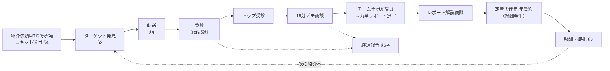

# 紹介制度設計（設計項目の網羅と叩き台）

Dさんアポ（2026-07-16）のフィードバック対応。

> ① どんな人に診断を渡すべきか、イメージできるようにしてほしい
> ② 紹介制度を用意してほしい（どんな人に・どうやって渡したら・どんなことが起きて・何が紹介者にとって嬉しいのかを明確にする）

本書は「決めるべきこと」を網羅し、各項目に叩き台を置いた設計ドキュメント。`（要決定）` はユーザー判断が必要な項目。決定が入り次第、紹介キット等の成果物に落とす。位置づけとしては、`ファネル図.md` の「事例・紹介の還流」ノードを制度として形式化するもの。

> 参照：`法人ポジショニング.md`（ターゲット条件・除外条件）／`ターゲット法人10社リスト.xlsx`（選定基準・声かけスクリプト・候補の出し方）／`紹介トークスクリプト.md`（アポ当日の話し方・転送文面の確定版）／`紹介者向け共有文面.md`（紹介者へ送る依頼メッセージ）／`apps-script/README.md`（refコード・紹介者マスタ）
> 前提フローは2026-07-30時点の `main`。②紹介は結果画面からアプリ内の読み解きガイド（全4章）→ 終章のヒアリング2項目 → 無償の体験セッション申込に着地する。メールアドレスは取らない（有償の読み解きガイドとメール配信は廃止済み）。
> 本文に長音ダッシュは使わない（プロジェクトの表記ルール）。

---

## 決定記録（2026-07-17）

| 論点 | 決定 |
|:--|:--|
| 報酬の形と料率 | 自分の事業がある紹介者＝原則相互紹介。事業を持たない紹介者＝一律売上の30%（一回限り。アップセル・年間更新は対象外） |
| 報酬の発生時点 | 年間契約締結時（バックエンド商品のみ）。フロント（法人＝体験WS／個人＝無償の読み解きガイド・体験セッション）では発生しない |
| 30%の基数 | 初年度契約金額の30%（更新・追加発注は対象外） |
| 個人側の報酬発生点 | 個別コーチングセッション成約時にその売上の30%（一回限り）。法人側はセッション単発では発生せず、年間契約締結時のみ |
| 支払時期 | 報酬発生月の翌月（2026-07-17確定） |
| 商品名 | **ナチュール診断**（2026-07-17確定。J-PlatPat称呼検索で重複なしを確認済み）。診断名も同一。文中2回目以降は「ナチュール」と略してよい。英字表記は当面定めない。経緯：be-oneself（ビーワンセルフ）は商標先行（登録6785687＝03・42・44類、商願2026-003275＝41類）により回避 |
| 紹介先の特典 | なし（§5-1・5-2の安心設計で足りると判断） |
| 制度の対象範囲 | 個人・法人の両方 |
| 紹介経由受診の結果画面 | 現行のまま（②紹介セグメントはアプリ内の読み解きガイドへ進む） |
| 制度名 | 「ナチュール診断 紹介キャンペーン」 |

**残る確認事項**：①「ナチュール」関連のドメイン・SNSアカウントの確保と（任意）自社商標出願の判断 ②税務は§6-5の整理どおり運用（給与支払いを始めたとき・高額化したときに税理士へ再確認）。

---

## 0. この設計から作る成果物

| # | 成果物 | 形式 | 誰に渡すか |
|:-:|:--|:--|:--|
| 1 | 「こんな人がいたら」（渡す相手の目安） | テキスト（紹介キット内） | 紹介者全員 |
| 2 | 紹介キット（転送文面＋専用refリンク＋渡す相手の目安） | LINEメッセージ一式 | 紹介者全員 |
| 3 | 紹介制度の説明1枚（流れ・約束・お礼） | 1枚（画像 or PDF） | 紹介者全員 |
| 4 | 紹介案件の管理タブ | 回答ログに新設 | 自分用 |

---

## 1. 紹介フローの全体像と設計ポイント

各ステップに設計項目（§番号）を割り当てる。以降が網羅リスト。

---

## 2. 誰に渡すか（ターゲットの解像度）：フィードバック①への対応

紹介者が思い出すのは「属性」ではなく「聞いた愚痴・見た光景」。だからトリガーワードが最重要。

**本節は法人ルート（紹介先＝5〜30名のチームのトップ）の定義**。個人ルート（紹介先＝紹介者の友人・知人。着地はP1〜P3）は §2-8 に分けて置く。**紹介者ごとにどちらか一方だけを渡す**。両方渡すと候補探しの焦点がぼけ、送信率が落ちる。

| # | 定義・設計すること | 叩き台 |
|:-:|:--|:--|
| 2-1 | **1行定義**（紹介者が暗記できる長さ） | 「5〜30人のお店・施設のトップ（オーナー・店長・院長・施設長・園長）で、人の悩みを口にしている人」 |
| 2-2 | **属性条件**（業種の名指し・規模・役割） | 業種：飲食・カフェ／美容室・サロン／整骨院・治療院／小規模宿／介護・看護・保育／結婚式場（看護を明記：女性中心の職場で人間関係の問題が発生しやすい）。規模：**5〜30名規模で働くチーム/組織**（会社全体でなくチーム単位でよい）。役割：その場で決められるトップ |
| 2-3 | **トリガーワード集**（この愚痴を聞いたら、のセリフ集） | 「人がすぐ辞める」「また辞めた」「求人かけても来ない」「新しい子が馴染めてない」「スタッフ同士がギスギスしてる」「空気の悪さがお客さんに伝わってる気がする」「重役ポストの人間性に不満がある」「任せられなくて結局自分でやってる」「シフトが回らない」 |
| 2-4 | **合わない人**（渡さなくていい人の明文化。紹介者の迷いを消す） | 従業員3名以下／タイミー等スポット人材中心で回している（いつ行っても知らない人がいる店）／決裁が本部にある多店舗チェーンの雇われ店長／本人が「人は入れ替わるもの」と割り切っている |
| 2-5 | **探す場所のヒント**（「候補の出し方」7つの問いの紹介者版） | 行きつけの美容室・飲食店／家族・友人の職場（介護・保育・式場・宿）／通っている整骨院・ジム／商店会・経営者仲間／（Dさん向け）クライアントとその紹介元 |
| 2-6 | **ミニ人物例**（顔が浮かぶ実例スケッチを2〜3件） | 例1：美容室オーナー（スタッフ8名）。毎年1〜2人の重要メンバーが離脱。「『まさにこれからなのに…』と思う人ほどやめちゃう」とこぼす。例2：保育園の園長（12名）。ベテランと若手の空気が悪く、間に挟まれている。例3：式場の支配人（15名）。新人プランナーが現場チームに馴染めず半年退職が続く |
| 2-7 | **媒体・形式** | LINEにそのまま貼れるテキスト（上から：1行定義→業種→セリフ集→合わない人→人物例）。画像版は作らない |

### 2-8. 個人ルートのターゲット定義（紹介先＝友人・知人。2026-08-10追加）

個別コーチングセッション（P3）への紹介。紹介者は自分の生活圏に配る人（コーチング受講者、コミュニティを持つ人など）で、**この層の生活圏に法人の決裁者はいない前提で組む**。法人を探させると「該当なし」で会話が終わる。

| # | 項目 | 内容 |
|:-:|:--|:--|
| 2-8-1 | **1行定義** | 人との関わりで「また同じことになってる」と感じていそうな人。肩書き・職業・場面を問わない |
| 2-8-2 | **属性条件** | 置かない。属性で切ると紹介者が候補を自分で狭める。診断が場面非依存であることが、そのまま送り先を選ばない根拠になる |
| 2-8-3 | **トリガーワード集** | 「なんでいつもこうなるんだろう」「また同じような人を好きになる」「本音が言えないまま我慢してる」「気を使いすぎて疲れる」「悪い人じゃないんだけど、なんか合わない」「自分が悪いのかなって考えちゃう」 |
| 2-8-4 | **合わない人** | しんどさの真ん中にいる人（別れた直後など。必要なのは診断でなく人）／診断もの全般が苦手な人 |
| 2-8-5 | **探す場所のヒント** | 最近パートナー・恋愛の長い話を聞いた相手／同じ話を何度もしている友人／職場・家族でも可（**恋愛の相手だけに絞らせない**。絞ると候補が数人で尽きる） |
| 2-8-6 | **紹介者に禁じること** | 相手の悩みを言い当てにいくこと。「あなたこういうパターンあるよね」は押しつけになり、紹介者と紹介先の関係を傷める |
| 2-8-7 | **媒体・形式** | LINEにそのまま貼れるテキスト（`紹介キット.md` §1-2）。転送文面は `紹介トークスクリプト.md` §E |

**紹介者がコーチング受講者である場合の追加ルール**

- **依頼より先に本人に診断を受けてもらい、その場で読み解く**。転送文面の芯は「自分が受けて腑に落ちた」なので、未受診のまま送らせると嘘になる（`紹介者向け共有文面.md` §3）。加えて、セッションで本人が自力で言語化したものにタイプの名前がつく体験そのものが、依頼の前に渡すGiveになる。
- **転送文面にコーチングを出さない**。受講していることは紹介者のプライベートで、友人へ開示する義務を負わせない。
- **お礼のルールは事前に開示する**（§6-2）。ただし「あなただけ特別」でなく「紹介してくれる人全員に同じルール」として伝える。コーチングの関係に個人的な取引を持ち込まないための置き方で、曖昧にする方が後で気まずくなる。受け取らない選択も明示する。
- **紹介の話と本人のコーチングの話を、毎回同じ会話に混ぜない**。経過報告のたびに紹介の進捗を確認しにいくと、依頼が催促に変わる。

---

## 3. 「紹介」の定義と成果イベント

| # | 定義・設計すること | 叩き台 |
|:-:|:--|:--|
| 3-1 | **ファネル上のイベント定義**（どの段階を何と呼ぶか） | 法人（2026-08-07更新）：E0 転送／E1 受診（ref記録）／E2 トップ受診／E3 15分デモ商談／E4 チーム全員の受診とチーム力学レポート進呈（無償）／E5 レポート解説商談／E6 定着の伴走の年契約締結（報酬発生）。**初月は請求しないので、報酬の発生タイミングは2ヶ月目の継続確定時とする**。個人：P1 アプリ内読み解きガイド読了／P2 体験セッション申込・実施（無償）／P3 個別コーチングセッション成約 |
| 3-2 | **「紹介1件」のカウント時点**`（決定）` | 紹介成立のカウント＝E2（進捗管理用）。**報酬発生＝法人はE6 年間契約締結時／個人はP3 個別コーチングセッション成約時**。原則：各ルートの最深バックエンドに達したときのみ報酬 |
| 3-3 | **帰属ルール**（重複・既知リード・有効期間） | 同一企業を複数人が紹介→ref記録が先の人。既にリスト掲載・接触済みの先→紹介依頼時に開示して対象外。有効期間→ref受診から12ヶ月以内の年間契約締結まで（発生点がE6のため長めに取る） |
| 3-4 | **制度の対象範囲**`（決定）` | 個人・法人の両方。個人側はP1〜P3で管理（Bさんのコミュニティ拡散も制度内） |

---

## 4. 渡し方（HOW）

| # | 定義・設計すること | 叩き台 |
|:-:|:--|:--|
| 4-1 | **渡し方の基本フロー**`（決定）` | ①紹介依頼MTGで紹介の承諾をもらう → ②承諾を得られた人全員に紹介キットを送る → ③紹介者は転送1本（30秒。文面コピペ＋送信）。MTGで話題になった場合のみ、実務に組み込めるよう専用URLを共有する（コンサル初回ヒアリング・チーム受診など。C・Dさん向け）。**同席・引き合わせは紹介者の負担が大きいため基本やらない** |
| 4-2 | **紹介キットの中身一覧** | ①転送用文面（LINE用・メール用）②専用refリンク③渡す相手の目安（§2）④制度説明1枚（§8-2）⑤提案資料1枚PDF（相手が食いついた時の深掘り用） |
| 4-3 | **refコード運用** | 発行：自分。形式：イニシャル英大文字＋ランダム英数5文字。`紹介者マスタ` タブに登録。棚卸し：四半期ごとに稼働状況を確認 |
| 4-4 | **紹介経由の受診者が見る結果画面**`（決定）` | 現行のまま（②紹介セグメントは結果画面からアプリ内の読み解きガイド全4章へ進み、終章のヒアリング2項目を経て体験セッション申込に着地する。これがナーチャリングを担う）。トップ本人と分かる場合は24時間以内に感想を聞き15分デモを打診。法人文脈への出し分けは `?ctx=` 実装時に検討 |

---

## 5. 紹介先の体験（安心設計）：「紹介したら相手が営業される」不安を消す

| # | 定義・設計すること | 叩き台 |
|:-:|:--|:--|
| 5-1 | **受け取った後に起きることのステップ明示**（紹介者に見せる用） | ①診断2分（無料・登録不要）→②結果を見る（ここで終わってOK）→③そのままアプリ内の読み解きガイド全4章（8分ほど・メール登録不要）→④終章から無償の体験セッション申込（オンライン30〜45分）→⑤「チームでやりたい」となったら15分の説明→⑥チーム全員が各自のスマホで3分の診断→⑦チーム力学レポートを無償で進呈し、30分で解説 |
| 5-2 | **売り込まない約束の明文化**（パターンDの制度化） | 「受けて終わりで大丈夫。こちらから直接の営業連絡はしません（連絡は紹介者経由か、ご本人からの問い合わせのみ）。断られたら以後こちらから接触しません」 |
| 5-3 | **紹介先の特典**`（決定）` | なし。§5-1のステップ明示と§5-2の売り込まない約束で安心を担保する（実績が出て紹介数を増やす段階で再検討可） |
| 5-4 | **紹介者の顔を潰さない設計** | 転送文面に誇張を入れない／価格・効果を約束しない／断られても紹介者に一切の負担が戻らないことを明記 |

**5-2の適用範囲（2026-08-10追記）**：売り込まない約束を**先出しするのは法人ルートだけ**。法人では紹介先に商談で出向くため、約束が実体を持つ。個人ルートでは①診断だけ受けた人の連絡先を取らないので約束が不要 ②先に言うと逆に警戒を生む ③体験セッション申込者にはセッション末尾で継続の案内をするため、無条件の「営業しません」が正確でない、の3点から**依頼メッセージには書かず、聞かれたときだけ答える**。紹介先に何が起きるかは、別送する制度説明（`紹介キット.md` §2-2）の「送ったあとに起きること」が担う。紹介者本人が受診すれば、連絡先を聞かれないことを自分で体験するので、文章の約束より強い。

---

## 6. 紹介者へのリターン（REWARD）：フィードバック②の核

| # | 定義・設計すること | 叩き台 |
|:-:|:--|:--|
| 6-1 | **報酬メニューと階層別の適用**`（決定）` | **自分の事業がある紹介者（C・Dなど）＝原則相互紹介（金銭なし）**。**事業を持たない紹介者（A・Bなど）＝一律売上の30%を一回限り**（アップセル・年間更新は対象外）。全階層共通：経過報告 |
| 6-2 | **何に対して払うか**`（決定）` | **年間契約締結時（バックエンド商品のみ）**。フロント（法人＝体験WS／個人＝無償の読み解きガイド・体験セッション）では発生しない。含意：紹介直後の即時リターンは経過報告と相互紹介が担うため、§6-4の運用が制度の生命線になる。条件（発生点が深いこと）は制度説明1枚で事前開示する |
| 6-3 | **料率・基数・支払い**`（決定）` | 法人＝初年度契約金額の30%／個人＝個別コーチングセッション売上の30%。いずれも一回限り、アップセル・更新・追加発注は対象外。支払時期：報酬発生月の翌月 |
| 6-4 | **経過報告の運用**（最重要の非金銭リターン） | E1受診発生時「◯人受けてくれました」／E3商談化「15分お話しすることになりました」／E4実施後「無事開催、こんな反応でした」＋御礼／不成立時も「終わりました。ありがとうございました」を必ず送る |
| 6-5 | **支払いの実務**（税・経理）`（整理済み）` | 一般整理：給与を払っていない個人事業主は源泉徴収義務者でないため、源泉徴収・支払調書とも原則不要（単発の紹介料は源泉対象の限定列挙にも該当しない）。実務は①銀行振込で記録②覚書を残す（対象契約・金額・日付）③「支払手数料」等で経費計上④受け取り側へ「雑所得。給与所得者は年20万円超で確定申告」と一言。給与支払いを始めたとき・高額化したときは税理士へ再確認 |

---

## 7. 運用ルール

| # | 定義・設計すること | 叩き台 |
|:-:|:--|:--|
| 7-1 | **紹介者ガイドライン**（言ってよいこと・いけないこと） | 無料で2分、は断定OK。価格・導入効果・日程は約束しない（「本人に聞いて」でよい）。医療・メンタルの効能は言わない。転送文面の改変は挨拶程度まで |
| 7-2 | **プライバシー原則** | 紹介先の連絡先を紹介者から預からない（本人転送方式が原則）。例外的に同席・引き合わせが発生する場合のみ、紹介者が事前に本人の了承を取る |
| 7-3 | **記録と計測** | 回答ログに「紹介案件」タブ新設。列：紹介者／紹介先名／業種／規模／イベント段階（E0〜E5）／日付／次アクション／報酬状態。KPI：紹介者数、転送数、E1→E2→E3→E4転換率、リードタイム |
| 7-4 | **β運用の位置づけ** | 当面は指名した紹介者のみのβ（一般公開しない）。料率・特典は変更あり得ることを明記 |
| 7-5 | **エッジケース** | 自分の勤務先を紹介（Aさんのケース）→OK、本人が推進者になる。紹介者自身が受注に同席して稼働した場合→紹介フィーでなく協業費として別建て。紹介先が競合だった場合→丁重に辞退 |

---

## 8. 制度の見せ方と紹介者の増やし方

| # | 定義・設計すること | 叩き台 |
|:-:|:--|:--|
| 8-1 | **制度名**`（決定）` | 「ナチュール診断 紹介キャンペーン」（J-PlatPat称呼確認済み） |
| 8-2 | **制度説明1枚の構成**（Dさんの問いへの直答） | ①どんな人に（§2のカード）②どうやって（§4の基本フロー：転送1本）③何が起きるか（§5-1のステップ＋売り込まない約束）④あなたに何が返るか（§6のメニュー＋経過報告の約束） |
| 8-3 | **紹介者リクルーティングの導線**（誰をいつ紹介者にするか） | デブリーフ最終回の最後に案内／体験WS実施後の経営者に「同業の知り合いに」／**個別コーチング受講者に案内（2026-08-10運用開始。個人ルート＝§2-8・`紹介トークスクリプト.md` §E）**。※結果画面の「大切な人にも」は個人波及であり本制度とは別物として扱う |
| 8-4 | **紹介者のオンボーディング** | キット一式の送付＋30分レクチャー（診断の説明の仕方・タイプの読み方・よくある質問への答え方） |

---

## 9. 優先順位：MVP（Dさんに1週間以内に返す最小セット）

| 優先 | 作るもの | 対応項目 |
|:-:|:--|:--|
| 今すぐ | 「こんな人がいたら」（1行定義＋業種＋セリフ集＋合わない人＋人物例） | §2 |
| 今すぐ | 制度説明1枚（渡し方→起きること→売り込まない約束→お礼） | §5・§8-2 |
| 今すぐ | Dさんへ条件の通知（事業ありのため相互紹介が適用。§6-1のルールで確定） | §6 |
| 初回紹介まで | 紹介案件管理タブ＋経過報告の運用開始 | §7-3・§6-4 |
| 初回紹介まで | 紹介先特典の決定 | §5-3 |
| 実績が出てから | 帰属の細則・税務確認・制度名の一般公開 | §3-3・§6-5・§8 |

## 10. 既存資産との対応（新規に作るものを最小化する）

| 必要なもの | 既にある | 新規に作る |
|:--|:--|:--|
| ターゲット定義 | `法人ポジショニング.md`・選定基準配点表（自分用） | 紹介者向けに翻訳したカード（§2） |
| 転送文面 | `紹介トークスクリプト.md` の確定版（2026-07-29実送信版）・`紹介者向け共有文面.md`・声かけスクリプト パターンB | 新規作成は不要（refコードの差し替えのみ） |
| ref計測 | `?ref=`＋紹介者マスタ＋指標v2 | 紹介案件タブ（E0〜E5管理） |
| 紹介先ナーチャリング | アプリ内の読み解きガイド（全4章）→ 体験セッション申込 | 売り込まない約束の明文化 |
| 商談移行 | パターンC（15分デモ） | 24時間以内フォローの運用ルール化 |
| 報酬 | なし | §6一式`（要決定）` |

## 11. 残る確認事項（2026-07-17時点）

1. **ドメイン・SNSアカウントの確保**：「ナチュール診断」「ナチュール」関連の空きを確認して取得。あわせて自社の商標出願（任意。紹介で名前が独り歩きする前に検討推奨）を判断する
2. **税務の運用**：§6-5の整理どおり。給与支払いを始めたとき・紹介料が高額化したときに税理士へ再確認

※商品名は「ナチュール診断」で確定（J-PlatPat称呼確認済み）。`紹介キット.md` も新名称に差し替え済み。
