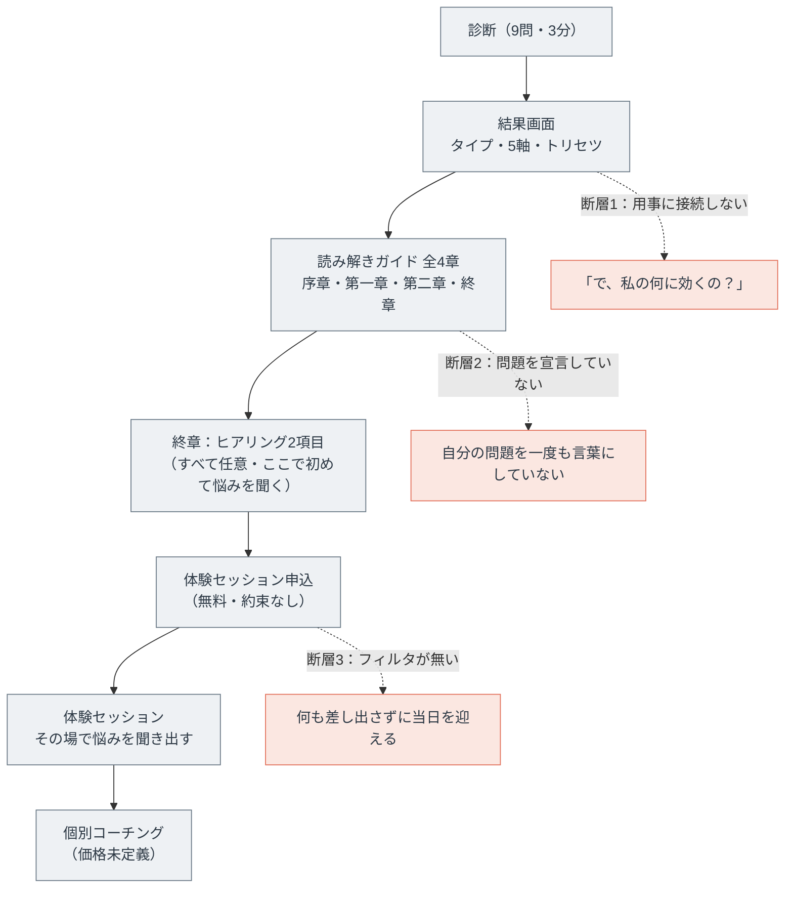
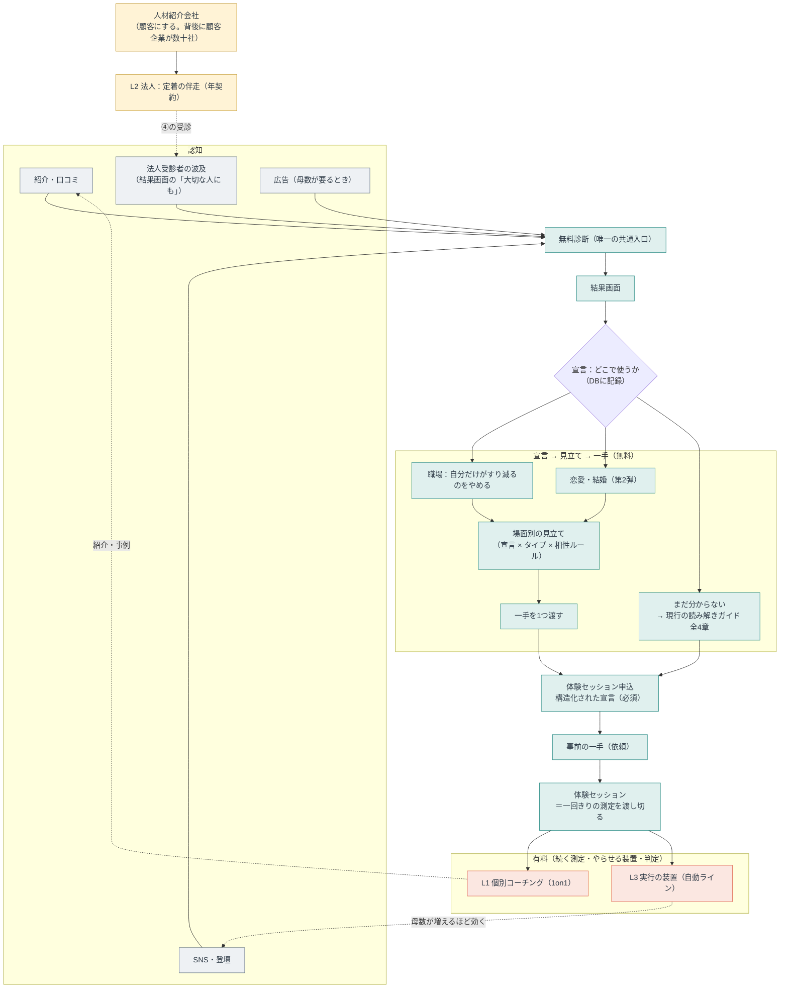

# 集客戦略マップ（個人ルート・2026-09-09）

「認知 → バックエンド商品の商談（現状は体験セッション申込）まで」を集客と定義したときの、**個人（toC）ルートの打ち手の地図**。
起点は2つの課題（①ガイド → 体験セッション申込の転換率が低い ②体験セッションに来た人の温度が低く成約率が落ちる）と、2つの戦略案（a. 問題別コンテンツ b. 転職エージェント）。

> 位置づけ：**個人ルートの実行戦略（2026-09-09策定）**。法人③④の中心価値・価格・獲得は `法人中心価値とファネル.md`・`0to1マーケティング戦略.md` が正で、本書はそれを前提に置く（変更しない）。
> **歩留まりの数字はすべて仮置き**。実測が1件も無いまま計画に使わない（§8で先に測る）。
> 参照：`ファネル図.md`（ファネル全体）／`guide-3day-spec.md`・`ガイド文面24本.md`（ガイドの文面）／`相性ルール.md`（ペアの力学）／`法人ポジショニング.md` §2（8タイプの消耗ポイント）／`アプリ化要件定義.md`（実装の正）。
> 本文に長音ダッシュは使わない（プロジェクトの表記ルール）。

---

## 0. 決めたこと（結論）

| # | 論点 | 決定 |
| :-: | :-- | :-- |
| 1 | 課題の見立て | **正しい。ただし原因は3つある**。①価値の翻訳が無い（曖昧な概念価値）②問題の宣言が導線の最後にしか、しかも任意でしか起きない ③本気度をつくる装置（フィルタ）が1つも無い。②③は文面でなく**導線の構造**の問題で、コピーを直しても動かない（§2） |
| 2 | 施策a | **採る。ただし「コンテンツを増やす」でなく「宣言 → 見立て → 一手 → 判定」の4段に組み替える**。読み物を足す方向に流れると、本プロジェクトが既に出した結論（AIが知識の値段をゼロにした・how-toを書かない）と正面衝突する（§3） |
| 3 | 分岐のさせ方 | 分岐させるのは**読み物の種類でなく、本人の宣言**。結果画面の直後に「どの場面の、誰との関係か」を選ばせ、**DBに記録する**（§3.2・§3.6） |
| 4 | 教育スキーム | **新しく作らない。** 現行ガイドが既に4段の連鎖（図星 → 道具 → **知ってるだけでは変わらない** → 一人では分からないから一緒に見る）を立てているので、**題材を「あなたのタイプ」から「あなたとあの人」に差し替えて複製する**。足すのは体験セッションの一手と1週間後の判定だけ。これで「マインドを変える必要がある」を**こちらが宣言せず、本人に発見させる**導線になる（§3.3.1） |
| 5 | 最初に作るドメイン | **職場**が先、恋愛・結婚が後。既存資産（8タイプの消耗ポイント・相性6カテゴリ）がそのまま使え、痛みに期限があるため（§3.4） |
| 6 | 職場ブランチの約束 | 「職場を変える」ではなく「**自分だけがすり減る関係性を終わりにして、自然体でいられる関係性を始める。**」（2026-09-10に文言確定。**やめる先＝自然体を足したことで、診断とガイドの語彙に一直線でつながる**）。個人がボトムアップで組織を変える動機は弱いという既存の結論（`ファネル図.md` 設計原則）を覆さずに済む（§3.5） |
| 7 | 現行ガイドの扱い | 提案どおり「**何に悩んでいるか分からない人**」の受け皿として残す。ただし**既定の入口はフォーク**にし、ガイドは選択肢の1つに降ろす（§3.2） |
| 8 | 課題②（温度）の打ち手 | 文面でなく**装置**で解く。申込時に構造化された宣言を必須化し、申込後に「一手」を渡し、**当日はその結果から始める**。やってこなかった人には売らない（§4） |
| 9 | 無料と有料の境界線 | 法人で確定した線（`0to1マーケティング戦略.md` §4.4）を**そのまま個人にも適用**する。知ることと**一回きりの測定**は無料、**続く測定・やらせる装置・できているの判定**から有料（§4.3） |
| 10 | 施策b（転職エージェント） | **送客先でなく顧客にする。** 送客マージンは採らず、人材紹介会社を法人セグメントの1チャネルとして扱い、**既存商品（定着の伴走／チームWS）をそのまま売る**。新規に作るものはゼロ。人材紹介会社は境界条件（単一拠点・5〜30名・中間管理職なし）を満たし、**自社のCA募集を出し続けているのでトリガーの観測が最も容易**。刺さる理由は早期離職の返金規定（定着が相手自身の売上の話になる）。**成果報酬は一切受け取らない**（§6） |
| 11 | 個人の商品名と価格 | **商品名は「ナチュール読み解きプログラム」**（コーチング・コンサルティング・カウンセリングとは名乗らない）。価格は**3ヶ月55万円／6ヶ月66万円・一括**（2026-09-09確定）。**既定は6ヶ月66万円**にする（月あたりでは安いのに、契約月の月商は11万円大きく、関係も2倍続く）。3ヶ月は「まず短く」の受け皿で、こちらから先に出さない。**カード決済を用意する**（分割は本人とカード会社の間で完結し、こちらには一括で入る）。値引きはせず、リスクの引き受けで埋める（§1.2・§5.2） |
| 12 | 必要本数 | **10月＝2本、11〜12月＝3本／月、2027年6月＝法人と分担して2本。** 必要な体験セッションは成約率30%で月7〜13件（月9〜20時間）で、**時間の制約には当たらない**。制約は「セッションに座らせる人の数」＝流入（§1.2・§1.3） |
| 13 | 10月と11月で使う流入が違う | **診断はまだ一般公開しておらず、過去の回答者というストックは実質ゼロ。** 10月は**直接依頼**（知人・前職の人脈・過去の受講者・紹介者候補にこちらから診断を頼む）だけで2本を作る。必要セッション4〜7件に対して**声をかける相手は約23人＝週8人**で、これが10月の管理変数になる。**11月からはフロー**（紹介・法人波及・X共有・登壇・広告）で月300件前後の診断完了を作る（§1.3） |
| 14 | 施策aは広告の許容単価を上げる | 診断完了1件あたりの売上は2,360〜2,833円。獲得コストを2〜3割に収めるなら**許容CPAは470〜850円**で、月300件は月14万〜26万円で買える。**申込率が10%から15%に上がれば許容CPAは1.5倍**になる。転換率の改善は、そのまま買える流入量の増加になる（§1.3） |
| 15 | 月商の構成 | **個人の一括は今月を作り、法人の年契約は来年を作る。** 2026年10〜12月は個人が主、2027年は法人の積み上げが主、その先はL3。**2027年に個人の本数が減るのは法人が積み上がるからで、これは「自分のリソースを使わない」方向と同じ向き**（§1.4・§5） |
| 16 | 「自分のリソースを使わない」の到達点 | **ゼロにはできない**。判定には責任が乗る必要があり、AIの回答には責任が乗らない（`0to1マーケティング戦略.md` §1.3 欠落3）。到達点は「人の時間あたり売上を上げる」で、判定を1対多・非同期に置き換える（§5.5） |
| 17 | 管理変数 | 成約数でなく**週の露出・依頼の件数**（自分で決められる量）。観測するのは診断完了数・宣言数・申込数（§9） |

> 一言でいうと：**価格が決まった時点で、10月に必要なのは2本、体験セッションは4〜7件、声をかける相手は約23人になった。ストックはゼロなので、ここは流入でも時間でもなく、週8人に頼み切れるかだけで決まる。** 11月からは月3本を毎月作り直すことになるので、**本人に問題を宣言させる場所（施策a）と、宣言した人にやらせて判定する装置**を10月中に作り、それで上がった申込率をそのまま広告の許容単価に変えて流入を買う。施策bは、エージェントを送客先でなく顧客に置くことで、既存の法人ラインの1チャネルとして取り込む。

---

## 1. 先に数字を合わせる（目標と現在地の差分）

打ち手を並べる前に、**目標がどれだけの量を要求しているか**を確定させる。ここが合っていないと、正しい施策でも間に合わない。

### 1.1 目標と既存ロードマップの差

既存の月商計画（`apps-script/UpdateRoadmapSheets.gs` の `moneyRows`。M1＝2026年8月）と、今回の目標を並べる。

| 月 | 既存ロードマップ | 今回の目標 | 差 |
| :-- | --: | --: | :-- |
| 2026年10月（M3） | 15万円 | **110万円** | **約7.3倍** |
| 2026年11月（M4） | 45万円 | **155万円** | 約3.4倍 |
| 2026年12月（M5） | 60万円 | **155万円** | 約2.6倍 |
| 2027年6月（M11） | 195万円 | **200万円** | ほぼ一致 |
| 2027年12月 | 計画の外（M12＝2027年7月で210万円） | **200万円** | 到達済みの水準 |

**読み取れること：ずれているのは2026年10〜12月だけ**で、2027年以降の目標は既存の法人ロードマップとほぼ同じ水準にある。
つまり今回の目標は「計画全体の引き上げ」ではなく、「**最初の9ヶ月分のランプを3ヶ月に前倒しできるか**」という問いである。

### 1.2 価格が決まった。何本で埋まるか

**個人のバックエンド価格（2026-09-09確定）：3ヶ月 55万円／6ヶ月 66万円。いずれも一括。**

この価格の構造から、先に3つ確定させる。

| # | 確定すること | 中身 |
| :-: | :-- | :-- |
| 1 | **既定は6ヶ月66万円にする** | 月あたりでは6ヶ月の方が安い（11万円 対 18.3万円）が、**契約した月の月商は6ヶ月の方が11万円大きい**。同じ本数で月商が2割上がり、関係も2倍続く。3ヶ月55万円は「まず短く試したい」人の受け皿に置き、こちらから先に出さない |
| 2 | **一括なので、契約した月がそのまま月商になる** | 分割にすると同じ本数でも月商が3分の1に落ちる。月次の目標を月次で作れるのは一括だからで、この設計は目標の形と噛み合っている |
| 3 | **一括ラインは積み上がらない。毎月ゼロから作り直す** | だから法人の年契約（積み上がる）とL3（自動）を**同時に**育てる。2027年に個人の必要本数が下がるのは、法人が積み上がるからである（§1.4の構成表） |

**必要な成約本数**

| 月 | 目標 | 6ヶ月66万円で埋めるなら | 3ヶ月55万円で埋めるなら |
| :-- | --: | --: | --: |
| 2026年10月 | 110万円 | **2本**（132万円） | **2本**（110万円） |
| 2026年11月 | 155万円 | **3本**（198万円） | **3本**（165万円） |
| 2026年12月 | 155万円 | **3本**（198万円） | **3本**（165万円） |
| 2027年6月 | 200万円 | 4本（264万円）／法人と分担すれば**2本** | 4本 |
| 2027年12月 | 200万円 | 法人が主。個人は**1〜2本** | 同左 |

**必要な体験セッション数**（1件1.5時間＝実施45分＋準備と記録45分）

| 月 | 必要成約 | 成約率20% | 成約率30% | 成約率50%（直接依頼） | 月の所要時間 |
| :-- | --: | --: | --: | --: | --: |
| 2026年10月 | 2本 | 10件 | **7件** | 4件 | 6〜15時間 |
| 2026年11〜12月 | 3本 | 15件 | **10件** | 6件 | 9〜23時間 |
| 2027年6月 | 4本 | 20件 | **13件** | 8件 | 12〜30時間 |

**セッションの数は、時間の制約に当たらない。** 月10件でも15時間で、法人の接触（週訪問4件＋手紙6通）と両立する。制約になるのは**セッションに座らせる人の数**であり、そこは§1.3の流入の問題になる。

**決済手段が成約率の一部になる。** 55万円・66万円を銀行振込だけで受けると、その額を一度に動かせる人に対象が狭まる。**カード決済（Stripe等）を用意すれば、分割は本人とカード会社の間で完結し、こちらには一括で入る。** 価格を下げずに払える人を増やせる唯一の手なので、10月の前に必ず用意する。**一括であることを値引きの理由にしない**（`法人中心価値とファネル.md` §2.7.3の原則を個人にも適用する。値引きでなくリスクの引き受けで埋める）。

### 1.3 その本数に必要な流入

必要セッション数から逆算する。歩留まりは実測前なので3通り置く（§8で実数に置き直す）。

| 段 | 悲観 | 中庸 | 楽観 |
| :-- | --: | --: | --: |
| 診断完了 → ガイド終章到達 | 20% | 30% | 40% |
| 終章到達 → 申込 | 5% | 10% | 15% |
| **セッション7件（10月）に必要な診断完了数** | 700件／月 | **233件／月** | 117件／月 |
| **セッション10件（11〜12月）に必要な診断完了数** | 1,000件／月 | **333件／月** | 167件／月 |

**ただし、この歩留まりが当てはまるのは「一般流入」だけ。** 診断はまだ一般公開しておらず、**過去の回答者というストックは実質ゼロ**（2026-09-09時点）。したがって10月は、上の表とは別の作り方をする。

**流入は3種類あり、月ごとに使う側が違う。**

| 種類 | 中身 | 歩留まり | いつ使うか |
| :-- | :-- | :-- | :-- |
| **ストック**（既に受けた人） | 過去の診断回答者 | ー | **実質ゼロ。当てにしない** |
| **直接依頼**（こちらから頼む） | 知人・前職の人脈・過去のコーチング受講者・紹介者候補 | **高い**（頼まれて受けるので、受診率も来場率も一般流入とは桁が違う） | **10月**。ここだけで2本を作る |
| **フロー**（毎月新しく入る人） | 紹介・法人受診者の波及・X共有・登壇・広告 | 上の表のとおり | **11月以降**。3本／月を毎月作り直すので、月300件前後の診断完了が要る |

**10月の逆算（直接依頼の場合）**

一般流入の歩留まり（診断完了 → 申込で約3%）は、**直接依頼には当てはまらない**。頼まれて受ける人は、受診率も体験セッションに来る率も大きく上がる。仮に置くとこうなる。

| 段 | 仮置き | 7件のセッションに必要な数 |
| :-- | --: | --: |
| 声をかける → 診断を受けてくれる | 60% | ー |
| 診断を受けた → 体験セッションに来てくれる | 50% | ー |
| **必要な声かけ人数** | | **約23人**（週8人・3週間） |

**週8人に声をかける。これが10月の管理変数**になる。診断の受診数でもセッション数でもなく、**自分で決められる量**はここだけ（`0to1マーケティング戦略.md` §2.1 の再現性の定義）。

**ただし直接依頼は、エンジンではなく起動装置。** 知人の母数は有限で、入力量を毎月同じだけ出せない。**10月の2本が出ても、フローの立ち上げ（11月以降）を後ろ倒しにしない。** これは「0→1は創業者の直接接触で作るが、紹介と人脈はパイプラインに数えない」という既存の結論（同 §2.2・§2.3）と同じ扱いになる。

**そして、知人にこそ値引きをしない。** 断りにくい相手に安く売ると、その価格が最初のアンカーとして残り、事例としても使えなくなる（§5.2 打ち手3・法人 §2.7.7）。**最初の2本は、値引きの代わりにリスクの引き受け**で通す。

**月300件をどう作るか（フローの内訳・仮置き）**

| 経路 | 手段 | すぐ効くか |
| :-- | :-- | :-- |
| ②紹介 | 紹介者を増やす（`紹介制度設計.md` の制度はそのまま使える） | 中 |
| 法人受診者の波及 | 1社10名が受診すれば、その先に「大切な人にも」導線がある。法人の契約が増えるほど自動で効く | 中 |
| X共有 | `responses.src='x'` で既に計測できる。結果画面の共有を押す理由を作る | 速 |
| 登壇・コミュニティ | 1回で数十件が動く | 中 |
| **広告** | **許容CPAが計算できるので、金で買える唯一の経路**（下） | 速 |

**広告の許容単価（ここが11月以降の鍵）**

診断完了233件で1本（55万円）なら、**診断完了1件あたりの売上は2,360円**。6ヶ月66万円なら2,833円。獲得コストを売上の20〜30%に収めるなら、**診断完了1件あたり470〜850円**が許容CPAになる。月300件なら**月14万〜26万円の広告費**で買える計算になる。

**そして施策aは、そのまま許容CPAを上げる。** 終章到達 → 申込が10%から15%に上がれば、1本に必要な診断完了は233件から156件に減り、**許容CPAは1.5倍**になる。転換率の改善は「歩留まりが良くなる」だけでなく、**買える流入量が増える**ことを意味する。ここが施策aを最優先にする理由になる。

### 1.4 目標を作る順序（3つの期間）

| 期間 | 何で作るか | この期間にやり切ること |
| :-- | :-- | :-- |
| **2026年10月** | **直接依頼で2本**。知人・前職の人脈・過去の受講者・紹介者候補に、こちらから診断を頼む。必要セッションは4〜7件で、**声をかける相手は約23人** | 提示物を作り直す（§5.2）。申込の構造化宣言と事前の一手（§4）を本番に載せる |
| **2026年11〜12月** | **3本／月**。直接依頼の母数は尽きるので、フローを立ち上げる。施策aを職場ドメインで稼働させ、申込率を上げて許容CPAを引き上げる | 施策aの実装と文面。広告の小さなテスト（CPAの実数を取る） |
| **2027年** | 法人の年契約が積み上がり、**個人の必要本数が下がる**。L3（実行の装置）が乗り始める | 法人の契約数を積む。L3の商品定義 |

**月商の構成（目標をどう分担させるか）**

| 月 | 目標 | 個人（一括） | 法人（月次・積み上げ） | L3 |
| :-- | --: | :-- | :-- | :-- |
| 2026年10月 | 110万円 | 2本＝110〜132万円 | 0〜15万円 | ー |
| 2026年11月 | 155万円 | 3本＝165〜198万円 | 15〜30万円 | ー |
| 2026年12月 | 155万円 | 2〜3本＝110〜198万円 | 30〜45万円 | ー |
| 2027年6月 | 200万円 | 2本＝110〜132万円 | 60〜90万円 | 立ち上げ |
| 2027年12月 | 200万円 | 1〜2本＝55〜132万円 | 120〜150万円 | 20〜30万円 |

**個人の本数が2027年に減るのは、法人が積み上がるから。** これは「自分のリソースを使わずに売上が立ち続ける状態」へ向かう動きと同じ向きで、目標の形（2027年に200万円で横ばい）とも噛み合っている。**10〜12月に個人で作るのは、その積み上げが立ち上がるまでの橋**である。

---

## 2. 課題の構造（どこで熱が落ちるか）

### 2.1 3つの断層

課題の仮説（曖昧な概念価値のせいでベネフィットが伝わらない）は正しい。ただし**それだけでは説明がつかない落ち方**が2つある。

| # | 断層 | いま何が起きているか | 効く打ち手 |
| :-: | :-- | :-- | :-- |
| **断層1** | **翻訳の欠落** | 結果もガイドも「自然体」で貫かれている。終章の約束は「霧が晴れる感覚」で、**読者の具体的な用事（job）に一度も接続しない**。読者は「で、これが私の何に効くの？」のまま申込ボタンに着く | 施策a（§3） |
| **断層2** | **宣言が起きない** | 「いま悩んでいること」を聞くのは**終章の直前・任意**（`hearings` テーブル）。つまり**最後まで、読者は自分の問題を一度も言葉にしていない**。人は自分で言っていない問題には金を払わない | 宣言を導線の**先頭**に移す（§3.2） |
| **断層3** | **フィルタが無い** | ①一般は「3日間のライブに出席すること自体がフィルタ」、②紹介は「書くという行為がフィルタ」と設計されている（`ファネル図.md`）。**ところがアプリの現行導線には、そのどちらも無い**。無料で読めて、無料で申し込め、何も約束せずに当日を迎える | 装置を置く（§4） |

**課題②（セッションの温度が低い）の主因は断層3。** 温度は文面で上げるものでなく、**その人が何かを差し出したかどうか**で決まる。いまの導線は、来る人に何も差し出させていない。

### 2.2 現行導線（どこで熱が落ちるか）



---

## 3. 施策a の再定義

### 3.1 そのままの形だと、過去の結論と衝突する

施策aの原文は「診断結果をもとにどう解決できるのかを**理解するコンテンツ**を増やす」。ここは**慎重に扱う必要がある**。

`0to1マーケティング戦略.md` は既にこう結論している。

- AIが解いたのは「知らない → 知っている」の段だけで、**知識で信頼をつくる従来型コンテンツマーケは死んだ**（§1.4）。
- だから**how-toを書かない**。書くのはAIに書けない2つだけ、**固有の観測**と**実測の数字**（§6.2）。
- 配るのは知識でなく、**測定と実行体験**（§4.2）。

「問題別に解き方を説明する読み物」を8タイプ×2ドメインで作ると、**AIに同じものが即座に書ける棚**へ自分から入ることになる。しかも読者は「読んだ気になって満足する」ので、**転換率はむしろ下がりうる**（現行ガイドの終章が既にこの構造にある。読み終えた時点で完結感が出る）。

**それでも施策aは正しい。** 直すのは中身の置き方であって、方向ではない。

### 3.2 分岐させるのは、読み物でなく本人の宣言

施策aを、次の形に組み替える。

| 原案 | 再定義後 |
| :-- | :-- |
| 解決したい問題を**選択させ**、それに応じた**解説コンテンツ**を出す | 解決したい**場面と相手を宣言させ**、その宣言と診断結果を突き合わせた**その人固有の見立て**を返す |
| 分岐の単位＝コンテンツの種類 | 分岐の単位＝**本人の宣言（DBに記録する）** |
| 着地＝理解 | 着地＝**一手の実行と、その判定** |

これは `0to1マーケティング戦略.md` §3.6 の原則「**自分ごと化はコピーの上手さでなく相手の固有情報で起こす**」を、そのまま個人ルートに移したもの。法人ルートでは「観測の一文 → 本人の回答 → チームの実データ → 本人の1週間」と段を上げている。個人ルートの対応物は下の4段になる。

### 3.3 4段の階段（宣言 → 見立て → 一手 → 判定）

```
第0段  診断（既存）           …… 型を出す
第1段  宣言                   …… 「どの場面の、誰との、いつまでの話か」を本人が選ぶ
第2段  見立て                 …… 宣言 × 診断結果 × 相性ルールで、その関係の力学を1本返す
第3段  一手                   …… 明日やる具体行動を1つだけ渡す（複数渡さない）
第4段  判定                   …… 1週間後、「やったか・何が起きたか」を聞き、読み解いて返す
```

| 段 | 法人ルートの対応物 | 個人ルートでの実装 | 無料／有料 |
| :-: | :-- | :-- | :-: |
| 0 | 無料診断 | 既存のまま | 無料 |
| 1 | 現場責任者本人の受診 | **結果画面直後のフォーク**（選択式・3問） | 無料 |
| 2 | チーム力学レポート | **場面別の見立て**（宣言＋タイプ＋相性ルールから生成） | 無料 |
| 3 | 解説商談 | **体験セッション**（一回きりの測定を渡す場） | 無料 |
| 4 | 1週間後フォロー | **1週間後の判定**（やった／やらなかったの結果を読み解く） | ここから**有料**（§4.3） |

**第2段が施策aの本体**であり、ここは「読み物」ではなく「**あなたと、あなたが選んだあの人の間で何が起きているかの見立て**」である。`相性ルール.md` の6カテゴリ（主導権がぶつかる／停滞しやすい／すれ違い注意／直球が刺さる／問題が放置／腹の内が見えない）は既に自分視点のペア判定として実装済みなので、**相手のタイプを推定する3問を足すだけで、固有の見立てが機械生成できる**。ここが最大の資産で、AIの一般論と決定的に違う点になる（相手の情報が入っているため）。

### 3.3.1 教育の連鎖（新しく作らない。ガイドが既に立てている論法を複製する）

施策aの場面別ブランチで、新しい教育スキームを作る必要はない。**現行の読み解きガイドが既に4段の連鎖を立てており、題材を差し替えるだけで足りる。**

| 段 | 現行ガイドが言っていること | 施策a（場面別）での複製 |
| :-: | :-- | :-- |
| 1 図星 | 「沈黙が3秒続くと、つい自分が口火を切っていませんか？」 | **あなたとあの人**の力学を名指しする |
| 2 道具 | トリセツを渡す（第一章） | 関係の見取り図と**一手**を渡す |
| **3 断ち切り** | 「**クセは自分だけでは気づくことができません**」「多くの人が【**知ってるだけでは変わらない**】理由が、ここにあります」 | **そのまま使う。ここが最強の部品** |
| 4 必然 | 「【**一人では何をどう変えたら良いかわからないから**】」→ 一緒に読み解く | 体験セッション → 伴走 |

**足すのは1つだけ。体験セッションで一手を渡し、1週間後に判定する**（§4.1の装置2・3）。やってもらって「**できなかった**」「**やったのに変わらなかった**」が出ると、そこで初めて「なぜ自分はこれができないのか」が本人の問題になる。

**この順序だと、「マインドを変える必要がある」をこちらが宣言せずに済む。本人が自分の記録を見て発見する。** 宣言するより発見させる方が強く、しかもガイドが立てた論法（一人では気づけない・一人では分からない）と一致する。商品側でこれを受けるのが己成合宿で、位置を期間の中盤に置いたのはこのため（`個人商品定義.md` §2.2）。

> **確認済みの事実**：ガイドは「マインド」「価値観」という語を**一度も使っていない**（8タイプ×全4章で出現ゼロ）。ガイドが挙げる変われない理由は**観測の問題**（クセは自分では見えない）と**判定の問題**（一人では何をどう変えたらいいか分からない）で、内面に原因を置くことはむしろ明示的に否定している（「裏モードは、人のダメなところでもなく欠陥でもありません」）。**だから、そのままでも今回の骨格に繋がる。**

### 3.4 どのドメインから作るか

**職場が先、恋愛・結婚が後。** 理由は3つ。

1. **既存資産がそのまま使える**。`法人ポジショニング.md` §2 の「8タイプの消耗ポイント」（独走／正論が逃げ場を奪う／笑いと根回しで先送り／NOが言えず抱え込む／任せられない）は職場の具体パターンとして既に言語化されている。恋愛・結婚は全部が新規制作になる。
2. **痛みに期限がある**。異動・評価・繁忙期・退職の検討には日付が付く。「今すぐ解決したい課題」という今回の課題設定に、最も直接効く。
3. **法人ラインと語彙が共通化する**。同じ言葉で③現場責任者にも語れるので、資産が二重に効く。

恋愛・結婚は**第2弾**に置く。母数と拡散力（「大切な人にも受けてもらう」導線が既に効く領域）は職場より大きい見込みだが、制作が全部新規で、かつ競合の密度も高い。職場で4段の階段が回ることを確かめてから複製する。

### 3.5 職場ブランチの約束は「職場を変える」ではない

ここは踏み外すと既存の設計と衝突する。`ファネル図.md` の設計原則は「**職場改善はトップダウンで届ける。個人がボトムアップで職場を変えようとする動機は弱い**」と結論しており、④メンバーには売らないとも決めている。

したがって職場ブランチの約束は、組織ではなく**その人自身**に置く。

| 置いてはいけない約束 | 置く約束 |
| :-- | :-- |
| 職場を変える／上司を変える | **自分だけがすり減る関係性を終わりにして、自然体でいられる関係性を始める** |
| チームの空気をよくする | **その関係で、自分がすり減らない形をつくる** |
| 会社に言うべきことを言えるようにする | **言い方を変えて、返ってくるものを変える** |

**確定した文言（2026-09-10）：「自分だけがすり減る関係性を終わりにして、自然体でいられる関係性を始める。」** 部品の意味と、言ってよいことの範囲は `個人商品定義.md` §1.2。**主約束は「関係性」で広く取り、場面別ページでは「あの人」を補って具体に落とす**（核は変えず、相手と場面だけ差し替える）。

| ドメイン | 場面別の言い換え |
| :-- | :-- |
| **職場**（第1弾） | あの人と話した日に、**どっと疲れて帰る**のをやめる |
| 恋愛・結婚（第2弾） | 大切な人ほど、**なぜか自分だけがすり減る**。それをやめる |

**「あの人」の差し替え方（2026-09-12・アプリ実装済み）。** フォークで相手を宣言した人には、
そこで選ばれた立場をそのまま入れて返す（核は変えず、相手だけ差し替える）。

| 宣言 | 返す文 |
| :-- | :-- |
| 職場／上司 | **上司**と話した日に、どっと疲れて帰るのをやめる。 |
| 職場／同僚・部下 | **同僚**（**部下**）と話した日に、…（以下同じ） |
| 職場／その他 | **あの人**と話した日に、…（総称に戻す。「その他と話した日に」は日本語として壊れる） |
| 恋愛・結婚／パートナー | **パートナー**といるときほど、なぜか自分だけがすり減る。それをやめる。 |
| 恋愛・結婚／家族 | **家族**といるときほど、…（以下同じ） |
| 恋愛・結婚／その他 | **大切な人**といるときほど、…（総称に戻す） |
| ③まだ分からない | 主約束をそのまま（差し替える相手がいない） |

> 恋愛・結婚は「**Xほど**」のままだと相手の名前を入れたときに比較の意味に読めるので、
> 「**Xといるときほど**」にした。核（なぜか自分だけがすり減る／それをやめる）は変えていない。

この置き方なら、既存の結論を覆さずに済む（組織を動かす話ではなく、本人の関わり方の話であるため）。そして**この線引きが、施策bを「送客でなく顧客化」に向ける理由にも直結する**（§6）。

### 3.6 画面と実装（最小の変更）

| 場所 | 変更 | 実装の重さ |
| :-- | :-- | :-- |
| 結果画面の直後 | **フォークを置く**。「この結果を、どこで使いますか」＝ ①職場の、あの人との関係 ②恋愛・結婚の関係 ③まだ分からない／なんとなく気になる。選択式で3クリック以内 | 小（画面1枚＋列3本） |
| フォーク直後 | **ブリッジ1枚**（2026-09-12に追加）。宣言をそのまま読み上げ、相手を差し込んだ約束（§3.5）と、ガイドで何を読み解くかを返してから送り出す。**コンテンツは増やさない**（分岐するのは約束の1行だけ） | 小（画面1枚） |
| フォーク直後 | **相手を特定する3問**（立場・その人のタイプ推定2問）。ここで `相性ルール.md` の判定に必要な軸が揃う | 中（設問と判定の実装） |
| 見立て | 宣言＋自分のタイプ＋推定した相手のタイプで、**力学の見立て＋一手**を1画面で返す | 中（テンプレート＋スロット。`guide-3day-spec.md` と同じ作り方） |
| ③を選んだ人 | **現行の読み解きガイド 全4章**へ。提案どおり「何に悩んでいるか分からない人」の受け皿として残す | ゼロ（現状のまま） |
| 申込フォーム | **変えない**（2026-09-12に方針変更）。宣言はフォークの1か所で取り、申込フォームでは聞かない。詳細は §3.8 の A-4 | ゼロ |
| DB | `responses` に宣言の列（`concern_domain` / `concern_target` / `deadline`）、または `hearings` を拡張。**新しいマイグレーションを足す**（0001は編集しない） | 小 |

> 実装の順序としては、**フォークと宣言の記録だけを先に出す**のが正しい。見立ての文面が無くても、宣言が取れれば「どのドメインが多いか」「宣言した人の申込率は本当に高いのか」が測れる。**測れてから文面を作る**（文面が先だと、外したときに何を直すか分からない）。

### 3.7 制作量の見積り

| 作るもの | 本数 | 備考 |
| :-- | --: | :-- |
| 場面別の見立て（職場） | 8タイプ × 6カテゴリの組み合わせ | **全部は書かない**。`相性ルール.md` と同じく軸から生成する（64ペアを手書きしない設計が既にある） |
| 一手（職場） | 8タイプ × 6カテゴリ | 同上。1組合せ1行 |
| 共通のガワ | 1式 | `guide-3day-spec.md` §8と同じ構造を流用 |
| 恋愛・結婚 | 第2弾 | 職場が回ってから |

`ガイド文面24本.md` で24本を書き切った実績があるので、**軸からの生成に寄せれば職場ドメインは2〜3週間**で作れる規模になる。手書きのペア表を作り始めたら設計を間違えている合図。

### 3.8 施策aの作業分解（何から手をつけるか・2026-09-10）

原則は2つ。1つは**文面より先に、記録を出す**（§3.6の再掲。文面が先だと、外したときに何を直すか分からない）。

もう1つ、順序に効く事実がある。**10月は直接依頼で2本を作るので、施策aは10月の売上には効かない**（§1.4）。効き始めるのは11月。つまり**10月に実施する4〜7件の体験セッションが、見立てと一手の文面の材料になる**。だから文面制作を先にやらず、セッションの後に回す。**ここを逆にすると、実際に人が言った言葉を1つも持たないまま24本を書くことになる。**

#### 段1：測れるようにする（文面ゼロで出せる）

| # | やること | 中身 | 重さ |
| :-: | :-- | :-- | :-- |
| **A-1** | 結果画面の直後に**フォーク**を置く | 「この結果を、どこで使いますか」＝ ①**職場の、あの人との関係** ②**恋愛・結婚の関係** ③**まだ分からない**。3クリック以内。**選び終わったらブリッジ1枚**（宣言の読み上げ → 相手を差し込んだ約束（§3.5）→ ガイドで何を読み解くか → CTA）を返してから読み解きガイドへ送る | 小 |
| **A-2** | **宣言をDBに記録する** | 新しいマイグレーションを足す（`0001` は編集しない、が既存ルール）。`responses` に列を足す（下） | 小 |
| **A-3** | ③を選んだ人は現行ガイドへ | 既存の導線をそのまま使う。「何に悩んでいるか分からない人」の受け皿（§0決定7） | ゼロ |
| **A-4** | ~~申込フォームでも宣言を取る~~ → **取らない**（2026-09-12に変更） | **宣言を取る場所はフォークの1か所だけにする。** 宣言がある人はその値を体験セッションで使い、無い人は**セッションの場で聞く**（§4.2 の1段目）。同じことを2回聞かないぶん、申込フォームの摩擦も増やさない。申込フォームは**任意の自由記述のまま**で変更なし | ゼロ |

> **なぜ A-4 をやめたか。** 初案は「フォークを飛ばした人・ガイド経由の人の受け皿」として
> 申込フォームでも宣言を必須にしていた。やめた理由は2つ。
> ① **申込者が全員「宣言あり」になり、下の3つ目（宣言の有無別の申込率）が測れなくなる。**
> ② 体験セッションは§4.2の1段目が「宣言の確認」なので、**宣言が無ければその場で聞けばよい**。
> フォームで二度聞く必要がない（しかも選択肢では拾えない事情が、話せば出てくる）。
> 申込フォーム側には同じ列も作らない。**当日の材料は、紐づく回答の宣言を Admin の申込詳細に出す。**

**足す列の案**（`0004_declaration.sql`）

| 列 | 型 | 中身 |
| :-- | :-- | :-- |
| `concern_domain` | TEXT | `work` / `love` / `unknown` |
| `concern_target` | TEXT | 相手の立場（上司・同僚・部下・パートナー・家族 など） |
| `concern_deadline` | TEXT | いつまでに（今すぐ／数ヶ月のうち／期限はない） |
| `partner_type_code` | TEXT | 推定した相手のタイプ（3文字。段2で埋まる） |
| `declared_at` | TEXT | 宣言した時刻。**ここが null かどうかで宣言率が測れる** |

**段1が終わった時点で測れるようになること**（§8のSQLに足す）

- **宣言率**（診断完了のうち何%が宣言したか）
- **ドメイン分布**（職場と恋愛のどちらが多いか。第2弾の順番を決める材料）
- **宣言した人としない人の、申込率の差** ← §10の切り分け6の判定材料そのもの

#### 段2：相手を特定する（見立ての材料をそろえる）

`相性ルール.md` のルールは**相手のタイプコード3文字があれば動く**（3軸の組合せだけで64ペアを作る設計）。だから聞くのは3問だけでよい。

> **注意（2026-09-10に実装を確認）：この判定ロジックは現時点で存在しない。** `相性ルール.md` は `prototype.html` の `compatLine` / `renderCompat` を実装として指しているが、**結果画面はペア判定をやめてトリセツに置き換わっており、その関数は残っていない**。**B-2 は「移植」ではなく「新規実装」**になる。ただしルール自体は同ファイルに軸の表と組み立て手順まで書かれているので、**書き起こす作業であって設計はいらない**。

| # | やること | 中身 |
| :-: | :-- | :-- |
| **B-1** | **相手のタイプを推定する3問** | 3軸（本音 O/G・衝突 B/K・重心 L/S）を1問ずつ。**相手に診断を受けさせない**（前提にすると、相手が受けてくれない人には商品が成立しなくなる。`個人商品定義.md` §2.3 ガード5） |
| **B-2** | **相性判定を新規実装する** | `相性ルール.md` の軸の表と組み立て手順（Model B）をそのままコードにする。**手書きのペア表を作らない**（64ペアを軸から生成する設計が既にある）。**旧 `compatLine` は残っていないので流用元はない** |

> 相手の立場は A-1 のフォークで取るので、ここでは聞かない（設問を増やさない）。

#### 段3：見立てと一手を作る（文面制作・10月のセッションの後）

| # | やること | 本数 | 作り方 |
| :-: | :-- | :-- | :-- |
| **C-1** | 場面別の**見立て**（職場） | 8タイプ × 6カテゴリ | **軸から生成**。`相性ルール.md` と同じ方式 |
| **C-2** | **一手**（職場） | 同上・1組合せ1行 | 同上。**1回に1つだけ渡す**（複数渡すと、やらなかったときに原因が分からなくなる。`個人商品定義.md` §2.3 ガード4） |
| **C-3** | 共通のガワ | 1式 | `guide-3day-spec.md` §8の構造を流用 |

**材料はすでに手元にある。** タイプ別の消耗ポイントは `法人ポジショニング.md` §2 に8タイプ分、ペアの力学は `相性ルール.md` の6カテゴリ。**手書きのペア表を作り始めたら、設計を間違えている合図**（§3.7）。

#### 段4：温度の装置（§4の実装）

| # | やること | 中身 |
| :-: | :-- | :-- |
| **D-1** | 申込直後に**事前の一手**を渡す | 完了画面と通知に**1つだけ**。2分以内にできること（§4.1の装置2） |
| **D-2** | **体験セッションの型を変える** | §4.2の6段（宣言の確認 → 実データ → 見立て → 相手の言葉 → 距離 → 提案） |
| **D-3** | **やってこなかった人には売らない** | 運用のルール。無理に売ると成約率も満足度も落ちる（§4.1の装置3） |

> **D-2 と D-3 は実装ゼロで、10月の1件目から使える。段1〜3を待たない。**

#### 依存関係と着手順

```
今すぐ    D-2・D-3      実装ゼロ。10月の1件目のセッションから使う
   ↓
10月前半  A-1〜A-4      記録を出す。文面はまだ1本も作らない
   ↓
10月      体験セッション 4〜7件   ← ここで、実際に人が言った言葉が集まる
   ↓
10月後半  B-1・B-2      相手の推定と相性判定
   ↓
11月      C-1〜C-3      文面制作 → 宣言した人としない人の申込率を比較
```

**この期間にやらないこと**：恋愛・結婚ドメイン（第2弾。職場で4段が回ってから・§3.4）／L3の実行の装置（12月・§5.3）。

---

---

## 4. 温度をつくる装置（課題②への直接の打ち手）

### 4.1 申込の前後に置く3つの装置

温度は文面でなく、**相手が何を差し出したか**で決まる。順に重くする。

| # | 装置 | 置く場所 | 何を差し出させるか | 副作用 |
| :-: | :-- | :-- | :-- | :-- |
| 1 | **構造化された宣言** | **結果画面の直後のフォーク**（2026-09-12に位置を変更。当初は申込フォーム） | 場面・相手・いつまでに。選択式なので**書く負担は増えない**。**申込フォームでは聞かない**（宣言が無い人には当日その場で聞く。§3.8 の A-4） | ほぼ無し（摩擦は増えない） |
| 2 | **事前の一手（依頼）** | 申込直後の完了画面＋通知 | 「当日までに、これを1回だけ試してきてください」を1つだけ渡す | 申込数は減らない。**やってこない人が可視化される** |
| 3 | **当日はその結果から始める** | 体験セッション冒頭 | 実行の結果（固有の実データ） | やってこなかった人には**売らない**。無理に売ると成約率も満足度も落ちる |

装置2は `0to1マーケティング戦略.md` §1.3 の「賭け金の欠落」の裏返しで、実行意図（Gollwitzer & Sheeran 2006）と「人に報告する約束」（Matthews）の効果に乗っている。**人は、聞かれるから、やる。**

### 4.2 体験セッションの型を変える

いまの体験セッションは「悩みを聞き出して、最後に案内する」形になっている。これを、法人の解説商談と同じ型に揃える。

```
1  宣言の確認     …… フォークで選ばれた場面・相手・期限を、こちらから読み上げる
                      （宣言が無い人は、ここでその場で聞いて立てる）
2  実データ       …… 診断の5軸 ＋ 一手の結果（本人が持ってきたもの）
3  見立て         …… その関係で何が起きているか。能力の話にしない
4  相手の言葉      …… 「解消されたらどんな毎日か」を本人に言わせる（既存の hearings の設問）
5  距離           …… いまとその状態の間に何があるか
6  提案           …… 続ける装置（有料）を出す。リスクはこちらが引き受ける
```

これは Alan Weiss の順序（成果 → 測定指標 → 価値 → 提案 → 方法論）そのもので、`法人中心価値とファネル.md` §2.4 で既に採用している考え方を個人にも適用するもの。**方法論（何回やるか、何をするか）を先に話さない。**

### 4.3 無料と有料の境界線（法人で決めた線を、そのまま個人へ）

`0to1マーケティング戦略.md` §4.4 の線を、個人ルートにも適用する。

| | 無料 | 有料 |
| :-- | :-- | :-- |
| 原則 | 知ること、**一回きりの測定** | **続く測定・やらせる装置・できているの判定** |
| 個人ルートの中身 | 診断・場面別の見立て・一手1つ・体験セッション | 週次の確認・関係ごとの基準づくり・「できているか」の判定・記録の蓄積 |

**この線が引けると、体験セッションの位置づけが変わる。** いまは「無料で相談に乗る場」で、だから売りにくい。線を引くと「**一回きりの測定を渡し切る場**」になり、その場で価値が完結する。続きが要る人だけが有料に進む形になるので、押し売りの構造が消える。

---

## 5. 収益ラインの地図

### 5.1 4本のライン

| ライン | 中身 | 今月の月商への効き方 | 積み上がるか | 自分の時間 |
| :-- | :-- | :-- | :-: | :-- |
| **L1 人的（個人）** | **ナチュール読み解きプログラム**（1on1・**3ヶ月55万円／6ヶ月66万円・一括**。中身は `個人商品定義.md`） | **大きい**（契約した月がそのまま月商） | ×（毎月作り直す。継続の月額を置けば一部はストック化する） | 最も使う |
| **L2 法人** | 定着の伴走（年契約・月10／15／20万円） | 小さい（初月は請求しない） | ○ | 中（月3時間／社） |
| **L3 自動** | 問題別の「実行の装置」（続く測定・判定） | 小（作るまで時間が要る） | ○ | **少ない（本命）** |
| **L4 法人の拡張** | 人材紹介会社を顧客にする（商品はL2と同じ） | 小さい（L2と同じ） | ○ | 中（L2と同じ） |

### 5.2 L1：この価格を、この価格として成立させる

**価格は確定した。3ヶ月55万円／6ヶ月66万円・一括。** ここから先の仕事は「いくらにするか」ではなく、**この金額に見合うと相手が判断できる形をそろえること**になる。法人で使った手順（`法人中心価値とファネル.md` §2.7）をそのまま個人にも当てる。

**打ち手1：比較対象を自分で決める**

| 比較対象 | 相手の頭の中の金額 | そこに置かれるとどうなるか |
| :-- | :-- | :-- |
| 占い・カウンセリング1回 | 5,000〜10,000円 | 最悪。単発の相談枠に見える |
| コーチングの相場 | 月2万〜5万円 | 中位に埋もれる。**66万円は「相場の10倍」に見える** |
| **その関係に払い続けているコスト** | 転職1回の年収差・その関係で失った年数・毎晩の消耗 | **本命** |

「コーチング」「カウンセリング」と名乗った時点で、その相場の棚に入る（法人で「コンサルと名乗らない」と決めたのと同じ理屈）。**商品名は「ナチュール読み解きプログラム」に確定した**（2026-09-09。コーチング・コンサルティング・カウンセリングのいずれも使わない）。そのうえで名乗りは商品名でなく、§3.5の約束（**自分だけがすり減る関係性を終わりにして、自然体でいられる関係性を始める**）で通す。

**打ち手2：時間と回数で売らない**

66万円を「6ヶ月×月2回＝12回」で割ると1回5.5万円に見え、回数の話になる。**提示するのは回数でなく、期間の終わりに残るもの**（自分のトリセツ・相手ごとの基準・関わりの記録）。非同期のやりとりは「含まれる」とだけ言い、回数を約束しない。

**打ち手3：実績のなさは、値引きでなくリスクの引き受けで埋める**

個人版のリスク引き受けは「**初回セッションの後、合わないと感じたら全額返す**」。値引きは後から上げられず、安さを期待する人が集まるので使わない。**最初の3本が価格のアンカーになる**（法人§2.7.7と同じ）ので、ここで割らない。

**打ち手4：6ヶ月を既定にする**

先に3ヶ月55万円を見せると、6ヶ月66万円は「+11万円の追加提案」になり、判断がもう一段増える。逆に**6ヶ月を既定として出し、短くしたい人にだけ3ヶ月を出す**と、判断は1回で済み、月商も大きくなる（§1.2）。

**打ち手5：払える形を用意する**

カード決済（Stripe等）を10月の前に用意する。分割は本人とカード会社の間で完結するので、**こちらの入金は一括のまま**で、対象者だけが広がる。銀行振込だけの状態は、価格でなく決済手段で失注を作る。

### 5.2.1 現行商品の構造と、見直しの論点（2026-09-09）

> **この論点への回答として、`個人商品定義.md` を書き下ろした（2026-09-09）。商品の正はそちら。** 以下は、なぜ組み替えたかの経緯の記録として残す。営業資料（`ナチュールコーチング ご提案資料`）は、`個人商品定義.md` に合わせて直す。

#### 現行商品（ヒアリングした内容）

| | 中身 |
| :-- | :-- |
| **約束すること** | ①8タイプごとの人間関係における悩みポイントが解決できる ②自分の強みを活かした人間関係を構築できるようになる |
| **やること1** | タイプから傾向を探り、最終的には個人の理想と、出てくる課題をヒアリング |
| **やること2** | ヒアリングした課題の**原因は価値観にあると教育**し、価値観＝マインドを変えるセッションを行う |
| **やること3** | その上で再度、理想を目指す行動を行なってもらう（目標設定・行動） |

#### まず構造：タイプは入口でしか使われていない

```
入口   タイプ（傾向を探る。ここで1回だけ使う）
  ↓
中身   価値観・マインドを変える（タイプは関係しない汎用のコーチング）
  ↓
出口   目標設定・行動（自己実現）
```

**営業資料が「人生をリスタートする」になっているのは、資料の書き方の問題ではない。資料は商品を正しく写している。** ズレているのは資料でなく、**診断と商品の接続**にある。ここを直さないと、資料だけ直しても提示の瞬間にまた戻る。

#### 論点1：「原因は価値観にある」という教育が、診断とガイドの教育と反転する

| どこで | 何を言っているか |
| :-- | :-- |
| 診断の立ち位置（`CLAUDE.md`） | **自然体のあなた**を測る |
| ガイド第二章 | 裏モードは「**人のダメなところでもなく欠陥でもありません**。もっと自然体で人間関係を構築するための**伸び代**です」 |
| 法人側の結論（`法人中心価値とファネル.md` §3.1.1〜3.1.2） | **価値観は境界に置かない**（観測できないため）。商談で**作るもの**として扱う |
| **現行商品** | **課題の原因はあなたの価値観にある。だから価値観を変える** |

**「そのままのあなたでいい」と教えた直後に、「あなたを変えましょう」と言う形になっている。** これは2026-07-26に有償フロントを廃止したときと同じ種類の反転（「読むだけでは変われない」と教育した直後に読み物を売る）で、そのとき論理の反転を理由に商品を引いた判断と、扱いを揃える必要がある。

**もう1つ、実務上の危険がある。** 人間関係の消耗で来た人に「原因はあなたの内面にある」と先に宣言すると、**相手の側に原因がある場合**（支配的な相手・ハラスメント・明確な不当）に、本人を責める構造になる。ここは商品として明示的にガードを置く（「変えられるのは自分の関わり方の側だけ」と「あなたが悪いわけではない」を分けて言う）。

**直し方は「捨てる」でなく「順序を変える」。** 先に「原因は価値観」と宣言せず、**一手が出ない・やってみたが効かない、その理由として本人が降りていく形**にする。そうすれば教育の反転が起きず、しかも「やってみたができなかった」という**本人固有の実データ**の上で価値観の話ができる（§3.2の自分ごと化の原則そのもの）。

#### 論点2：商品の中に「あの人」がいない

3つのステップは、ヒアリング・価値観・目標設定のすべてが**本人の中で完結**する。一方、買い手が持ってくるのは必ず「**あの人**」の話であり、§3.5で置いた約束も「自分だけがすり減る関係性を終わりにして、自然体でいられる関係性を始める」である。

そして `相性ルール.md`（3軸から64ペアを生成する6カテゴリの力学）は、**相手がいて初めて動く道具**で、現行商品の中では1度も使われない。**競合が持っていない唯一の資産が、いちばん高い商品で使われていない。**

#### 論点3：成果が観測できない

「価値観が変わった」「マインドが変わった」は、本人の自己申告でしか測れない。`0to1マーケティング戦略.md` §1.3の欠落3は「**できているかは自己評価では歪む。判定には外部の測定と、判定に責任を持つ相手が要る**」と結論しており、法人側は四半期サーベイと離職率の実数で測ると決めている。**個人商品には、これに当たる観測点が無い。**

置くとすれば**関係の側**になる。相手の反応が変わったか、言ってこなかったことを言ってくるようになったか、こちらが消耗する頻度が減ったか。**本人の内面でなく、本人と相手の間に物差しを置く。**

#### 論点4：無料と有料の境界線を、商品が守れていない

§4.3で「知ることと一回きりの測定は無料、**続く測定・やらせる装置・できているの判定**から有料」と決めた。現行商品を当てはめる。

| 現行の要素 | 境界線のどちら側か |
| :-- | :-- |
| タイプから傾向を探る | 無料側（診断で渡している） |
| 理想と課題のヒアリング | 無料側（一回きりの測定） |
| 原因は価値観にあるという教育 | **知識の層**。AIが最も安く出す層と重なる（§3.1） |
| 価値観を変えるセッション | 気づきの層。有料たりうるが、判定が付いていない |
| 再度行動してもらう | **やらせる装置に当たるが、週次の観測も判定も入っていない** |

**接点の密度も釣り合っていない。** 法人の定着の伴走は月10万円で4接点（週次チェックイン・月次レビュー90分・オンデマンド48時間・レポート更新）。個人の66万円は法人の月10万円×6.6ヶ月分に相当するが、接点はセッション11回と合宿1回で、**間の週が空いている**。

#### 論点5：8タイプが「悩みの索引」にしかなっていない

約束①は「8タイプごとの悩みポイントが解決できる」で、ここでのタイプの役割は**悩みの分類**である。分類だけなら無料診断で足りてしまい、66万円の理由にならない。診断の実際の強みは3つある。

| 資産 | どこにあるか | 現行商品での使用 |
| :-- | :-- | :-: |
| タイプ別の消耗ポイント | `法人ポジショニング.md` §2に8タイプ分 | 入口のみ |
| **ペアの力学（64ペア・6カテゴリ）** | `相性ルール.md` | **未使用** |
| **トリセツ（渡せる物）** | 結果画面・ガイド第一章 | **未使用** |

#### 見直しの骨格（案）：タイプを、入口の索引から最後まで使う道具へ

| 現行 | 案 |
| :-- | :-- |
| ① タイプから傾向を探り、理想と課題をヒアリング | ① **自分のタイプ×相手のタイプで、その関係の力学を名指しする**。本人の課題でなく、二人の間に起きていることから始める |
| ② 課題の原因は価値観にあると教育し、価値観を変える | ② **原因を本人の内面に置かない。**「あなたの強みが、この相手にはこう作用している」という**作用の話**にする。変えるのは価値観でなく**関わり方の一手** |
| ③ 再度、理想を目指す行動（目標設定・行動） | ③ **一手を実行 → 相手の反応を記録 → 判定 → 次の一手**。週次で観測する。**価値観に降りるのは、一手が出ない／効かないときだけ** |

この置き換えが効く理由は5つ。**(1)** 診断とガイドの教育（あなたは欠陥ではない）と一貫する。**(2)** 相性ルールという既存資産が毎回使われる。**(3)** 成果が関係の側で観測できる（論点3）。**(4)** 無料と有料の境界線を守れる（論点4）。**(5)** 法人の定着の伴走と**同じ骨格**になるので、個人と法人で商品を二重に作らずに済む。

#### 温存するもの

**価値観を扱う手法そのものは捨てない。** 受講者の声を見る限り、深い変化が実際に起きている。変えるのは**位置と順序**だけで、「先に原因として宣言する」から「行動が出ない理由として本人が発見する」へ移す。方法論は同じものを使う。

#### 約束の粒度も見直す

「8タイプごとの悩みポイントが**解決できる**」は、法人で決めた粒度のルール（「離職率が◯%下がる」でなく「辞める理由そのものを減らす」）に照らすと過剰約束に近い。人間関係の結果には相手が関わるので、全部は引き受けられない。個人版の粒度の案は「**あの人との間で、消耗の起き方が変わる**」「**自分の強みが、その相手に届く形に変わる**」。

#### 確認が要ること

営業資料には「己成2days合宿」と「豊かさを極める8要素」が載っているが、**今回ヒアリングした商品の説明には出てこない**。どちらも資料内に説明が無いまま価格表に現れるので、**商品の実体と資料が一致しているか**を先に確認する（合宿は日程拘束と交通費という追加コストになるため、残すなら説明ページが要る）。

### 5.3 L3：実行の装置（1〜3年の自動化の本命）

「自分のリソースを使わず売上が立ち続ける状態」を担うのはここ。**中身は読み物ではなく、§3.3の第4段（判定）を続ける装置**である。

| 部品 | 自動化できるか | 備考 |
| :-- | :-- | :-- |
| 見立ての生成 | **できる**（軸からの生成。`相性ルール.md` の方式） | すでに実装の型がある |
| 一手の配信・リマインド | **できる** | 週次の定型 |
| 記録の蓄積（関係ごとの基準） | **できる** | DBに貯める |
| **判定（できているかの評価）** | **できない**（後述） | ここだけ人が要る |

### 5.4 なぜ「有償フロントを置かない」という決定と矛盾しないか

2026-07-26に「有償のフロント商品（関係性読み解きガイド）は置かない」と決めている。その理由は明快で、「**読むだけでは変われないと教育した直後に、読み物を売ることになり論理が反転する**」から（`ファネル図.md`）。

L3は**読み物ではない**。売るのは「続く測定・やらせる装置・判定」で、これは「読むだけでは変われない」という教育と**同じ向き**を向いている。したがって論理の反転は起きない。**この一点さえ守れば、有償の中間商品を置いてよい**（守れなくなったら、それは読み物に戻っている合図）。

### 5.5 「自分のリソースを使わない」の到達点

**完全な自動化には届かない。** 理由は自プロジェクトが既に特定している（`0to1マーケティング戦略.md` §1.3）。

- 欠落2（賭け金）：機械への約束は、破っても失うものがない。
- 欠落3（判定）：「できているか」は自己評価では歪む。**判定には、判定に責任を持つ相手が要る。AIの回答には責任が乗らない。**

したがって現実的な到達点はこうなる。

| 3年後の姿 | 中身 |
| :-- | :-- |
| 自動で回るもの | 診断・宣言・見立て・一手の配信・記録・リマインド・課金 |
| 人が残るもの | **判定だけ**。ただし1対1でなく、**1対多（グループの判定会）と非同期（記録への短い返信）**に置き換える |
| 効果 | 人の時間あたり売上が上がる。時間がゼロにはならない |

「時間ゼロ」を目標に置くと、判定を外した瞬間に価値が落ち、解約が増える形で跳ね返る。**目標は「時間あたり売上」に置き換える。**

---

## 6. 施策b：転職エージェントは、送客先でなく顧客にする

### 6.1 方針

**送客マージンは採らない。人材紹介会社（転職エージェント）を、法人セグメントの1チャネルとして扱い、既存商品をそのまま売る。**

| | 当初案（送客型） | **採る形（顧客化）** |
| :-- | :-- | :-- |
| 相手 | エージェント（提携先） | エージェント（**顧客**） |
| こちらが渡すもの | 求職者 | **定着の伴走／チーム読み解きワークショップ**（既存商品のまま） |
| もらう金 | 入社決定に連動した成果報酬 | **固定のフィー**（月10／15／20万円、または年50万円） |
| 新規に作るもの | 提携契約・送客導線・許認可の確認 | **ゼロ**。名乗りも価格も商品も既存のまま |

### 6.2 この向きなら、送客型で潰れた3つの理由がすべて消える

| # | 送客型で問題だったこと | 顧客化した場合 |
| :-: | :-- | :-- |
| 1 | **定着（辞めない店をつくる）を売りながら、人が辞めることで儲かる** | **消える。むしろ同じ向きになる。** エージェント自身のCA（キャリアアドバイザー）が辞めないようにする仕事なので、他の顧客に売っているものと1文字も変わらない |
| 2 | **④メンバー（顧客企業の従業員）を引き抜く形になる** | **消える。** 求職者に触れない。顧客企業の従業員に転職の導線を出す場面が発生しない |
| 3 | **許認可（職業安定法）の確認が要る** | **当たらない。** 求職者と求人者の間に立たず、就職の斡旋をしないため。念のため成果報酬は一切受け取らない（§6.7） |

残る論点は「**定着を売る事業者が、人材紹介会社を顧客に持つのは説明がつくか**」の一点だが、これは§6.5の理屈（早期離職の返金規定）で正面から説明できる。**むしろ最も説明のつく組み合わせになる。**

### 6.3 人材紹介会社は、既存セグメントの条件をそのまま満たす

`法人中心価値とファネル.md` §3.1.3 の境界条件に当てはめる。

| 条件 | 人材紹介会社（小規模）の実態 | 適合 |
| :-- | :-- | :-: |
| 単一拠点 | 1オフィスで完結する会社が多い | ◎ |
| 5〜30名 | 小規模・中規模のエージェントはこの帯に集中する | ◎ |
| 中間管理職なし（代表・拠点長が全員を直接見る） | 代表がプレイングマネージャーを兼ねている構造が多い | ◎ |
| **トリガー：求人を出し続けている** | **成果報酬型の営業組織なので入れ替わりが起きやすく、自社のCA募集を出し続けている。しかも人材媒体のヘビーユーザーなので、求人が観測しやすい** | ◎ |

**トリガー観測型の直接接触（`0to1マーケティング戦略.md` §3）と相性が良い。** 求人を出し続けている事業所を観測してリスト化する主エンジンにとって、**人材紹介会社は最も観測しやすい業種**にあたる（自社の求人を人材媒体に出しているため）。

> **含意：業種を1つ足すだけで、セグメントも商品も価格も名乗りも変えなくてよい。** これは `法人中心価値とファネル.md` §3.1.6「業種フォーカスはセグメントでなくチャネル」の原則どおりの拡張になる。

### 6.4 売るもの（新規開発はゼロ）

エージェントに対する価値は3層あり、**すべて既存商品のまま**で渡せる。

| 層 | 相手の痛み | 渡すもの | 既存商品のどこか |
| :-: | :-- | :-- | :-- |
| **1** | **CAが辞める。** 辞めると担当していた求職者と求人企業の関係が切れ、進行中の案件がそのまま落ちる | 定着の伴走（週次チェックイン＋月次レビュー＋オンデマンド＋レポート更新） | **そのまま**（月10／15／20万円） |
| **2** | **CAによって面談の当たり外れが大きい。** 求職者の本音が出ないまま紹介して、辞退・音信不通になる | 8タイプと相性6カテゴリを「相手ごとに関わり方を変える基準」として渡す。**相手を社内メンバーから求職者に読み替えるだけ** | チーム読み解きワークショップ＋自走キット（年50万円）の**中身を業種向けに差し替える**。新しい段は足さない |
| **3** | **紹介した人が早期に辞めると、手数料を返す**（§6.5） | 層1と層2の結果として、顧客企業への定着支援を自社の付加価値にできる | 同上 |

**層2で「新しい研修商品」を作らない。** 単発売り切りの研修は件数依存が重く、`料金形態分析_年間vs月額.md` の結論（単価15万円で月16〜17件は物理的に不可能）に逆戻りする。**既存のラダーの段を増やさず、既にある段の中身を業種向けに差し替える**のが正しい形になる。

### 6.5 なぜエージェントに刺さるか（返金規定という原資）

人材紹介では、紹介した人が入社後まもなく退職した場合に手数料の一部を返還する規定を置くのが通例（期間と返還率は契約による。**具体的な条件は商談で相手の契約書を見て確認する**）。

**つまりエージェントにとって、定着は他人事ではなく自社の売上の話である。**

| エージェント側で起きること | 金額の向き |
| :-- | :-- |
| 紹介した人が3ヶ月以内に辞める | 手数料の一部を返す。**入った金が出ていく** |
| 早期離職が続く | 顧客企業からの信用が落ち、次の依頼が来なくなる |
| 自社のCAが辞める | 進行中の案件が落ち、引き継ぎのコストが出る |

**この3つは全部、当方の商品が触れる場所にある。** しかも「人にかけている金」との比較（`法人中心価値とファネル.md` §2.7.1）が、エージェント相手では**返金の実額**という一段強い形で使える。

> 商談での言い方の骨：「**返した手数料の何件分かを、返さずに済む側に振り替えませんか**」。

### 6.6 チャネルとしての価値（顧客であると同時に、最短の紹介経路）

ここが顧客化のもう1つの利点になる。

**エージェント1社の背後には、求人を出し続けている顧客企業が数十社ある。** それはそのまま、当方のセグメント（単一拠点・5〜30名・中間管理職なし・求人を出し続けている）の候補リストである。しかも**エージェントは既にその会社の採用担当と話せる関係を持っている**。

そして§6.5のとおり、**エージェントにとって顧客企業の定着が進むことは返金リスクの低下**なので、当方を顧客企業へ持ち込む動機がある。「うちが紹介した人が定着するように、こういうサービスを一緒に入れませんか」は、エージェント自身の付加価値提案になる。

> ただし `0to1マーケティング戦略.md` §2 の原則どおり、**この経路をパイプラインに数えない**。紹介はサブ（後段）で、実測の成果を持つ顧客が10社そろってから主力に昇格させる。エージェントが自社で成果を体験している状態（＝層1を契約して数ヶ月）が、持ち込みの前提になる。

### 6.7 やらないこと（線引き）

この線を守るかぎり、§6.2の3つの問題は戻ってこない。

| # | やらないこと | 理由 |
| :-: | :-- | :-- |
| 1 | **成果報酬を一切受け取らない**（入社・面談設定・送客に連動した報酬） | 実態が斡旋と評価される方向に働く。固定のフィーだけにする |
| 2 | **求職者と求人者の間に立たない** | 職業紹介にあたる行為をしない |
| 3 | **顧客企業の従業員（④）に転職の導線を出さない** | 引き抜きになる。④に返すのは自己理解（トリセツ）だけという既存の決定を変えない |
| 4 | **診断をエージェントの求職者集客ツールとして貸さない**（共同ブランドの診断を作らない） | 共通言語としての診断が薄まり、当方のファネルと同じ個人を奪い合う。当面やらない |
| 5 | **「転職支援」と名乗らない** | 名乗りは既存のまま（スタッフが静かに辞めていくのを減らす、関係づくりのサービス）。名乗りを変えるとカテゴリが変わる |

### 6.8 進め方（最初の1社まで）

既存の法人ファネルをそのまま使う。**新しい導線を作らない。**

```
求人を出し続けている人材紹介会社を観測してリスト化（自社のCA募集が出ている）
  → 代表・拠点長本人が3分診断
  → CA全員が受診 → チーム力学レポート進呈（無償）
  → レポート解説商談（30分）。ここで返金規定の話を出す（§6.5）
  → 定着の伴走（年契約・初月は請求しない）
  → 数ヶ月後、顧客企業への持ち込みを相談する（§6.6）
```

**優先順位は既存のTierに割り込ませない。** `0to1マーケティング戦略.md` の主エンジン（週の接触件数）の中で、観測しやすい対象として**リストに混ぜる**のが正しい扱いになる。エージェントのためだけに別の営業活動を立てると、0→1の管理変数（週の接触件数）が分散する。

## 7. 全体マップ



---

## 8. 計測（フローが立ち上がってからの物差し）

### 8.1 いま取れる数字

`responses` と `apply_visits`・`session_applications` に、**7段すべての列が既にある**。

| 段 | 列・テーブル |
| :-- | :-- |
| 診断完了 | `responses.completed_at` |
| ガイド開封 | `responses.guide_opened_at` |
| 章ごとの到達 | `responses.guide_max_chapter`（0＝序章 1＝第一章 2＝第二章 3＝終章） |
| 終章到達 | `responses.guide_completed_at` |
| 申込画面への到達 | `apply_visits` |
| 申込 | `session_applications` |
| 実施・成約 | `session_applications.status`（未対応／日程調整中／実施済／成約／辞退） |

**「ガイド → 申込の率が下がっている」という今回の課題の前提は、まだ実測されていない。** 集計ダッシュボードは作らないと決めている（確認事項10）ので、SQLを1本定型化して週次で見る。

### 8.2 週次で見る1本

手元で実行する。**先にブランチを最新にする**（古いままだとコマンド自体が無い、あるいは古い内容を見ることになる）。

```
cd <リポジトリのパス>
git fetch origin
git checkout claude/customer-acquisition-strategy-map-aaoh80   # 初回は git checkout -b claude/customer-acquisition-strategy-map-aaoh80 origin/claude/customer-acquisition-strategy-map-aaoh80
git pull origin claude/customer-acquisition-strategy-map-aaoh80
cd app
```

```
npx wrangler d1 execute nature-shindan --remote --env="" --command "select count(*) as 診断完了, sum(case when guide_opened_at is not null then 1 else 0 end) as ガイド開封, sum(case when guide_max_chapter >= 1 then 1 else 0 end) as 第一章, sum(case when guide_max_chapter >= 2 then 1 else 0 end) as 第二章, sum(case when guide_completed_at is not null then 1 else 0 end) as 終章到達, sum(case when exists(select 1 from apply_visits av where av.response_id = r.id) then 1 else 0 end) as 申込画面到達 from responses r where r.deleted_at is null and r.completed_at is not null"
```

```
npx wrangler d1 execute nature-shindan --remote --env="" --command "select status, count(*) as 件数 from session_applications where deleted_at is null group by status"
```

**現時点では、この2本はほぼ空の結果を返す**（診断はまだ一般公開しておらず、回答が実質ゼロのため）。**10月に見る数字はここではなく、声をかけた人数・受けてくれた人数・セッションの約束が取れた人数**の3つで、これは台帳（手元の表）で数える。このSQLが意味を持ち始めるのは、**11月にフローが立ち上がってから**。そこで初めて§1.3の歩留まりを実数に置き直す。

### 8.3 宣言で見る4本（施策a 段1・2026-09-10に実装）

段1（§3.8 の A-1〜A-4）で `responses` に宣言の列が入った。**場面別の読み物を1本も作らないまま、次の4つが測れる。**
実行の仕方は §8.2 と同じ（先にブランチを最新にしてから `cd app`）。

**1. 宣言率**（診断を終えた人のうち、何%がフォークで宣言したか）

```
npx wrangler d1 execute nature-shindan --remote --env="" --command "select count(*) as 診断完了, sum(case when declared_at is not null then 1 else 0 end) as 宣言, round(100.0 * sum(case when declared_at is not null then 1 else 0 end) / max(count(*), 1), 1) as 宣言率 from responses where deleted_at is null and completed_at is not null"
```

**2. ドメイン分布**（職場と恋愛のどちらが多いか。第2弾の順番を決める材料・§3.4）

```
npx wrangler d1 execute nature-shindan --remote --env="" --command "select case concern_domain when 'work' then '職場' when 'love' then '恋愛・結婚' when 'unknown' then 'まだ分からない' else '（未宣言）' end as 場面, count(*) as 件数 from responses where deleted_at is null and completed_at is not null group by 1 order by 件数 desc"
```

**3. 宣言の有無別の申込率**（§10 の切り分け6の判定材料そのもの）

```
npx wrangler d1 execute nature-shindan --remote --env="" --command "select case when r.declared_at is not null then '宣言あり' else '宣言なし' end as 区分, count(*) as 診断完了, sum(case when exists(select 1 from session_applications sa where sa.response_id = r.id and sa.deleted_at is null) then 1 else 0 end) as 申込, round(100.0 * sum(case when exists(select 1 from session_applications sa where sa.response_id = r.id and sa.deleted_at is null) then 1 else 0 end) / max(count(*), 1), 1) as 申込率 from responses r where r.deleted_at is null and r.completed_at is not null group by 1"
```

> **3本目が意味を持つように、宣言を取る場所はフォークの1か所だけにしてある**（§3.8 の A-4）。
> 申込フォームでも聞くと申込者が全員「宣言あり」に入り、比べる相手がいなくなる。
> 宣言が無い申込者には体験セッションの場で聞く（§4.2 の1段目）ので、取りこぼしにはならない。
> なお `concern_target` は場面ごとに値が違う（職場＝boss/peer/report、恋愛・結婚＝partner/family、共通＝other）。
> 相手別に見るときは場面と組で数える。

**4本目（ブリッジの効き目を見る）。** フォークの直後にブリッジ（宣言 → 約束 → CTA）を挟んでいるので、
**宣言した人としない人で、ガイドの読了率が変わったか**も同じ形で見られる。
分母が増えてから、3本目とあわせて見る。

```
npx wrangler d1 execute nature-shindan --remote --env="" --command "select case when declared_at is not null then '宣言あり' else '宣言なし' end as 区分, count(*) as 診断完了, sum(case when guide_opened_at is not null then 1 else 0 end) as ガイド開封, sum(case when guide_completed_at is not null then 1 else 0 end) as 終章到達 from responses where deleted_at is null and completed_at is not null group by 1"
```

**いつから見るか。** §8.2 と同じで、意味を持ち始めるのは11月にフローが立ち上がってから。
10月は分母が小さいので、率でなく**実数**（宣言が何件たまったか）だけを見る。

### 8.4 較正の考え方

法人側と同じ扱いにする。**転換率の目標値を先に置かない。4週間の実数を取ってから置く**（`法人中心価値とファネル.md` §4.2）。本書の§1の歩留まりはすべて仮置きで、実測が出た時点で引き直す。

---

## 9. 実行順（90日）

目標から逆算した順序で並べる。**10月の2本は「作る」より先に「声をかける」で決まる**ので、実装より案内が先に来る。

| 期間 | やること | 完了の定義 |
| :-- | :-- | :-- |
| **今週** | ①**声をかける相手を23人リストアップする**（知人・前職の人脈・過去のコーチング受講者・紹介者候補）。診断の回答は実質ゼロなので、名簿は自分の頭の中から作る ②**体験セッションの型を§4.2に変える**（実装ゼロ・§3.8のD-2/D-3） | 23人の名前が表になっている。（提示物と決済は完了済み） |
| **9月内** | ④**週8人に声をかける**（一斉配信でなく1人ずつ。「診断を作ったので受けてみてほしい」で頼み、受けた人の結果に触れてセッションに誘う。§3.6の原則どおり、**初回の連絡では売らない**） ⑤申込フォームを**構造化宣言（必須）＋事前の一手**に組み替える ⑥体験セッションの型を§4.2に変える | **10月に実施するセッションの予定が4〜7件入っている**。装置1〜3が本番で動いている |
| **10月** | ⑦セッションを実施し、**2本を決める** ⑧結果画面直後のフォークと宣言の記録を実装（**文面より先に、記録を出す**。作業分解は§3.8の段1） ⑨法人の接触量は落とさない（`0to1マーケティング戦略.md` の週次の量） | 2本。宣言がDBに溜まり始めている |
| **11月** | ⑩職場ドメインの見立てと一手を軸から生成して実装（§3.8の段2・段3） ⑪宣言した人としない人の申込率を比較 ⑫**広告を小さく回してCPAの実数を取る**（許容470〜850円に対してどこにいるか） | 3本。施策aが稼働し、CPAの実数がある |
| **12月** | ⑬CPAが許容内なら広告を増やす。外なら経路を紹介・波及・登壇へ寄せる ⑭L3（実行の装置）の商品定義 ⑮恋愛・結婚ドメインの着手判断 | 3本。フローが毎月300件前後を作る形になっている |

**管理変数は週の露出・依頼の件数**（1人ずつの案内・投稿・紹介依頼・登壇の申し込みなど、自分で決められる量）。診断完了数・宣言数・申込数・成約数は観測変数であって、管理変数にしない（`0to1マーケティング戦略.md` §3.4と同じ考え方）。**10月の管理変数は「今週何人に声をかけたか」の1本**でよい。

---

## 10. 詰まったときの切り分け（数字が出ないとき、どこを直すか）

目標に届かない月が出たとき、**何を直すかを事前に決めておく**。原因の特定に時間を使わないための表で、上から順に見る。

| # | 観測 | 直す場所 |
| :-: | :-- | :-- |
| 1 | **セッションが埋まらない** | 流入でなく、まず**声をかけた人数**を見る（§9の管理変数）。10月は週8人が基準で、そこに届いていないなら原因は歩留まりでなく入力量 |
| 2 | セッションは埋まるが**成約が出ない** | 価格でなく**§4.2の型**（宣言の確認 → 実データ → 見立て → 相手の言葉 → 距離 → 提案）の順序を疑う。値下げは使わない（下げると戻せない） |
| 3 | 成約は出るが**66万円が通らず55万円ばかり**になる | 出し方を疑う。6ヶ月を既定として先に出しているか（§5.2 打ち手4） |
| 4 | 「払えない」で落ちる | 価格でなく**決済**を疑う。カード決済が用意できているか（§5.2 打ち手5） |
| 5 | 宣言を必須にしたら**申込数が半分以下**に落ちた | 摩擦が重い。選択式の粒度を粗くする。ただし**数が減っても成約率と成約数が上がっているなら成功**なので、申込数だけを見て戻さない |
| 6 | 宣言した人としない人で**申込率も成約率も差が出ない** | 導線でなく**流入の質**を疑う（買う気のない層が来ている）。経路別（`src`・`utm_*`・`ref_code`）に分けて見る |
| 7 | 事前の一手をやってくる人が**2割を切る** | 一手が重い。1つだけ・2分以内に落とす |
| 8 | 見立てが「よくある一般論」だと言われる | 相手のタイプ推定が効いていない。推定3問の設計に戻る（§3.6） |
| 9 | **CPAが850円を超える** | 広告を止める前に、申込率（施策a）で許容CPAを上げられないかを見る。上がらなければ経路を紹介・法人波及・登壇へ寄せる（§1.3） |
| 10 | 声をかける相手が尽きた | 予定していた順序どおり。直接依頼は起動装置であってエンジンではない。**11月からはフローで作る**設計になっている（§1.3・§1.4） |

---

## 11. 未確定（次に決めること）

| # | 論点 | 決め方 |
| :-: | :-- | :-- |
| 1 | 66万円／55万円の提示物（何を約束し、何が残るか） | 今週。**回数と時間を書かない**（§5.2 打ち手2）。最初の3本がアンカーになるので、ここで割らない |
| 2 | ロードマップ（スプレッドシート）の月商目標を新目標に引き直すか | `apps-script/UpdateRoadmapSheets.gs` の `moneyRows` を直して再実行する形になる。個人の行が「参考値・単価未確定」のままなので、引き直すなら同時に直す |
| 3 | 恋愛・結婚ドメインの着手時期 | 職場で4段の階段が回ってから |
| 4 | フォークの選択肢を2つにするか3つにするか（家族・親子を足すか） | 宣言の実数を見てから。選択肢を増やすほど制作量が線形に増える |
| 5 | L3の商品名・価格・提供形態 | 12月。読み物にならないことだけが制約（§5.4） |
| 6 | エージェント向けに層2（求職者の読み解き）をどこまで作り込むか | 層1（定着の伴走）で1社決まってから。**新しい研修商品を足さず、チームWSの中身を差し替える形を守る**（§6.4） |
| 7 | 返金規定の実際の条件（期間・返還率） | 商談で相手の契約書を見て確認する。ここが数字で言えると層3の説得力が変わる（§6.5） |
