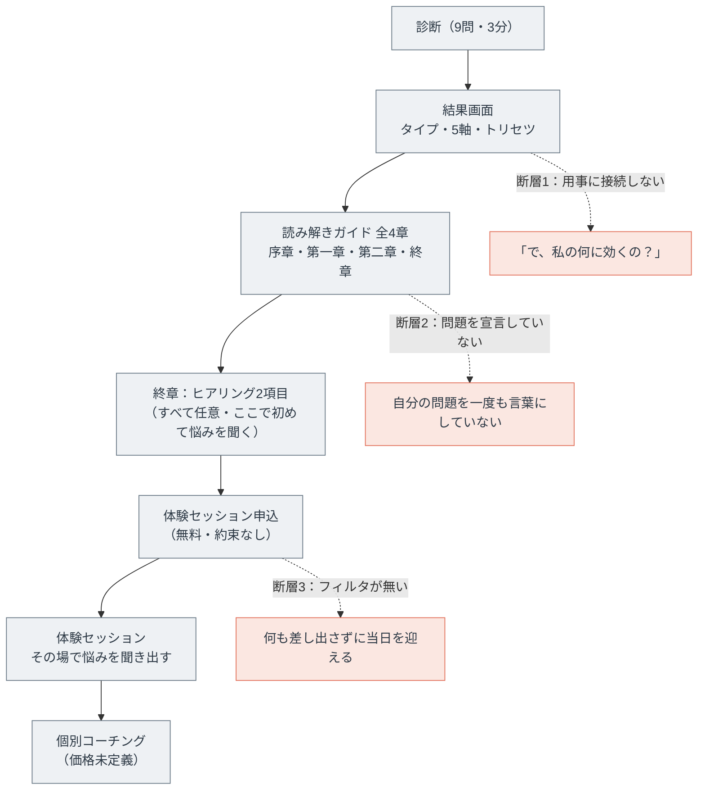
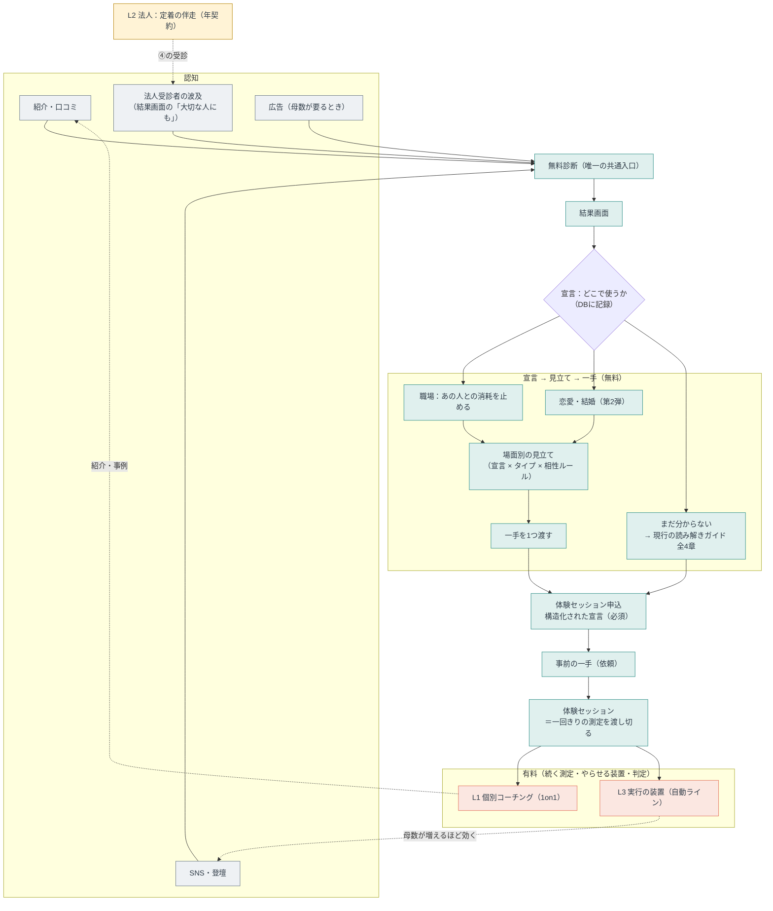

# 集客戦略マップ（個人ルート・2026-09-09）

「認知 → バックエンド商品の商談（現状は体験セッション申込）まで」を集客と定義したときの、**個人（toC）ルートの打ち手の地図**。
起点は2つの課題（①ガイド → 体験セッション申込の転換率が低い ②体験セッションに来た人の温度が低く成約率が落ちる）と、2つの戦略案（a. 問題別コンテンツ b. 転職エージェント送客）。

> 位置づけ：**個人ルートの実行戦略（2026-09-09策定）**。法人③④の中心価値・価格・獲得は `法人中心価値とファネル.md`・`0to1マーケティング戦略.md` が正で、本書はそれを前提に置く（変更しない）。
> **歩留まりの数字はすべて仮置き**。実測が1件も無いまま計画に使わない（§8で先に測る）。
> 参照：`ファネル図.md`（ファネル全体）／`guide-3day-spec.md`・`ガイド文面24本.md`（ガイドの文面）／`相性ルール.md`（ペアの力学）／`法人ポジショニング.md` §2（8タイプの消耗ポイント）／`アプリ化要件定義.md`（実装の正）。
> 本文に長音ダッシュは使わない（プロジェクトの表記ルール）。

---

## 0. 決めたこと（結論）

| # | 論点 | 決定 |
| :-: | :-- | :-- |
| 1 | 課題の見立て | **正しい。ただし原因は3つある**。①価値の翻訳が無い（曖昧な概念価値）②問題の宣言が導線の最後にしか、しかも任意でしか起きない ③本気度をつくる装置（フィルタ）が1つも無い。②③は文面でなく**導線の構造**の問題で、コピーを直しても動かない（§2） |
| 2 | 施策a | **採る。ただし「コンテンツを増やす」でなく「宣言 → 見立て → 一手 → 判定」の4段に組み替える**。読み物を足す方向に流れると、本プロジェクトが既に出した結論（AIが知識の値段をゼロにした・how-toを書かない）と正面衝突する（§3） |
| 3 | 分岐のさせ方 | 分岐させるのは**読み物の種類でなく、本人の宣言**。結果画面の直後に「どの場面の、誰との関係か」を選ばせ、**DBに記録する**（§3.2・§3.6） |
| 4 | 最初に作るドメイン | **職場**が先、恋愛・結婚が後。既存資産（8タイプの消耗ポイント・相性6カテゴリ）がそのまま使え、痛みに期限があるため（§3.4） |
| 5 | 職場ブランチの約束 | 「職場を変える」ではなく「**あの人との消耗を止める**」。個人がボトムアップで組織を変える動機は弱いという既存の結論（`ファネル図.md` 設計原則）を覆さずに済む（§3.5） |
| 6 | 現行ガイドの扱い | 提案どおり「**何に悩んでいるか分からない人**」の受け皿として残す。ただし**既定の入口はフォーク**にし、ガイドは選択肢の1つに降ろす（§3.2） |
| 7 | 課題②（温度）の打ち手 | 文面でなく**装置**で解く。申込時に構造化された宣言を必須化し、申込後に「一手」を渡し、**当日はその結果から始める**。やってこなかった人には売らない（§4） |
| 8 | 無料と有料の境界線 | 法人で確定した線（`0to1マーケティング戦略.md` §4.4）を**そのまま個人にも適用**する。知ることと**一回きりの測定**は無料、**続く測定・やらせる装置・できているの判定**から有料（§4.3） |
| 9 | 施策b（転職エージェント送客） | **保留**。法人の中心価値（定着＝辞めない店をつくる）と**同じ会社が辞めることで儲かる**構造になり、④メンバー（顧客の従業員）を引き抜く形にもなる。許認可（職業安定法）の確認も要る。何より、今回の2つの課題を1つも解かない（§6） |
| 10 | 10〜12月の埋め方 | **新規集客では埋まらない**。3週間で流入は作れない。10月は「**商品と価格を定義して、既に温かい在庫（過去の診断回答者・紹介・知人）に直接案内する**」以外に手が無い。施策aは11月以降の数字のための投資として置く（§1.4） |
| 11 | 月商の作り方 | **個人の一括商品は今月の月商を動かせるが積み上がらない。法人の年契約は今月をほとんど動かさないが積み上がる。** 2026年10〜12月は前者、2027年は後者、1〜3年後はL3（実行の装置）が主（§1.4・§5） |
| 12 | 「自分のリソースを使わない」の到達点 | **ゼロにはできない**。判定には責任が乗る必要があり、AIの回答には責任が乗らない（`0to1マーケティング戦略.md` §1.3 欠落3）。到達点は「人の時間あたり売上を上げる」で、判定を1対多・非同期に置き換える（§5.5） |
| 13 | 管理変数 | 成約数でなく**週の露出・依頼の件数**（自分で決められる量）。観測するのは診断完了数・宣言数・申込数（§9） |

> 一言でいうと：**いま抜けているのは「コンテンツ」でなく「本人に問題を宣言させる場所」と「宣言した人にやらせて判定する装置」、そして「売る商品の定義と価格」である。** 施策aはその3つを作る仕事として実行し、施策bは本業の約束と衝突するので保留する。

---

## 1. 先に数字を合わせる（目標と現在地の差分）

打ち手を並べる前に、**目標がどれだけの量を要求しているか**を確定させる。ここが合っていないと、正しい施策でも間に合わない。

### 1.1 目標と既存ロードマップの差

既存の月商計画（`apps-script/UpdateRoadmapSheets.gs` の `moneyRows`。M1＝2026年8月）と、今回の目標を並べる。

| 月 | 既存ロードマップ | 今回の目標 | 差 |
| :-- | --: | --: | :-- |
| 2026年10月（M3） | 15万円 | **110万円** | **約7.3倍** |
| 2026年11月（M4） | 45万円 | **155万円** | 約3.4倍 |
| 2026年12月（M5） | 60万円 | **155万円** | 約2.6倍 |
| 2027年6月（M11） | 195万円 | **200万円** | ほぼ一致 |
| 2027年12月 | 計画の外（M12＝2027年7月で210万円） | **200万円** | 到達済みの水準 |

**読み取れること：ずれているのは2026年10〜12月だけ**で、2027年以降の目標は既存の法人ロードマップとほぼ同じ水準にある。
つまり今回の目標は「計画全体の引き上げ」ではなく、「**最初の9ヶ月分のランプを3ヶ月に前倒しできるか**」という問いである。

### 1.2 110万円は、何本で埋まるか

**最大の欠落：個人のバックエンド（個別コーチング）に価格が無い。** ロードマップの注記にも「個人は②紹介経由の個別コーチングのみの参考値。単価が未確定なので、確定した時点で引き直す」とある。売る物の値段が決まっていない状態では、逆算が始まらない。

単価別に、110万円に必要な本数と体験セッション数を置く（成約率は仮置き）。

| 単価（1本） | 必要な成約 | 成約率30%なら必要セッション | 成約率20%なら | セッションの所要（1件1.5時間） |
| --: | --: | --: | --: | --: |
| 15万円 | 7.3本 | 25件 | 37件 | 37〜55時間／月 |
| 20万円 | 5.5本 | 19件 | 28件 | 28〜42時間／月 |
| **30万円** | **3.7本** | **13件** | **19件** | **19〜28時間／月** |
| 50万円 | 2.2本 | 8件 | 11件 | 12〜17時間／月 |

**支払い方の設計が月商を決める。** 3ヶ月30万円を月10万円×3回にすると、初月の月商は1本あたり10万円にしかならず、4本売っても40万円で目標に届かない。**10〜12月の目標を月商で達成するなら、一括（または初回に大きく寄せる）を選ぶ**しかない。この選択は「積み上がらない」という代償とセットで、2027年以降は法人の年契約とL3が積み上げ側を担う（§5）。

### 1.3 その本数に必要な流入

体験セッション13件／月を作るのに、どれだけの診断完了が要るか。**歩留まりは実測が無いので3通り置く**（§8で実数に置き直す）。

| 段 | 悲観 | 中庸 | 楽観 |
| :-- | --: | --: | --: |
| 診断完了 → ガイド終章到達 | 20% | 30% | 40% |
| 終章到達 → 申込 | 5% | 10% | 15% |
| **セッション13件に必要な診断完了数** | **1,300件／月** | **433件／月** | **217件／月** |

現在、月に数百件の診断を安定して生む流入路は無い（広告は未出稿、①一般のライブは未実装、②紹介は数が限られる）。
**したがって10月の110万円は、流入を増やす方向では埋まらない。**

### 1.4 結論：3つの期間を別々に設計する

| 期間 | 何で埋めるか | 前提 |
| :-- | :-- | :-- |
| **2026年10月** | **既に温かい在庫への直接案内**。過去の診断回答者・②紹介の受診者・体験セッション実施済・知人。**商品と価格を今週決めて、案内文を送る**のが唯一の3週間で動く手 | 在庫の実数を先に数える（§8のSQL）。数えずに計画を作らない |
| **2026年11〜12月** | 施策a（宣言 → 見立て → 一手 → 判定）を職場ドメインで稼働させ、**転換率**で埋める。同時に法人の契約を積む | 10月中に実装と文面を作り切る |
| **2027年以降** | 法人の年契約の積み上げ（既存ロードマップどおり）＋ L3（実行の装置）の自動ライン | 目標水準は既存計画と一致するので、計画の引き直しは不要 |

> **正直に書いておく**：10月110万円は、上の「温かい在庫」が十分に無ければ達成できない。達成できるかどうかは在庫の実数で決まるので、**まず数える**（§8）。数えた結果として届かないなら、10月の目標を動かすか、法人側で既に商談中の案件を前倒しするかの判断になる。これは戦略の問題でなく在庫の問題である。

---

## 2. 課題の構造（どこで熱が落ちるか）

### 2.1 3つの断層

課題の仮説（曖昧な概念価値のせいでベネフィットが伝わらない）は正しい。ただし**それだけでは説明がつかない落ち方**が2つある。

| # | 断層 | いま何が起きているか | 効く打ち手 |
| :-: | :-- | :-- | :-- |
| **断層1** | **翻訳の欠落** | 結果もガイドも「自然体」で貫かれている。終章の約束は「霧が晴れる感覚」で、**読者の具体的な用事（job）に一度も接続しない**。読者は「で、これが私の何に効くの？」のまま申込ボタンに着く | 施策a（§3） |
| **断層2** | **宣言が起きない** | 「いま悩んでいること」を聞くのは**終章の直前・任意**（`hearings` テーブル）。つまり**最後まで、読者は自分の問題を一度も言葉にしていない**。人は自分で言っていない問題には金を払わない | 宣言を導線の**先頭**に移す（§3.2） |
| **断層3** | **フィルタが無い** | ①一般は「3日間のライブに出席すること自体がフィルタ」、②紹介は「書くという行為がフィルタ」と設計されている（`ファネル図.md`）。**ところがアプリの現行導線には、そのどちらも無い**。無料で読めて、無料で申し込め、何も約束せずに当日を迎える | 装置を置く（§4） |

**課題②（セッションの温度が低い）の主因は断層3。** 温度は文面で上げるものでなく、**その人が何かを差し出したかどうか**で決まる。いまの導線は、来る人に何も差し出させていない。

### 2.2 現行導線（どこで熱が落ちるか）



---

## 3. 施策a の再定義

### 3.1 そのままの形だと、過去の結論と衝突する

施策aの原文は「診断結果をもとにどう解決できるのかを**理解するコンテンツ**を増やす」。ここは**慎重に扱う必要がある**。

`0to1マーケティング戦略.md` は既にこう結論している。

- AIが解いたのは「知らない → 知っている」の段だけで、**知識で信頼をつくる従来型コンテンツマーケは死んだ**（§1.4）。
- だから**how-toを書かない**。書くのはAIに書けない2つだけ、**固有の観測**と**実測の数字**（§6.2）。
- 配るのは知識でなく、**測定と実行体験**（§4.2）。

「問題別に解き方を説明する読み物」を8タイプ×2ドメインで作ると、**AIに同じものが即座に書ける棚**へ自分から入ることになる。しかも読者は「読んだ気になって満足する」ので、**転換率はむしろ下がりうる**（現行ガイドの終章が既にこの構造にある。読み終えた時点で完結感が出る）。

**それでも施策aは正しい。** 直すのは中身の置き方であって、方向ではない。

### 3.2 分岐させるのは、読み物でなく本人の宣言

施策aを、次の形に組み替える。

| 原案 | 再定義後 |
| :-- | :-- |
| 解決したい問題を**選択させ**、それに応じた**解説コンテンツ**を出す | 解決したい**場面と相手を宣言させ**、その宣言と診断結果を突き合わせた**その人固有の見立て**を返す |
| 分岐の単位＝コンテンツの種類 | 分岐の単位＝**本人の宣言（DBに記録する）** |
| 着地＝理解 | 着地＝**一手の実行と、その判定** |

これは `0to1マーケティング戦略.md` §3.6 の原則「**自分ごと化はコピーの上手さでなく相手の固有情報で起こす**」を、そのまま個人ルートに移したもの。法人ルートでは「観測の一文 → 本人の回答 → チームの実データ → 本人の1週間」と段を上げている。個人ルートの対応物は下の4段になる。

### 3.3 4段の階段（宣言 → 見立て → 一手 → 判定）

```
第0段  診断（既存）           …… 型を出す
第1段  宣言                   …… 「どの場面の、誰との、いつまでの話か」を本人が選ぶ
第2段  見立て                 …… 宣言 × 診断結果 × 相性ルールで、その関係の力学を1本返す
第3段  一手                   …… 明日やる具体行動を1つだけ渡す（複数渡さない）
第4段  判定                   …… 1週間後、「やったか・何が起きたか」を聞き、読み解いて返す
```

| 段 | 法人ルートの対応物 | 個人ルートでの実装 | 無料／有料 |
| :-: | :-- | :-- | :-: |
| 0 | 無料診断 | 既存のまま | 無料 |
| 1 | 現場責任者本人の受診 | **結果画面直後のフォーク**（選択式・3問） | 無料 |
| 2 | チーム力学レポート | **場面別の見立て**（宣言＋タイプ＋相性ルールから生成） | 無料 |
| 3 | 解説商談 | **体験セッション**（一回きりの測定を渡す場） | 無料 |
| 4 | 1週間後フォロー | **1週間後の判定**（やった／やらなかったの結果を読み解く） | ここから**有料**（§4.3） |

**第2段が施策aの本体**であり、ここは「読み物」ではなく「**あなたと、あなたが選んだあの人の間で何が起きているかの見立て**」である。`相性ルール.md` の6カテゴリ（主導権がぶつかる／停滞しやすい／すれ違い注意／直球が刺さる／問題が放置／腹の内が見えない）は既に自分視点のペア判定として実装済みなので、**相手のタイプを推定する3問を足すだけで、固有の見立てが機械生成できる**。ここが最大の資産で、AIの一般論と決定的に違う点になる（相手の情報が入っているため）。

### 3.4 どのドメインから作るか

**職場が先、恋愛・結婚が後。** 理由は3つ。

1. **既存資産がそのまま使える**。`法人ポジショニング.md` §2 の「8タイプの消耗ポイント」（独走／正論が逃げ場を奪う／笑いと根回しで先送り／NOが言えず抱え込む／任せられない）は職場の具体パターンとして既に言語化されている。恋愛・結婚は全部が新規制作になる。
2. **痛みに期限がある**。異動・評価・繁忙期・退職の検討には日付が付く。「今すぐ解決したい課題」という今回の課題設定に、最も直接効く。
3. **法人ラインと語彙が共通化する**。同じ言葉で③現場責任者にも語れるので、資産が二重に効く。

恋愛・結婚は**第2弾**に置く。母数と拡散力（「大切な人にも受けてもらう」導線が既に効く領域）は職場より大きい見込みだが、制作が全部新規で、かつ競合の密度も高い。職場で4段の階段が回ることを確かめてから複製する。

### 3.5 職場ブランチの約束は「職場を変える」ではない

ここは踏み外すと既存の設計と衝突する。`ファネル図.md` の設計原則は「**職場改善はトップダウンで届ける。個人がボトムアップで職場を変えようとする動機は弱い**」と結論しており、④メンバーには売らないとも決めている。

したがって職場ブランチの約束は、組織ではなく**その人自身**に置く。

| 置いてはいけない約束 | 置く約束 |
| :-- | :-- |
| 職場を変える／上司を変える | **あの人との消耗を止める** |
| チームの空気をよくする | **その関係で、自分がすり減らない形をつくる** |
| 会社に言うべきことを言えるようにする | **言い方を変えて、返ってくるものを変える** |

この置き方なら、既存の結論を覆さずに済む（組織を動かす話ではなく、本人の関わり方の話であるため）。そして**この線引きが、施策bを保留する理由にも直結する**（§6）。

### 3.6 画面と実装（最小の変更）

| 場所 | 変更 | 実装の重さ |
| :-- | :-- | :-- |
| 結果画面の直後 | **フォークを置く**。「この結果を、どこで使いますか」＝ ①職場の、あの人との関係 ②恋愛・結婚の関係 ③まだ分からない／なんとなく気になる。選択式で3クリック以内 | 小（画面1枚＋列3本） |
| フォーク直後 | **相手を特定する3問**（立場・その人のタイプ推定2問）。ここで `相性ルール.md` の判定に必要な軸が揃う | 中（設問と判定の実装） |
| 見立て | 宣言＋自分のタイプ＋推定した相手のタイプで、**力学の見立て＋一手**を1画面で返す | 中（テンプレート＋スロット。`guide-3day-spec.md` と同じ作り方） |
| ③を選んだ人 | **現行の読み解きガイド 全4章**へ。提案どおり「何に悩んでいるか分からない人」の受け皿として残す | ゼロ（現状のまま） |
| 申込フォーム | 任意の自由記述を、**必須の構造化宣言**（場面・相手・いつまでに）＋任意の自由記述に組み替える | 小 |
| DB | `responses` に宣言の列（`concern_domain` / `concern_target` / `deadline`）、または `hearings` を拡張。**新しいマイグレーションを足す**（0001は編集しない） | 小 |

> 実装の順序としては、**フォークと宣言の記録だけを先に出す**のが正しい。見立ての文面が無くても、宣言が取れれば「どのドメインが多いか」「宣言した人の申込率は本当に高いのか」が測れる。**測れてから文面を作る**（文面が先だと、外したときに何を直すか分からない）。

### 3.7 制作量の見積り

| 作るもの | 本数 | 備考 |
| :-- | --: | :-- |
| 場面別の見立て（職場） | 8タイプ × 6カテゴリの組み合わせ | **全部は書かない**。`相性ルール.md` と同じく軸から生成する（64ペアを手書きしない設計が既にある） |
| 一手（職場） | 8タイプ × 6カテゴリ | 同上。1組合せ1行 |
| 共通のガワ | 1式 | `guide-3day-spec.md` §8と同じ構造を流用 |
| 恋愛・結婚 | 第2弾 | 職場が回ってから |

`ガイド文面24本.md` で24本を書き切った実績があるので、**軸からの生成に寄せれば職場ドメインは2〜3週間**で作れる規模になる。手書きのペア表を作り始めたら設計を間違えている合図。

---

## 4. 温度をつくる装置（課題②への直接の打ち手）

### 4.1 申込の前後に置く3つの装置

温度は文面でなく、**相手が何を差し出したか**で決まる。順に重くする。

| # | 装置 | 置く場所 | 何を差し出させるか | 副作用 |
| :-: | :-- | :-- | :-- | :-- |
| 1 | **構造化された宣言（必須）** | 申込フォーム | 場面・相手・いつまでに。選択式なので**書く負担は増えない**が、宣言は必ず立つ | ほぼ無し（摩擦は増えない） |
| 2 | **事前の一手（依頼）** | 申込直後の完了画面＋通知 | 「当日までに、これを1回だけ試してきてください」を1つだけ渡す | 申込数は減らない。**やってこない人が可視化される** |
| 3 | **当日はその結果から始める** | 体験セッション冒頭 | 実行の結果（固有の実データ） | やってこなかった人には**売らない**。無理に売ると成約率も満足度も落ちる |

装置2は `0to1マーケティング戦略.md` §1.3 の「賭け金の欠落」の裏返しで、実行意図（Gollwitzer & Sheeran 2006）と「人に報告する約束」（Matthews）の効果に乗っている。**人は、聞かれるから、やる。**

### 4.2 体験セッションの型を変える

いまの体験セッションは「悩みを聞き出して、最後に案内する」形になっている。これを、法人の解説商談と同じ型に揃える。

```
1  宣言の確認     …… 申込時に選んだ場面・相手・期限を、こちらから読み上げる
2  実データ       …… 診断の5軸 ＋ 一手の結果（本人が持ってきたもの）
3  見立て         …… その関係で何が起きているか。能力の話にしない
4  相手の言葉      …… 「解消されたらどんな毎日か」を本人に言わせる（既存の hearings の設問）
5  距離           …… いまとその状態の間に何があるか
6  提案           …… 続ける装置（有料）を出す。リスクはこちらが引き受ける
```

これは Alan Weiss の順序（成果 → 測定指標 → 価値 → 提案 → 方法論）そのもので、`法人中心価値とファネル.md` §2.4 で既に採用している考え方を個人にも適用するもの。**方法論（何回やるか、何をするか）を先に話さない。**

### 4.3 無料と有料の境界線（法人で決めた線を、そのまま個人へ）

`0to1マーケティング戦略.md` §4.4 の線を、個人ルートにも適用する。

| | 無料 | 有料 |
| :-- | :-- | :-- |
| 原則 | 知ること、**一回きりの測定** | **続く測定・やらせる装置・できているの判定** |
| 個人ルートの中身 | 診断・場面別の見立て・一手1つ・体験セッション | 週次の確認・関係ごとの基準づくり・「できているか」の判定・記録の蓄積 |

**この線が引けると、体験セッションの位置づけが変わる。** いまは「無料で相談に乗る場」で、だから売りにくい。線を引くと「**一回きりの測定を渡し切る場**」になり、その場で価値が完結する。続きが要る人だけが有料に進む形になるので、押し売りの構造が消える。

---

## 5. 収益ラインの地図

### 5.1 4本のライン

| ライン | 中身 | 今月の月商への効き方 | 積み上がるか | 自分の時間 |
| :-- | :-- | :-- | :-: | :-- |
| **L1 人的（個人）** | 個別コーチング（1on1） | **大きい**（一括なら即月商） | × | 最も使う |
| **L2 法人** | 定着の伴走（年契約・月10／15／20万円） | 小さい（初月は請求しない） | ○ | 中（月3時間／社） |
| **L3 自動** | 問題別の「実行の装置」（続く測定・判定） | 小（作るまで時間が要る） | ○ | **少ない（本命）** |
| L4 提携（保留） | 転職エージェント送客 | 小 | △ | 少 |

### 5.2 L1：まず価格を決める（いま最も欠けている部品）

決め方は法人と同じ手順を使う（`法人中心価値とファネル.md` §2.7）。**相場に合わせない。比較対象を自分で決める。**

| 比較対象 | 相手の頭の中の金額 | そこに置かれるとどうなるか |
| :-- | :-- | :-- |
| 占い・カウンセリング1回 | 5,000〜10,000円 | 最悪。単発の相談枠に見える |
| コーチングの相場 | 月2万〜5万円 | 中位に埋もれる |
| **その関係に払い続けているコスト** | 転職1回の年収差・その関係で失った年数 | **本命** |

**推奨：3ヶ月30万円（一括）を最初のアンカーに置く。** 根拠は§1.2の逆算（月4本で110万円を超え、セッション13〜19件／月は1人で回せる）と、法人で採った「最初の3社がアンカーを決める。値引きせず、代わりにリスクを引き受ける」原則。個人版のリスク引き受けは「**初回セッション後に合わないと感じたら、そこまでの分は請求しない**」の形にする。

> 値引きの害は同じ：後から上げられないこと、そして安さを期待する人が集まること。

### 5.3 L3：実行の装置（1〜3年の自動化の本命）

「自分のリソースを使わず売上が立ち続ける状態」を担うのはここ。**中身は読み物ではなく、§3.3の第4段（判定）を続ける装置**である。

| 部品 | 自動化できるか | 備考 |
| :-- | :-- | :-- |
| 見立ての生成 | **できる**（軸からの生成。`相性ルール.md` の方式） | すでに実装の型がある |
| 一手の配信・リマインド | **できる** | 週次の定型 |
| 記録の蓄積（関係ごとの基準） | **できる** | DBに貯める |
| **判定（できているかの評価）** | **できない**（後述） | ここだけ人が要る |

### 5.4 なぜ「有償フロントを置かない」という決定と矛盾しないか

2026-07-26に「有償のフロント商品（関係性読み解きガイド）は置かない」と決めている。その理由は明快で、「**読むだけでは変われないと教育した直後に、読み物を売ることになり論理が反転する**」から（`ファネル図.md`）。

L3は**読み物ではない**。売るのは「続く測定・やらせる装置・判定」で、これは「読むだけでは変われない」という教育と**同じ向き**を向いている。したがって論理の反転は起きない。**この一点さえ守れば、有償の中間商品を置いてよい**（守れなくなったら、それは読み物に戻っている合図）。

### 5.5 「自分のリソースを使わない」の到達点

**完全な自動化には届かない。** 理由は自プロジェクトが既に特定している（`0to1マーケティング戦略.md` §1.3）。

- 欠落2（賭け金）：機械への約束は、破っても失うものがない。
- 欠落3（判定）：「できているか」は自己評価では歪む。**判定には、判定に責任を持つ相手が要る。AIの回答には責任が乗らない。**

したがって現実的な到達点はこうなる。

| 3年後の姿 | 中身 |
| :-- | :-- |
| 自動で回るもの | 診断・宣言・見立て・一手の配信・記録・リマインド・課金 |
| 人が残るもの | **判定だけ**。ただし1対1でなく、**1対多（グループの判定会）と非同期（記録への短い返信）**に置き換える |
| 効果 | 人の時間あたり売上が上がる。時間がゼロにはならない |

「時間ゼロ」を目標に置くと、判定を外した瞬間に価値が落ち、解約が増える形で跳ね返る。**目標は「時間あたり売上」に置き換える。**

---

## 6. 施策b（転職エージェント送客）の判定

### 6.1 判定：**保留**

「やらない」ではなく「いまの構成では取れない」。理由は3つあり、うち1つは構造的で、条件をつけても消えない。

### 6.2 理由

**理由1：法人の中心価値と正面から衝突する（最大の理由）**

法人ラインの約束は「**辞めない店をつくる（定着）**」で、最高単価もそこに乗せている。同じ事業者が、個人ルートでは**人が辞めることで報酬を得る**構造を持つと、次が起きる。

- ③現場責任者に「定着」を売りながら、その裏で転職を斡旋している事業者、という事実が1件でも露見した時点で、法人ラインは終わる。
- **④メンバー（顧客企業の従業員）は同じ診断を受ける。** 職場ブランチの出口に転職導線があれば、**顧客の従業員を引き抜く形**になる。これは是非以前に、契約として成立しない。
- 個人の側でも、「この人は私のためでなく手数料のために転職を勧めているのでは」という疑いが、無料セッションの信頼を壊す。無料フロントで信頼をつくる設計（`ファネル図.md`）と噛み合わない。

§3.5で職場ブランチの約束を「あの人との消耗を止める（関わり方を変える）」に置いた。転職送客は「**環境を変えろ**」という逆向きの答えで、**1つの導線に矛盾した2つの約束が乗る**ことになる。

**理由2：許認可の確認が要る（要・専門家確認）**

- 求職者と求人者の間に立って就職の斡旋を行うと**職業紹介**にあたり、有料職業紹介事業は許可制（職業安定法）。
- 情報を提供するだけなら「募集情報等提供事業」の枠だが、こちらも届出の対象になりうる。
- **入社決定に連動した成果報酬**は、実態として斡旋と評価される方向に働きやすい。

いずれも**社労士・弁護士への確認事項**であり、本書で結論を出さない。**確認前に成果報酬型の設計を進めない。**

**理由3：今回の2つの課題を1つも解かない**

課題は「ガイド → 申込の転換率」と「セッションの温度」。転職送客はどちらにも触れず、**新しい収益ラインを1本足すだけ**である。しかも提携の締結からマージンの入金までは、面談設定・選考・入社を挟んで通常2〜4ヶ月かかるので、**10〜12月の目標にも間に合わない**。

### 6.3 それでも成立させるなら、満たすべき条件

| # | 条件 |
| :-: | :-- |
| 1 | **法人顧客の従業員（④）を構造的に除外できること**。受診経路の記録で機械的に弾き、運用の注意に頼らない |
| 2 | **別ブランド・別事業者にすること**。ナチュール診断の名前と信頼を使わない。同一ブランドで両方をやる形は成立しない |
| 3 | **許認可の確認が済んでいること**（理由2） |
| 4 | **「辞めるべきか、関わり方を変えるべきか」の切り分けを先に無料で渡し、環境要因と判定された人だけを、明示の同意のうえで渡すこと**。勧めない。渡すだけにする |

### 6.4 マージンでなく、役務として売る代替案

ユーザーの原文には「**転職エージェントの集客問題の解決支援を行い、そのマージンを売上にする**」とある。前半（集客支援）と後半（送客マージン）は分離できる。

| 案 | 中身 | 上の3つの理由への当たり方 |
| :-- | :-- | :-- |
| **代替案A** | 診断と見立てを、エージェントの**候補者集客ツールとして定額で提供する**（月額のライセンス、または制作フィー） | 理由2（許認可）を回避できる。理由1は残るので、別ブランドが要る |
| **代替案B** | エージェントの**キャリアアドバイザー向け研修**として、8タイプと相性の型を売る（法人ラインの商品の応用） | 理由1・2ともに当たらない。**最も筋がよい**。相手は法人で、売るものは既存の型 |

**代替案Bが本命。** 転職エージェントは「人と人の関係を読む」ことが商品の中核にある業種なので、③現場責任者向けの型がほぼそのまま乗る。しかも法人ラインの中に収まるので、新しい矛盾を作らない。

---

## 7. 全体マップ



---

## 8. 計測（まず数える。仮説のまま計画に使わない）

### 8.1 いま取れる数字

`responses` と `apply_visits`・`session_applications` に、**7段すべての列が既にある**。

| 段 | 列・テーブル |
| :-- | :-- |
| 診断完了 | `responses.completed_at` |
| ガイド開封 | `responses.guide_opened_at` |
| 章ごとの到達 | `responses.guide_max_chapter`（0＝序章 1＝第一章 2＝第二章 3＝終章） |
| 終章到達 | `responses.guide_completed_at` |
| 申込画面への到達 | `apply_visits` |
| 申込 | `session_applications` |
| 実施・成約 | `session_applications.status`（未対応／日程調整中／実施済／成約／辞退） |

**「ガイド → 申込の率が下がっている」という今回の課題の前提は、まだ実測されていない。** 集計ダッシュボードは作らないと決めている（確認事項10）ので、SQLを1本定型化して週次で見る。

### 8.2 週次で見る1本

手元で実行する。**先にブランチを最新にする**（古いままだとコマンド自体が無い、あるいは古い内容を見ることになる）。

```
cd <リポジトリのパス>
git fetch origin
git checkout claude/customer-acquisition-strategy-map-aaoh80   # 初回は git checkout -b claude/customer-acquisition-strategy-map-aaoh80 origin/claude/customer-acquisition-strategy-map-aaoh80
git pull origin claude/customer-acquisition-strategy-map-aaoh80
cd app
```

```
npx wrangler d1 execute nature-shindan --remote --env="" --command "select count(*) as 診断完了, sum(case when guide_opened_at is not null then 1 else 0 end) as ガイド開封, sum(case when guide_max_chapter >= 1 then 1 else 0 end) as 第一章, sum(case when guide_max_chapter >= 2 then 1 else 0 end) as 第二章, sum(case when guide_completed_at is not null then 1 else 0 end) as 終章到達, sum(case when exists(select 1 from apply_visits av where av.response_id = r.id) then 1 else 0 end) as 申込画面到達 from responses r where r.deleted_at is null and r.completed_at is not null"
```

```
npx wrangler d1 execute nature-shindan --remote --env="" --command "select status, count(*) as 件数 from session_applications where deleted_at is null group by status"
```

**この2本が、10月の計画の出発点になる**（§1.4の「温かい在庫」の実数もここで出る）。

### 8.3 較正の考え方

法人側と同じ扱いにする。**転換率の目標値を先に置かない。4週間の実数を取ってから置く**（`法人中心価値とファネル.md` §4.2）。本書の§1の歩留まりはすべて仮置きで、実測が出た時点で引き直す。

---

## 9. 実行順（90日）

| 期間 | やること | 完了の定義 |
| :-- | :-- | :-- |
| **今週** | ①§8のSQLを回して7段の実数と温かい在庫を数える ②**L1の価格と商品定義を確定**（推奨：3ヶ月30万円・一括・初回後のリスク引き受け） | 数字が出ている。価格が1つに決まっている |
| **9月内** | ③温かい在庫への案内文を作り、送る ④申込フォームを構造化宣言（必須）＋事前の一手に組み替える | 案内を送り終えている。装置1と2が本番で動いている |
| **10月** | ⑤結果画面直後のフォークと宣言の記録を実装（**文面より先に、記録を出す**） ⑥体験セッションの型を§4.2に変える ⑦法人の接触は `0to1マーケティング戦略.md` の量を落とさない | 宣言がDBに溜まり始めている |
| **11月** | ⑧職場ドメインの見立てと一手を軸から生成して実装 ⑨宣言した人としない人の申込率を比較 | 施策aが稼働。差が数字で見えている |
| **12月** | ⑩L3（実行の装置）の商品定義 ⑪恋愛・結婚ドメインの着手判断 | L3の中身と価格が決まっている |

**管理変数は週の露出・依頼の件数**（投稿・DM・紹介依頼・登壇の申し込みなど、自分で決められる量）。診断完了数・宣言数・申込数・成約数は観測変数であって、管理変数にしない（`0to1マーケティング戦略.md` §3.4と同じ考え方）。

---

## 10. リスクと反証条件（この地図が間違っていると分かる条件）

| # | 反証条件 | そのとき何を疑うか |
| :-: | :-- | :-- |
| 1 | 宣言を必須にしたら、申込数が**半分以下**に落ちた | 摩擦の入れ方が重すぎる。選択式の粒度を粗くする（ただし数が減っても成約率が上がるなら成功） |
| 2 | 宣言した人としない人で、**申込率も成約率も差が出ない** | 断層1・2の見立てが誤り。原因は導線でなく流入の質（そもそも買う気の無い層が来ている）を疑う |
| 3 | 事前の一手をやってくる人が**2割を切る** | 一手が重い、または渡し方が弱い。1つだけ・2分以内に落とす |
| 4 | 体験セッションの実施はできるが、**30万円で1本も売れない** | 価格でなく§4.2の型（概念的合意の順序）を疑う。値下げは最後（下げると戻せない） |
| 5 | 職場ドメインの見立てが「よくある一般論」に見えると言われる | 相手のタイプ推定が効いていない。推定3問の設計に戻る |
| 6 | 10月に温かい在庫が**数十件しか無い**と分かった | 目標の期日を動かすか、法人の既存商談を前倒しする。集客の設計の問題ではないので、施策aを急いでも解決しない |

---

## 11. 未確定（次に決めること）

| # | 論点 | 決め方 |
| :-: | :-- | :-- |
| 1 | **L1の価格と支払い方**（一括か分割か） | §1.2と§5.2。最初の3本がアンカーになるので、最初に決めて動かさない |
| 2 | 恋愛・結婚ドメインの着手時期 | 職場で4段の階段が回ってから |
| 3 | フォークの選択肢を2つにするか3つにするか（家族・親子を足すか） | 宣言の実数を見てから。選択肢を増やすほど制作量が線形に増える |
| 4 | L3の商品名・価格・提供形態 | 12月。読み物にならないことだけが制約（§5.4） |
| 5 | 代替案B（エージェント向け研修）の位置づけ | 法人ラインの応用として、`法人中心価値とファネル.md` 側で扱うか判断する |
| 6 | 施策bの許認可 | 社労士・弁護士へ確認。確認前に成果報酬型の設計を進めない |
